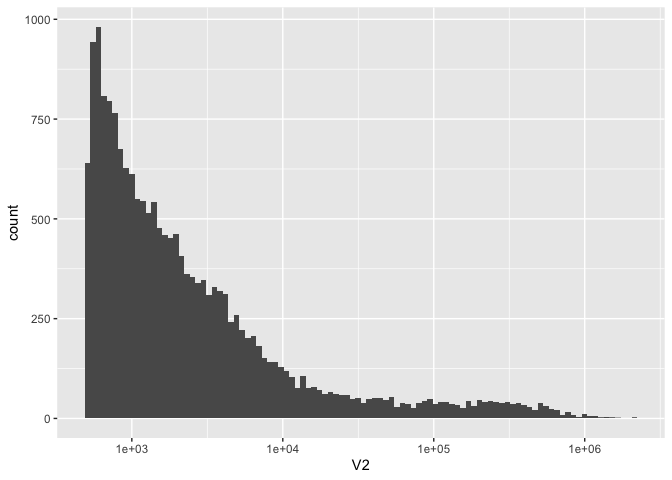
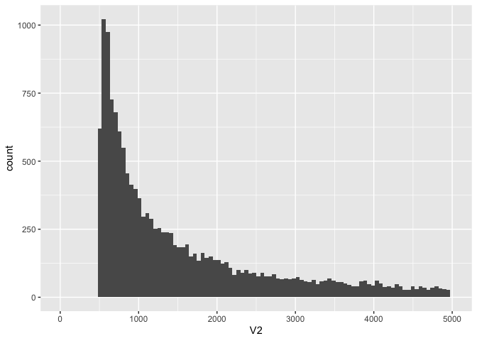

    library(tidyverse)

    ## ── Attaching packages ─────────────────────────────────────── tidyverse 1.3.2 ──
    ## ✔ ggplot2 3.4.0      ✔ purrr   1.0.0 
    ## ✔ tibble  3.1.8      ✔ dplyr   1.0.10
    ## ✔ tidyr   1.2.1      ✔ stringr 1.5.0 
    ## ✔ readr   2.1.3      ✔ forcats 0.5.2 
    ## ── Conflicts ────────────────────────────────────────── tidyverse_conflicts() ──
    ## ✖ dplyr::filter() masks stats::filter()
    ## ✖ dplyr::lag()    masks stats::lag()

Bismark + was done on Hyak.

Genmome stats

    kt <- read.csv("../data/Pver-karytotype.tab", header = FALSE, sep = "\t")

There are 18268 scaffolds

    nrow(kt)

    ## [1] 18268

    ggplot(kt, aes(x = V2)) +
      geom_histogram(bins = 100) +
      scale_x_log10()

    ggplot(kt, aes(x = V2)) +
      geom_histogram(bins = 100) +
      xlim(0, 5000)

    ## Warning: Removed 3932 rows containing non-finite values (`stat_bin()`).

    ## Warning: Removed 2 rows containing missing values (`geom_bar()`).

    kt %>% filter(V2 < 1000) %>% count()

    ##      n
    ## 1 6544

First thing I want to do is do a simple histogram showing distribution
of methylation levels. This will likely be done by taking 10 bedgraphs
and concatenating then, making a histogram.

After that I would want to look at distribution across features..
