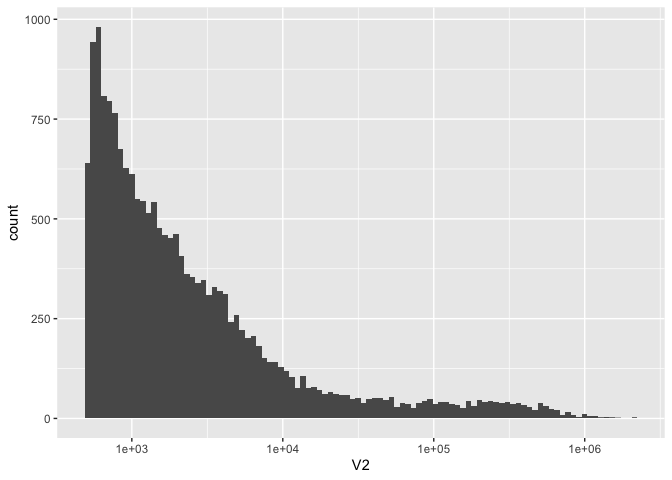
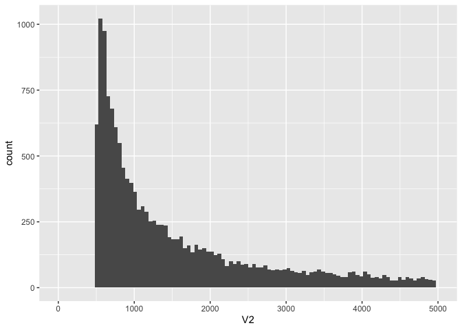
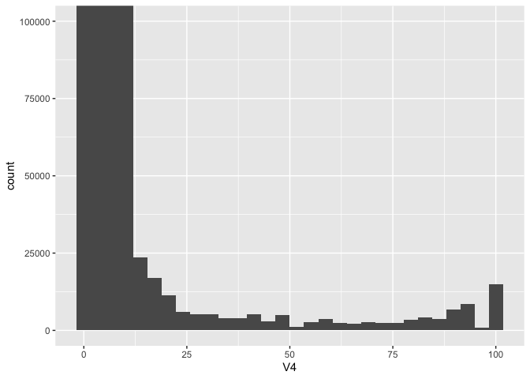
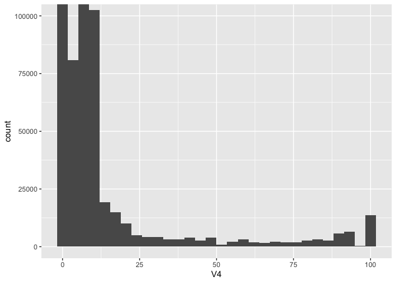
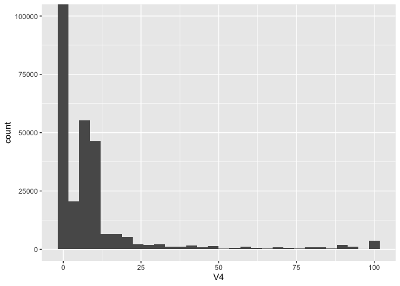
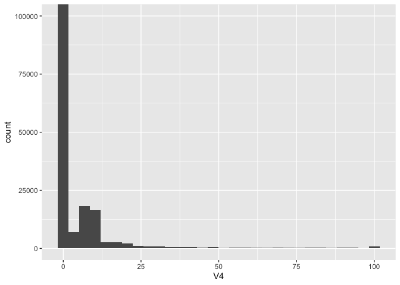

01.1-methylation-explore
================

``` r
library(tidyverse)
```

Bismark + was done on Hyak.

Genmome stats

``` r
kt <- read.csv("../data/Pver-karytotype.tab", header = FALSE, sep = "\t")
```

``` r
knitr::kable(head(kt))
```

| V1                |      V2 |
|:------------------|--------:|
| JAAVTL010000001.1 | 2095917 |
| JAAVTL010000002.1 | 2081954 |
| JAAVTL010000003.1 | 1617595 |
| JAAVTL010000004.1 | 1576134 |
| JAAVTL010000005.1 | 1560107 |
| JAAVTL010000006.1 | 1451149 |

There are 18268 scaffolds

``` r
nrow(kt)
```

    [1] 18268

``` r
ggplot(kt, aes(x = V2)) +
  geom_histogram(bins = 100) +
  scale_x_log10()
```



``` r
ggplot(kt, aes(x = V2)) +
  geom_histogram(bins = 100) +
  xlim(0, 5000)
```



``` r
knitr::kable(kt %>% filter(V2 < 1000) %>% count())
```

|    n |
|-----:|
| 6544 |

First thing I want to do is do a simple histogram showing distribution
of methylation levels. This will likely be done by taking 10 bedgraphs
and concatenating then, making a histogram.

After that I would want to look at distribution across features..

``` bash
ls ../big-data
```

    10_10x.bedgraph
    11_10x.bedgraph
    12_10x.bedgraph
    13_10x.bedgraph
    14_10x.bedgraph
    15_10x.bedgraph
    16_10x.bedgraph
    17_10x.bedgraph
    18_10x.bedgraph
    19_10x.bedgraph
    1_10x.bedgraph
    20_10x.bedgraph
    21_10x.bedgraph
    22_10x.bedgraph
    23_10x.bedgraph
    24_10x.bedgraph
    25_10x.bedgraph
    26_10x.bedgraph
    27_10x.bedgraph
    28_10x.bedgraph
    29_10x.bedgraph
    2_10x.bedgraph
    30_10x.bedgraph
    31_10x.bedgraph
    32_10x.bedgraph
    3_10x.bedgraph
    4_10x.bedgraph
    5_10x.bedgraph
    6_10x.bedgraph
    7_10x.bedgraph
    8_10x.bedgraph
    9_10x.bedgraph
    merge10x.bedgraph

``` bash
#cat ../big-data/*10x.bedgraph > ../big-data/merge10x.bedgraph
```

``` bash
head ../big-data/merge10x.bedgraph
```

    Pver_Sc0000000_size2095917  261 263 0.000000
    Pver_Sc0000000_size2095917  280 282 0.000000
    Pver_Sc0000000_size2095917  287 289 0.000000
    Pver_Sc0000000_size2095917  291 293 7.142857
    Pver_Sc0000000_size2095917  409 411 0.000000
    Pver_Sc0000000_size2095917  414 416 5.000000
    Pver_Sc0000000_size2095917  441 443 0.000000
    Pver_Sc0000000_size2095917  457 459 0.000000
    Pver_Sc0000000_size2095917  484 486 5.555556
    Pver_Sc0000000_size2095917  866 868 0.000000

``` r
read.csv("../big-data/12_10x.bedgraph", header = FALSE, sep = "\t") %>%
ggplot(aes(x = V4)) +
  geom_histogram() +
  coord_cartesian(ylim=c(0, 100000))
```

    `stat_bin()` using `bins = 30`. Pick better value with `binwidth`.



``` r
read.csv("../big-data/1_10x.bedgraph", header = FALSE, sep = "\t") %>%
ggplot(aes(x = V4)) +
  geom_histogram() +
  coord_cartesian(ylim=c(0, 100000))
```

    `stat_bin()` using `bins = 30`. Pick better value with `binwidth`.



``` r
read.csv("../big-data/5_10x.bedgraph", header = FALSE, sep = "\t") %>%
ggplot(aes(x = V4)) +
  geom_histogram() +
  coord_cartesian(ylim=c(0, 100000))
```

    `stat_bin()` using `bins = 30`. Pick better value with `binwidth`.



``` r
read.csv("../big-data/16_10x.bedgraph", header = FALSE, sep = "\t") %>%
ggplot(aes(x = V4)) +
  geom_histogram() +
  coord_cartesian(ylim=c(0, 100000))
```

    `stat_bin()` using `bins = 30`. Pick better value with `binwidth`.


