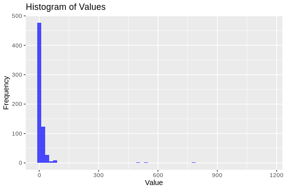

02 Apul lncRNA distribution
================
Steven Roberts
14 September, 2023

- <a href="#01-lncrna-fasta" id="toc-01-lncrna-fasta">0.1 lncRNA fasta</a>

Lets take lncRNA file and see where in genome we find

## 0.1 lncRNA fasta

``` bash
tail ../../DEF-cross-species/data/apul_bedtools_lncRNAs.fasta

fgrep ">" -c ../../DEF-cross-species/data/apul_bedtools_lncRNAs.fasta
```

    ## >::NW_025323431.1:208-473
    ## ttttaaacgtcgtttcgtctctcctatgtattgtagattacagcggttgcattgaatcatgtagatgaggtttttagtttcacaagtaaggttaaattttatggggcgagtttccccggtagaaaagaaggtatatgtagtaagtccgtgagaaatgtagggacaagtagcgcagtttttgccacaacggaaagaaccacaaggaagttgaggattggcagaattagaagggagtttagctgtaactaataagtcacgaaggttg
    ## >::NW_025323433.1:674-908
    ## ggggtcgacagacccgatccaacagatcacaagtatctcaagctcaagtgtgtcaaattcaacgagaagaaaacgtatcctgaaactttgaagccgcaaccgcgtttaaagtgttacttatatcacaatttctttttttcgttatcaatcctgttaagtcgatttaagcaatctaagctttattttcccgtgtattaaacaccatttagttcaatgtcaacattcgcatgcgtt
    ## >::NW_025323441.1:682-973
    ## CCACAGTGTCAAATACTGCAAAGTTCAAGAAGCAACAAAATCACTGATCTTTCCGGTCCTGATTCCAAGGCAATTGCGATATCATTATGGACACGGATTAAGGCCGTTTCAGTACCGTGAAGTTTTCTTTAATCTttctttttagtcttttttttttttttttctttaatcttcCTCTTTAAATATTCTTCCTAATCACttccaccacaacatgacaatttttGGCTTTTACTCATACCatagaaacacagaaagccacgAGAAATCTCTCAAGAGGGTTCATTTCATACA
    ## >::NW_025323449.1:960-1165
    ## ttaacaattattcctcgagcccgaatgggctattgactcagagcccatgagggcgaggaataattgttttagtaaaatccaactagttggtcaaaaaaatatcaagactaaacgtctttcgcaagttaaagctagacttcaatcctcttttaccgccaaaacattacaaatatggcggcgcgtttcgctactagtgggctataac
    ## >::NW_025323450.1:1113-1479
    ## ttttttttttgcgatgcTTGCCTCGACAATTGAAGGTTAAAAACGATGCAACATACCTTTAATTACCCTAAGTTGTCGAAGCCTCGCTGTTCCAACAAGTACTGCAGTACCGTGATCGGCAACAAATCTGTCATCATAGTAGTGTAACACCTCAAACCCCACTTCAATGTTACTGATtatgcttttcttctttttcacctTTGCGTTTTTCTCTCGCTTAACTTCCTCAGTCGTGGTTTCTTCTTTTAAGAGGTTCTCATCATCGATGGCGAAGGGACCGTACCAATATCGTGGCATAAGAGTGGGAATAAGGGTATCTTGGACCCATTTCCAATATGACTCATAATCGGCCACCTGGAAAAATAA
    ## 15854

``` bash

cat ../../DEF-cross-species/data/apul_bedtools_lncRNAs.fasta | grep '^>' | sed -n 's/.*::\([^:]*\):.*/\1/p' | sort | uniq -c | awk '{$1=$1; print}' |  head
```

    ## 1160 NC_058066.1
    ## 858 NC_058067.1
    ## 625 NC_058068.1
    ## 757 NC_058069.1
    ## 787 NC_058070.1
    ## 502 NC_058071.1
    ## 777 NC_058072.1
    ## 643 NC_058073.1
    ## 557 NC_058074.1
    ## 829 NC_058075.1

``` bash

cat ../../DEF-cross-species/data/apul_bedtools_lncRNAs.fasta | grep '^>' | sed -n 's/.*::\([^:]*\):.*/\1/p' | sort | uniq -c  | awk '{$1=$1; print}' > ../output/07-Apul-lncRNA-dist/scaffold-count.txt
```

``` r
# Read the data using read.csv with a space separator
data <- read.csv("../output/07-Apul-lncRNA-dist/scaffold-count.txt", header = FALSE, sep = " ", col.names = c("Value", "Label"))
```

``` r
ggplot(data, aes(x=Value)) +
  geom_histogram(binwidth=20, fill="blue", alpha=0.7) +
  ggtitle("Histogram of Values") +
  xlab("Value") +
  ylab("Frequency")
```


