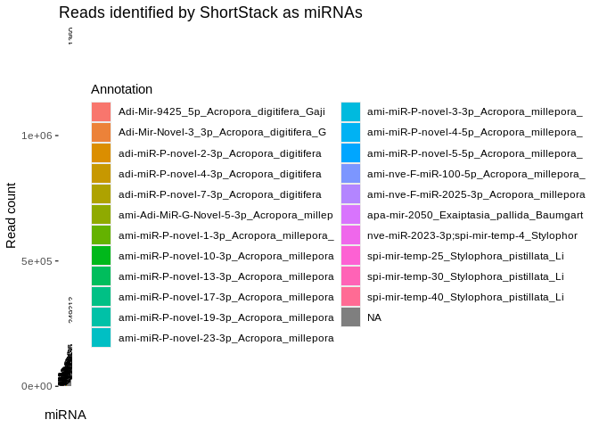
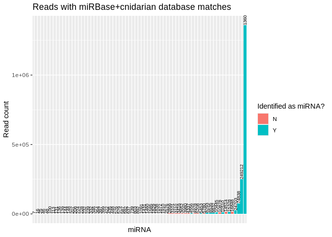
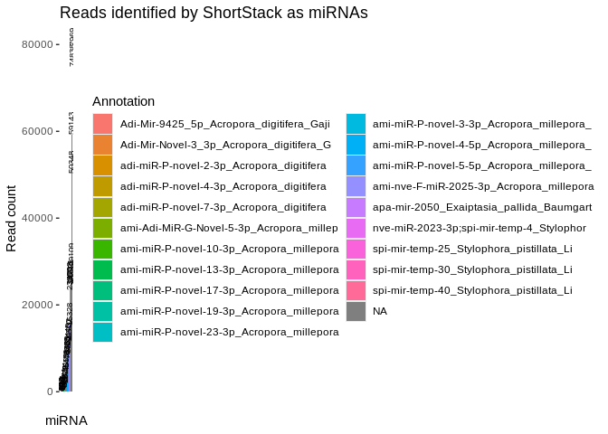
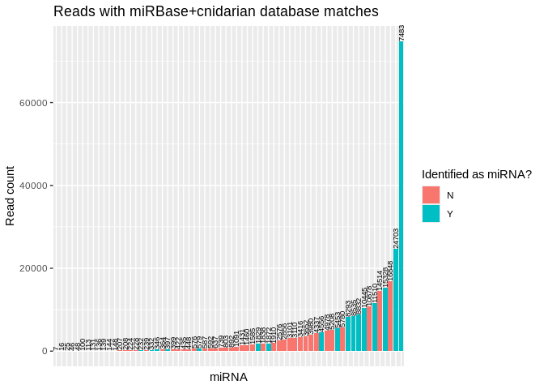
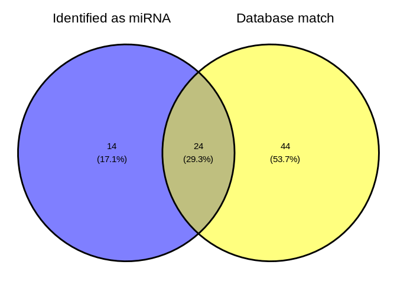

13.2.1-Apul-sRNAseq-ShortStack-31bp-fastp-merged-cnidarian_miRBase
================
Sam White
2024-02-15

- <a href="#1-set-r-variables" id="toc-1-set-r-variables">1 Set R
  variables</a>
- <a href="#2-create-a-bash-variables-file"
  id="toc-2-create-a-bash-variables-file">2 Create a Bash variables
  file</a>
- <a href="#3-load-shortstack-conda-environment"
  id="toc-3-load-shortstack-conda-environment">3 Load ShortStack conda
  environment</a>
- <a href="#4-run-shortstack" id="toc-4-run-shortstack">4 Run
  ShortStack</a>
  - <a href="#41-modify-genome-filename-for-shortstack-compatability"
    id="toc-41-modify-genome-filename-for-shortstack-compatability">4.1
    Modify genome filename for ShortStack compatability</a>
  - <a href="#42-excecute-shortstack-command"
    id="toc-42-excecute-shortstack-command">4.2 Excecute ShortStack
    command</a>
  - <a href="#43-check-runtime" id="toc-43-check-runtime">4.3 Check
    runtime</a>
- <a href="#5-results" id="toc-5-results">5 Results</a>
  - <a href="#51-shortstack-synopsis" id="toc-51-shortstack-synopsis">5.1
    ShortStack synopsis</a>
  - <a href="#52-inspect-resultstxt" id="toc-52-inspect-resultstxt">5.2
    Inspect <code>Results.txt</code></a>
    - <a href="#521-directory-tree-of-all-shortstack-outputs"
      id="toc-521-directory-tree-of-all-shortstack-outputs">5.2.1 Directory
      tree of all ShortStack outputs</a>
  - <a href="#53-visualize" id="toc-53-visualize">5.3 Visualize</a>
- <a href="#6-citations" id="toc-6-citations">6 Citations</a>

Use [ShortStack](https://github.com/MikeAxtell/ShortStack) ([Axtell
2013](#ref-axtell2013a); [Shahid and Axtell 2014](#ref-shahid2014);
[Johnson et al. 2016](#ref-johnson2016a))to perform alignment of sRNAseq
data and annotation of sRNA-producing genes.

This is the same ShortStack analysis as seen in
[13.2-Apul-sRNAseq-ShortStack-31bp-fastp-merged.Rmd](https://github.com/urol-e5/deep-dive/blob/main/D-Apul/code/13.2-Apul-sRNAseq-ShortStack-31bp-fastp-merged.Rmd),
but this analysis uses a customized miRBase database, utilizing
cnidarian miRNAs curated by Jill Ashley, which includes published
cnidarian miRNAs:

- [`cnidarian-mirbase-mature-v22.1.fasta`](../../data/cnidarian-mirbase-mature-v22.1.fasta)

The *A.millepora* genome will be used as the reference genome for
*A.pulchra*, as *A.pulchra* does not currently have a sequenced genome
and *A.millepora* had highest alignment rates for standard RNAseq data
compared to other published genomes tested.

------------------------------------------------------------------------

Inputs:

- Requires trimmed sRNAseq files generated by
  [08.2-Dapul-sRNAseq-trimming-31bp-fastp-merged.Rmd](https://github.com/urol-e5/deep-dive/blob/main/D-Apul/code/08.2-Dapul-sRNAseq-trimming-31bp-fastp-merged.Rmd)

  - Filenames formatted: `*fastp-adapters-polyG-31bp-merged.fq.gz`

- *A.millepora* genome FastA. See
  [12-Apul-sRNAseq-MirMachine.Rmd](https://github.com/urol-e5/deep-dive/blob/main/D-Apul/code/12-Apul-sRNAseq-MirMachine.Rmd)
  for download info if needed.

Outputs:

- See [ShortStack outputs
  documentation](https://github.com/MikeAxtell/ShortStack#outputs) for
  full list and detailed descriptions.

Software requirements:

- Utilizes a
  [ShortStack](https://github.com/MikeAxtell/ShortStack#installation)
  Conda/Mamba environment, per the installation instructions.

Replace with name of your ShortStack environment and the path to the
corresponding conda installation (find this *after* you’ve activated the
environment).

E.g.

``` bash
# Activate environment
conda activate ShortStack4_env

# Find conda path
which conda
```

------------------------------------------------------------------------

# 1 Set R variables

``` r
shortstack_conda_env_name <- c("ShortStack-4.0.3_env")
shortstack_cond_path <- c("/home/sam/programs/mambaforge/condabin/conda")
```

# 2 Create a Bash variables file

This allows usage of Bash variables across R Markdown chunks.

``` bash
{
echo "#### Assign Variables ####"
echo ""

echo "# Trimmed FastQ naming pattern"
echo "export trimmed_fastqs_pattern='*fastp-adapters-polyG-31bp-merged.fq.gz'"

echo "# Data directories"
echo 'export deep_dive_dir=/home/shared/8TB_HDD_01/sam/gitrepos/deep-dive'
echo 'export deep_dive_data_dir="${deep_dive_dir}/data"'
echo 'export output_dir_top=${deep_dive_dir}/D-Apul/output/13.2.1-Apul-sRNAseq-ShortStack-31bp-fastp-merged-cnidarian_miRBase'
echo 'export trimmed_fastqs_dir="${deep_dive_dir}/D-Apul/output/08.2-Apul-sRNAseq-trimming-31bp-fastp-merged/trimmed-reads"'
echo ""

echo "# Input/Output files"
echo 'export genome_fasta_dir=${deep_dive_dir}/D-Apul/data/Amil/ncbi_dataset/data/GCF_013753865.1'
echo 'export genome_fasta_name="GCF_013753865.1_Amil_v2.1_genomic.fna"'
echo 'export shortstack_genome_fasta_name="GCF_013753865.1_Amil_v2.1_genomic.fa"'

echo 'export mirbase_mature_fasta_version=cnidarian-mirbase-mature-v22.1.fasta'
echo 'export genome_fasta="${genome_fasta_dir}/${shortstack_genome_fasta_name}"'
echo ""

echo "# Set number of CPUs to use"
echo 'export threads=40'
echo ""

echo "# Initialize arrays"
echo 'export trimmed_fastqs_array=()'


} > .bashvars

cat .bashvars
```

    #### Assign Variables ####

    # Trimmed FastQ naming pattern
    export trimmed_fastqs_pattern='*fastp-adapters-polyG-31bp-merged.fq.gz'
    # Data directories
    export deep_dive_dir=/home/shared/8TB_HDD_01/sam/gitrepos/deep-dive
    export deep_dive_data_dir="${deep_dive_dir}/data"
    export output_dir_top=${deep_dive_dir}/D-Apul/output/13.2.1-Apul-sRNAseq-ShortStack-31bp-fastp-merged-cnidarian_miRBase
    export trimmed_fastqs_dir="${deep_dive_dir}/D-Apul/output/08.2-Apul-sRNAseq-trimming-31bp-fastp-merged/trimmed-reads"

    # Input/Output files
    export genome_fasta_dir=${deep_dive_dir}/D-Apul/data/Amil/ncbi_dataset/data/GCF_013753865.1
    export genome_fasta_name="GCF_013753865.1_Amil_v2.1_genomic.fna"
    export shortstack_genome_fasta_name="GCF_013753865.1_Amil_v2.1_genomic.fa"
    export mirbase_mature_fasta_version=cnidarian-mirbase-mature-v22.1.fasta
    export genome_fasta="${genome_fasta_dir}/${shortstack_genome_fasta_name}"

    # Set number of CPUs to use
    export threads=40

    # Initialize arrays
    export trimmed_fastqs_array=()

# 3 Load [ShortStack](https://github.com/MikeAxtell/ShortStack) conda environment

If this is successful, the first line of output should show that the
Python being used is the one in your
$$ShortStack$$(<https://github.com/MikeAxtell/ShortStack> conda
environment path.

E.g.

`python:         /home/sam/programs/mambaforge/envs/mirmachine_env/bin/python`

``` r
use_condaenv(condaenv = shortstack_conda_env_name, conda = shortstack_cond_path)

# Check successful env loading
py_config()
```

    python:         /home/sam/programs/mambaforge/envs/ShortStack-4.0.3_env/bin/python
    libpython:      /home/sam/programs/mambaforge/envs/ShortStack-4.0.3_env/lib/libpython3.10.so
    pythonhome:     /home/sam/programs/mambaforge/envs/ShortStack-4.0.3_env:/home/sam/programs/mambaforge/envs/ShortStack-4.0.3_env
    version:        3.10.13 | packaged by conda-forge | (main, Dec 23 2023, 15:36:39) [GCC 12.3.0]
    numpy:          /home/sam/programs/mambaforge/envs/ShortStack-4.0.3_env/lib/python3.10/site-packages/numpy
    numpy_version:  1.26.4

    NOTE: Python version was forced by use_python() function

# 4 Run ShortStack

## 4.1 Modify genome filename for ShortStack compatability

``` bash
# Load bash variables into memory
source .bashvars

# Check for FastA file first
# Then create rename file if doesn't exist
if [ -f "${genome_fasta_dir}/${shortstack_genome_fasta_name}" ]; then
  echo "${genome_fasta_dir}/${shortstack_genome_fasta_name}"
  echo ""
  echo "Already exists. Nothing to do."
  echo ""
else

  # Copy genome FastA to ShortStack-compatible filename (ending with .fa)
  cp ${genome_fasta_dir}/${genome_fasta_name} ${genome_fasta_dir}/${shortstack_genome_fasta_name}
fi

# Confirm
ls -lh ${genome_fasta_dir}/${shortstack_genome_fasta_name}
```

    /home/shared/8TB_HDD_01/sam/gitrepos/deep-dive/D-Apul/data/Amil/ncbi_dataset/data/GCF_013753865.1/GCF_013753865.1_Amil_v2.1_genomic.fa

    Already exists. Nothing to do.

    -rw-r--r-- 1 sam sam 460M Nov  6  2023 /home/shared/8TB_HDD_01/sam/gitrepos/deep-dive/D-Apul/data/Amil/ncbi_dataset/data/GCF_013753865.1/GCF_013753865.1_Amil_v2.1_genomic.fa

## 4.2 Excecute ShortStack command

Uses the `--dn_mirna` option to identify miRNAs in the genome, without
relying on the `--known_miRNAs`.

This part of the code redirects the output of `time` to the end of
`shortstack.log` file.

- `; } \ 2>> ${output_dir_top}/shortstack.log`

``` bash
# Load bash variables into memory
source .bashvars

# Make output directory, if it doesn't exist
mkdir --parents "${output_dir_top}"

# Create array of trimmed FastQs
trimmed_fastqs_array=(${trimmed_fastqs_dir}/${trimmed_fastqs_pattern})


# Pass array contents to new variable as space-delimited list
trimmed_fastqs_list=$(echo "${trimmed_fastqs_array[*]}")


###### Run ShortStack ######
{ time \
ShortStack \
--genomefile "${genome_fasta}" \
--readfile ${trimmed_fastqs_list} \
--known_miRNAs ${deep_dive_data_dir}/${mirbase_mature_fasta_version} \
--dn_mirna \
--threads ${threads} \
--outdir ${output_dir_top}/ShortStack_out \
&> ${output_dir_top}/shortstack.log ; } \
2>> ${output_dir_top}/shortstack.log
```

## 4.3 Check runtime

``` bash
# Load bash variables into memory
source .bashvars

tail -n 3 ${output_dir_top}/shortstack.log \
| grep "real" \
| awk '{print "ShortStack runtime:" "\t" $2}'
```

    ShortStack runtime: 46m10.802s

# 5 Results

## 5.1 ShortStack synopsis

``` bash
# Load bash variables into memory
source .bashvars

tail -n 25 ${output_dir_top}/shortstack.log
```

    Writing final files

    Found a total of 38 MIRNA loci


    Non-MIRNA loci by DicerCall:
    N 18768
    22 39
    23 32
    21 12
    24 6

    Creating visualizations of microRNA loci with strucVis
    <<< WARNING >>>
    Do not rely on these results alone to annotate new MIRNA loci!
    The false positive rate for de novo MIRNA identification is low, but NOT ZERO
    Insepct each mirna locus, especially the strucVis output, and see
    https://doi.org/10.1105/tpc.17.00851 , https://doi.org/10.1093/nar/gky1141

    Tue 02 Apr 2024 08:56:32 -0700 PDT
    Run Completed!

    real    46m10.802s
    user    779m56.322s
    sys 253m43.749s

ShortStack identified 38 miRNAs.

## 5.2 Inspect `Results.txt`

``` bash
# Load bash variables into memory
source .bashvars

head ${output_dir_top}/ShortStack_out/Results.txt

echo ""
echo "----------------------------------------------------------"
echo ""

echo "Nummber of potential loci:"
awk '(NR>1)' ${output_dir_top}/ShortStack_out/Results.txt | wc -l
```

    Locus   Name    Chrom   Start   End Length  Reads   DistinctSequences   FracTop Strand  MajorRNA    MajorRNAReads   Short   Long    21  22  23  24  DicerCall   MIRNA   known_miRNAs
    NC_058066.1:152483-152910   Cluster_1   NC_058066.1 152483  152910  428 140 32  0.05    -   UAAGUACUUUAUCAACUAACUCUAGGCA    75  1   130 0   2   0   7   N   N   NA
    NC_058066.1:161064-161674   Cluster_2   NC_058066.1 161064  161674  611 549 247 0.2987249544626594  .   UUUUAGCCUAGUGCGGGUUUCCAGACGU    43  25  479 16  4   4   21  N   N   NA
    NC_058066.1:172073-172496   Cluster_3   NC_058066.1 172073  172496  424 105 40  0.12380952380952381 -   GCGAUUAUUAACGGCUGGAACGACAGGCGA  16  1   88  1   1   0   14  N   N   NA
    NC_058066.1:203242-203651   Cluster_4   NC_058066.1 203242  203651  410 100 45  0.56    .   UUCUGACUCUAUUAGCAACGAAGACUUU    26  1   96  0   1   0   2   N   N   NA
    NC_058066.1:204535-205150   Cluster_5   NC_058066.1 204535  205150  616 313 157 0.7763578274760383  .   UCCCAACACGUCUAGACUGUACAAUUUCU   32  3   304 1   1   2   2   N   N   NA
    NC_058066.1:205745-206966   Cluster_6   NC_058066.1 205745  206966  1222    1930    416 0.35544041450777203 .   CAAAAGAGCGGACAAAAUAGUCGACAGAUU  716 3   1882    5   10  7   23  N   N   NA
    NC_058066.1:210841-211344   Cluster_7   NC_058066.1 210841  211344  504 1247    333 0.7457898957497995  .   UAAUACUUGUAGUGAAGGUUCAAUCUCGA   95  10  1133    7   7   20  70  N   N   NA
    NC_058066.1:349655-351297   Cluster_8   NC_058066.1 349655  351297  1643    3279    1165    0.8127477889600488  +   UCAGCUUGGAAAUGACAGCUUUUGACGU    255 27  3141    10  22  17  62  N   N   NA
    NC_058066.1:351491-353439   Cluster_9   NC_058066.1 351491  353439  1949    8889    1615    0.4114073574080324  .   UUUCAAAUCAAAGAUCUUCGCAACGAUGA   780 82  8503    34  34  114 122 N   N   NA

    ----------------------------------------------------------

    Nummber of potential loci:
    18895

Column 20 of the `Results.txt` file identifies if a cluster is a miRNA
or not (`Y` or `N`).

``` bash
# Load bash variables into memory
source .bashvars

echo "Number of loci characterized as miRNA:"
awk '$20=="Y" {print $0}' ${output_dir_top}/ShortStack_out/Results.txt \
| wc -l
echo ""

echo "----------------------------------------------------------"

echo ""
echo "Number of loci _not_ characterized as miRNA:"
awk '$20=="N" {print $0}' ${output_dir_top}/ShortStack_out/Results.txt \
| wc -l
```

    Number of loci characterized as miRNA:
    38

    ----------------------------------------------------------

    Number of loci _not_ characterized as miRNA:
    18857

Column 21 of the `Results.txt` file identifies if a cluster aligned to a
known miRNA (miRBase) or not (`Y` or `NA`).

Since there are no miRNAs, the following code will *not* print any
output.

The `echo` command after the `awk` command is simply there to prove that
the chunk executed.

``` bash
# Load bash variables into memory
source .bashvars

echo "Number of loci matching miRBase miRNAs:"
awk '$21!="NA" {print $0}' ${output_dir_top}/ShortStack_out/Results.txt \
| wc -l
echo ""

echo "----------------------------------------------------------"

echo ""
echo "Number of loci _not_ matching miRBase miRNAs:"
awk '$21=="NA" {print $0}' ${output_dir_top}/ShortStack_out/Results.txt \
| wc -l
```

    Number of loci matching miRBase miRNAs:
    69

    ----------------------------------------------------------

    Number of loci _not_ matching miRBase miRNAs:
    18827

Although there are loci with matches to miRBase miRNAs, ShortStack did
*not* annotate these clusters as miRNAs likely [because they do not
*also* match secondary structure
criteria](https://github.com/MikeAxtell/ShortStack#mirna-annotation).

### 5.2.1 Directory tree of all ShortStack outputs

Many of these are large (by GitHub standards) BAM files, so will not be
added to the repo.

Additionally, it’s unlikely we’ll utilize most of the other files
(bigwig) generated by ShortStack.

``` bash
# Load bash variables into memory
source .bashvars

tree -h ${output_dir_top}/
```

    /home/shared/8TB_HDD_01/sam/gitrepos/deep-dive/D-Apul/output/13.2.1-Apul-sRNAseq-ShortStack-31bp-fastp-merged-cnidarian_miRBase/
    ├── [ 22K]  shortstack.log
    └── [ 36K]  ShortStack_out
        ├── [ 31K]  alignment_details.tsv
        ├── [1.1M]  Counts.txt
        ├── [106K]  known_miRNAs.gff3
        ├── [1.8M]  known_miRNAs_unaligned.fasta
        ├── [5.3M]  merged_alignments_21_m.bw
        ├── [5.8M]  merged_alignments_21_p.bw
        ├── [5.1M]  merged_alignments_22_m.bw
        ├── [5.5M]  merged_alignments_22_p.bw
        ├── [ 10M]  merged_alignments_23-24_m.bw
        ├── [ 11M]  merged_alignments_23-24_p.bw
        ├── [1.4G]  merged_alignments.bam
        ├── [227K]  merged_alignments.bam.csi
        ├── [ 65M]  merged_alignments_other_m.bw
        ├── [ 67M]  merged_alignments_other_p.bw
        ├── [ 46M]  merged_alignments_sRNA-ACR-140-S1-TP2-fastp-adapters-polyG-31bp-merged.bw
        ├── [ 50M]  merged_alignments_sRNA-ACR-145-S1-TP2-fastp-adapters-polyG-31bp-merged.bw
        ├── [ 48M]  merged_alignments_sRNA-ACR-150-S1-TP2-fastp-adapters-polyG-31bp-merged.bw
        ├── [ 41M]  merged_alignments_sRNA-ACR-173-S1-TP2-fastp-adapters-polyG-31bp-merged.bw
        ├── [ 41M]  merged_alignments_sRNA-ACR-178-S1-TP2-fastp-adapters-polyG-31bp-merged.bw
        ├── [ 11K]  mir.fasta
        ├── [1.9M]  Results.gff3
        ├── [2.8M]  Results.txt
        ├── [256M]  sRNA-ACR-140-S1-TP2-fastp-adapters-polyG-31bp-merged.bam
        ├── [224K]  sRNA-ACR-140-S1-TP2-fastp-adapters-polyG-31bp-merged.bam.csi
        ├── [291M]  sRNA-ACR-145-S1-TP2-fastp-adapters-polyG-31bp-merged.bam
        ├── [227K]  sRNA-ACR-145-S1-TP2-fastp-adapters-polyG-31bp-merged.bam.csi
        ├── [304M]  sRNA-ACR-150-S1-TP2-fastp-adapters-polyG-31bp-merged.bam
        ├── [229K]  sRNA-ACR-150-S1-TP2-fastp-adapters-polyG-31bp-merged.bam.csi
        ├── [268M]  sRNA-ACR-173-S1-TP2-fastp-adapters-polyG-31bp-merged.bam
        ├── [227K]  sRNA-ACR-173-S1-TP2-fastp-adapters-polyG-31bp-merged.bam.csi
        ├── [240M]  sRNA-ACR-178-S1-TP2-fastp-adapters-polyG-31bp-merged.bam
        ├── [228K]  sRNA-ACR-178-S1-TP2-fastp-adapters-polyG-31bp-merged.bam.csi
        └── [4.0K]  strucVis
            ├── [ 12K]  Cluster_10055.ps
            ├── [ 30K]  Cluster_10055.txt
            ├── [ 11K]  Cluster_10187.ps
            ├── [5.6K]  Cluster_10187.txt
            ├── [ 12K]  Cluster_10487.ps
            ├── [ 11K]  Cluster_10487.txt
            ├── [ 11K]  Cluster_10675.ps
            ├── [7.3K]  Cluster_10675.txt
            ├── [ 11K]  Cluster_10726.ps
            ├── [2.2K]  Cluster_10726.txt
            ├── [ 11K]  Cluster_10729.ps
            ├── [2.2K]  Cluster_10729.txt
            ├── [ 11K]  Cluster_1506.ps
            ├── [ 11K]  Cluster_1506.txt
            ├── [ 11K]  Cluster_16040.ps
            ├── [2.0K]  Cluster_16040.txt
            ├── [ 11K]  Cluster_16041.ps
            ├── [1.7K]  Cluster_16041.txt
            ├── [ 11K]  Cluster_17867.ps
            ├── [1.3K]  Cluster_17867.txt
            ├── [ 12K]  Cluster_1900.ps
            ├── [8.7K]  Cluster_1900.txt
            ├── [ 12K]  Cluster_1998.ps
            ├── [ 32K]  Cluster_1998.txt
            ├── [ 12K]  Cluster_2057.ps
            ├── [7.9K]  Cluster_2057.txt
            ├── [ 12K]  Cluster_2074.ps
            ├── [ 41K]  Cluster_2074.txt
            ├── [ 12K]  Cluster_2521.ps
            ├── [ 40K]  Cluster_2521.txt
            ├── [ 11K]  Cluster_2522.ps
            ├── [ 27K]  Cluster_2522.txt
            ├── [ 12K]  Cluster_2551.ps
            ├── [ 22K]  Cluster_2551.txt
            ├── [ 11K]  Cluster_3019.ps
            ├── [5.0K]  Cluster_3019.txt
            ├── [ 12K]  Cluster_3087.ps
            ├── [6.3K]  Cluster_3087.txt
            ├── [ 12K]  Cluster_3090.ps
            ├── [3.5K]  Cluster_3090.txt
            ├── [ 11K]  Cluster_316.ps
            ├── [ 18K]  Cluster_316.txt
            ├── [ 12K]  Cluster_3672.ps
            ├── [ 15K]  Cluster_3672.txt
            ├── [ 12K]  Cluster_3973.ps
            ├── [ 21K]  Cluster_3973.txt
            ├── [ 12K]  Cluster_4247.ps
            ├── [ 29K]  Cluster_4247.txt
            ├── [ 11K]  Cluster_4867.ps
            ├── [ 15K]  Cluster_4867.txt
            ├── [ 11K]  Cluster_514.ps
            ├── [3.5K]  Cluster_514.txt
            ├── [ 12K]  Cluster_5241.ps
            ├── [ 57K]  Cluster_5241.txt
            ├── [ 12K]  Cluster_548.ps
            ├── [ 52K]  Cluster_548.txt
            ├── [ 12K]  Cluster_6376.ps
            ├── [ 21K]  Cluster_6376.txt
            ├── [ 11K]  Cluster_6439.ps
            ├── [ 42K]  Cluster_6439.txt
            ├── [ 12K]  Cluster_6958.ps
            ├── [ 42K]  Cluster_6958.txt
            ├── [ 12K]  Cluster_6965.ps
            ├── [ 11K]  Cluster_6965.txt
            ├── [ 12K]  Cluster_6977.ps
            ├── [ 63K]  Cluster_6977.txt
            ├── [ 12K]  Cluster_7025.ps
            ├── [ 14K]  Cluster_7025.txt
            ├── [ 11K]  Cluster_7077.ps
            ├── [ 24K]  Cluster_7077.txt
            ├── [ 11K]  Cluster_8475.ps
            ├── [4.6K]  Cluster_8475.txt
            ├── [ 12K]  Cluster_8545.ps
            ├── [ 29K]  Cluster_8545.txt
            ├── [ 12K]  Cluster_9460.ps
            └── [ 28K]  Cluster_9460.txt

    2 directories, 109 files

## 5.3 Visualize

We noticed that a) not all of the identified miRNAs have database
matches, and b) some reads have a match in the database but are *not*
classified as miRNAs. Let’s look at this in more depth.

``` r
Apul_shortstack_results <- read.csv("../output/13.2.1-Apul-sRNAseq-ShortStack-31bp-fastp-merged-cnidarian_miRBase/ShortStack_out/Results.txt", sep="\t")
```

``` r
# Reads identified as miRNAs (but not necessarily known)
Apul_shortstack_results %>% 
  filter(MIRNA == "Y") %>%
  mutate(known_miRNAs = str_sub(known_miRNAs, 1, 40)) %>%
  mutate(Locus = str_sub(Locus, 20, 40)) %>%
  ggplot(aes(x = reorder(Locus, Reads), y = Reads, fill = known_miRNAs)) +
  geom_bar(stat = "identity") +
   geom_text(aes(label = Reads), vjust = 0.5, hjust = 0, color = "black", size = 2.5, angle = 90) +
  labs(x = "miRNA", y = "Read count", 
       title = "Reads identified by ShortStack as miRNAs",
       fill = "Annotation") +
  theme(axis.text.x = element_blank(),
        axis.ticks.x = element_blank())
```

<!-- -->

``` r
ggsave("../output/13.2.1-Apul-sRNAseq-ShortStack-31bp-fastp-merged-cnidarian_miRBase/figures/Apul_ShortStack_miRNA_histogram.png", width = 12, height = 7, units = "in")


# Reads matched in the reference db (but not necessarily identified as miRNA)
Apul_shortstack_results %>% 
  filter(!is.na(known_miRNAs)) %>%
  mutate(known_miRNAs = str_sub(known_miRNAs, 1, 40)) %>%
  mutate(Locus = str_sub(Locus, 20, 40)) %>%
  ggplot(aes(x = reorder(Locus, Reads), y = Reads, fill = MIRNA)) +
  geom_bar(stat = "identity") +
  geom_text(aes(label = Reads), vjust = 0.5, hjust = 0, color = "black", size = 2.5, angle = 90) +
  labs(x = "miRNA", y = "Read count", 
       title = "Reads with miRBase+cnidarian database matches",
       fill = "Identified as miRNA?") +
  theme(axis.text.x = element_blank(),
        axis.ticks.x = element_blank())
```

<!-- -->

``` r
ggsave("../output/13.2.1-Apul-sRNAseq-ShortStack-31bp-fastp-merged-cnidarian_miRBase/figures/Apul_ShortStack_dbmatch_histogram.png", width = 12, height = 7, units = "in")
```

There’s two miRNAs with very high read counts, and it’s making
visualization of the rest difficult. Let’s remove them and retry
visualizing the rest.

``` r
# Reads identified as miRNAs (but not necessarily known)
Apul_shortstack_results %>% 
  filter(MIRNA == "Y") %>%
  filter(Reads < 200000) %>%
  mutate(known_miRNAs = str_sub(known_miRNAs, 1, 40)) %>%
  mutate(Locus = str_sub(Locus, 20, 40)) %>%
  ggplot(aes(x = reorder(Locus, Reads), y = Reads, fill = known_miRNAs)) +
  geom_bar(stat = "identity") +
   geom_text(aes(label = Reads), vjust = 0.5, hjust = 0, color = "black", size = 2.5, angle = 90) +
  labs(x = "miRNA", y = "Read count", 
       title = "Reads identified by ShortStack as miRNAs",
       fill = "Annotation") +
  theme(axis.text.x = element_blank(),
        axis.ticks.x = element_blank())
```

<!-- -->

``` r
ggsave("../output/13.2.1-Apul-sRNAseq-ShortStack-31bp-fastp-merged-cnidarian_miRBase/figures/Apul_ShortStack_miRNA_histogram_reduced.png", width = 12, height = 7, units = "in")


# Reads matched in the reference db (but not necessarily identified as miRNA)
Apul_shortstack_results %>% 
  filter(!is.na(known_miRNAs)) %>%
  filter(Reads < 200000) %>%
  mutate(known_miRNAs = str_sub(known_miRNAs, 1, 40)) %>%
  mutate(Locus = str_sub(Locus, 20, 40)) %>%
  ggplot(aes(x = reorder(Locus, Reads), y = Reads, fill = MIRNA)) +
  geom_bar(stat = "identity") +
  geom_text(aes(label = Reads), vjust = 0.5, hjust = 0, color = "black", size = 2.5, angle = 90) +
  labs(x = "miRNA", y = "Read count", 
       title = "Reads with miRBase+cnidarian database matches",
       fill = "Identified as miRNA?") +
  theme(axis.text.x = element_blank(),
        axis.ticks.x = element_blank())
```

<!-- -->

``` r
ggsave("../output/13.2.1-Apul-sRNAseq-ShortStack-31bp-fastp-merged-cnidarian_miRBase/figures/Apul_ShortStack_dbmatch_histogram_reduced.png", width = 12, height = 7, units = "in")
```

``` r
# Make list
mirnas <- Apul_shortstack_results %>% filter(MIRNA == "Y") %>% pull(Locus)
matches <- Apul_shortstack_results %>% filter(!is.na(known_miRNAs)) %>% pull(Locus)

Apul_shortstack_vennlist <- list(
  "Identified as miRNA" = mirnas,
  "Database match" = matches
)

# Make venn diagrams
ggvenn(Apul_shortstack_vennlist)
```

<!-- -->

``` r
ggsave("../output/13.2.1-Apul-sRNAseq-ShortStack-31bp-fastp-merged-cnidarian_miRBase/figures/Apul_ShortStack_venn.png", width = 12, height = 7, units = "in")
```

------------------------------------------------------------------------

# 6 Citations

<div id="refs" class="references csl-bib-body hanging-indent">

<div id="ref-axtell2013a" class="csl-entry">

Axtell, Michael J. 2013. “ShortStack: Comprehensive Annotation and
Quantification of Small RNA Genes.” *RNA* 19 (6): 740–51.
<https://doi.org/10.1261/rna.035279.112>.

</div>

<div id="ref-johnson2016a" class="csl-entry">

Johnson, Nathan R, Jonathan M Yeoh, Ceyda Coruh, and Michael J Axtell.
2016. “Improved Placement of Multi-Mapping Small RNAs.” *G3
Genes\|Genomes\|Genetics* 6 (7): 2103–11.
<https://doi.org/10.1534/g3.116.030452>.

</div>

<div id="ref-shahid2014" class="csl-entry">

Shahid, Saima, and Michael J. Axtell. 2014. “Identification and
Annotation of Small RNA Genes Using ShortStack.” *Methods* 67 (1):
20–27. <https://doi.org/10.1016/j.ymeth.2013.10.004>.

</div>

</div>
