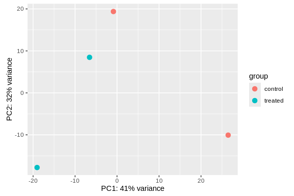
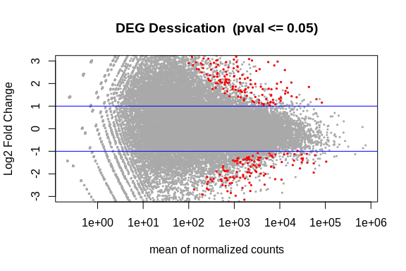

15-Hisat
================
Steven Roberts
14 May, 2024

- <a href="#1-run-hisat-on-rna-seq" id="toc-1-run-hisat-on-rna-seq">1 Run
  HiSat on RNA-seq</a>
  - <a href="#11-grab-trimmed-rna-seq-reads"
    id="toc-11-grab-trimmed-rna-seq-reads">1.1 Grab Trimmed RNA-seq
    Reads</a>
  - <a href="#12-genome" id="toc-12-genome">1.2 Genome</a>
  - <a href="#13-hisat" id="toc-13-hisat">1.3 HiSat</a>
    - <a href="#131-performance-tuning" id="toc-131-performance-tuning">1.3.1
      Performance tuning</a>
  - <a href="#14-convert-to-bam" id="toc-14-convert-to-bam">1.4 convert to
    bam</a>
  - <a href="#15-looking-at-bams" id="toc-15-looking-at-bams">1.5 Looking at
    Bams</a>
    - <a
      href="#151-an-alternate-faster-differential-expression-analysis-workflow"
      id="toc-151-an-alternate-faster-differential-expression-analysis-workflow">1.5.1
      An alternate, faster differential expression analysis workflow</a>
- <a href="#2-stringtie" id="toc-2-stringtie">2 StringTie</a>
  - <a href="#201-using-stringtie-with-deseq2-and-edger"
    id="toc-201-using-stringtie-with-deseq2-and-edger">2.0.1 <strong>Using
    StringTie with DESeq2 and edgeR</strong></a>
- <a href="#3-deseq" id="toc-3-deseq">3 DESeq</a>

# 1 Run HiSat on RNA-seq

Will end up with 5 sorted bam files.

## 1.1 Grab Trimmed RNA-seq Reads

``` bash

ls ../data/fastq/ 
```

    RNA-ACR-140-S1-TP2_R1_001.fastp-trim.20230519.fastq.gz
    RNA-ACR-140-S1-TP2_R2_001.fastp-trim.20230519.fastq.gz
    RNA-ACR-145-S1-TP2_R1_001.fastp-trim.20230519.fastq.gz
    RNA-ACR-145-S1-TP2_R2_001.fastp-trim.20230519.fastq.gz
    RNA-ACR-150-S1-TP2_R1_001.fastp-trim.20230519.fastq.gz
    RNA-ACR-150-S1-TP2_R2_001.fastp-trim.20230519.fastq.gz
    RNA-ACR-173-S1-TP2_R1_001.fastp-trim.20230519.fastq.gz
    RNA-ACR-173-S1-TP2_R2_001.fastp-trim.20230519.fastq.gz
    RNA-ACR-178-S1-TP2_R1_001.fastp-trim.20230519.fastq.gz
    RNA-ACR-178-S1-TP2_R2_001.fastp-trim.20230519.fastq.gz

## 1.2 Genome

``` bash
ls ../data/GCF_013753865.1_Amil_v2.1_genomic.fna
```

    ../data/GCF_013753865.1_Amil_v2.1_genomic.fna

``` bash
head ../data/Amil/ncbi_dataset/data/GCF_013753865.1/genomic.gtf

wc -l ../data/Amil/ncbi_dataset/data/GCF_013753865.1/genomic.gtf

grep -v '^#' ../data/Amil/ncbi_dataset/data/GCF_013753865.1/genomic.gtf | cut -f3 | sort | uniq

grep -c "transcript" ../data/Amil/ncbi_dataset/data/GCF_013753865.1/genomic.gtf

grep -c "gene" ../data/Amil/ncbi_dataset/data/GCF_013753865.1/genomic.gtf
```

    #gtf-version 2.2
    #!genome-build Amil_v2.1
    #!genome-build-accession NCBI_Assembly:GCF_013753865.1
    #!annotation-source NCBI Acropora millepora Annotation Release 101
    NC_058066.1 Gnomon  gene    1962    23221   .   -   .   gene_id "LOC114963522"; transcript_id ""; db_xref "GeneID:114963522"; gbkey "Gene"; gene "LOC114963522"; gene_biotype "lncRNA"; 
    NC_058066.1 Gnomon  transcript  1962    23221   .   -   .   gene_id "LOC114963522"; transcript_id "XR_003825913.2"; db_xref "GeneID:114963522"; gbkey "ncRNA"; gene "LOC114963522"; model_evidence "Supporting evidence includes similarity to: 100% coverage of the annotated genomic feature by RNAseq alignments, including 2 samples with support for all annotated introns"; product "uncharacterized LOC114963522"; transcript_biotype "lnc_RNA"; 
    NC_058066.1 Gnomon  exon    23085   23221   .   -   .   gene_id "LOC114963522"; transcript_id "XR_003825913.2"; db_xref "GeneID:114963522"; gene "LOC114963522"; model_evidence "Supporting evidence includes similarity to: 100% coverage of the annotated genomic feature by RNAseq alignments, including 2 samples with support for all annotated introns"; product "uncharacterized LOC114963522"; transcript_biotype "lnc_RNA"; exon_number "1"; 
    NC_058066.1 Gnomon  exon    21001   21093   .   -   .   gene_id "LOC114963522"; transcript_id "XR_003825913.2"; db_xref "GeneID:114963522"; gene "LOC114963522"; model_evidence "Supporting evidence includes similarity to: 100% coverage of the annotated genomic feature by RNAseq alignments, including 2 samples with support for all annotated introns"; product "uncharacterized LOC114963522"; transcript_biotype "lnc_RNA"; exon_number "2"; 
    NC_058066.1 Gnomon  exon    18711   18775   .   -   .   gene_id "LOC114963522"; transcript_id "XR_003825913.2"; db_xref "GeneID:114963522"; gene "LOC114963522"; model_evidence "Supporting evidence includes similarity to: 100% coverage of the annotated genomic feature by RNAseq alignments, including 2 samples with support for all annotated introns"; product "uncharacterized LOC114963522"; transcript_biotype "lnc_RNA"; exon_number "3"; 
    NC_058066.1 Gnomon  exon    1962    2119    .   -   .   gene_id "LOC114963522"; transcript_id "XR_003825913.2"; db_xref "GeneID:114963522"; gene "LOC114963522"; model_evidence "Supporting evidence includes similarity to: 100% coverage of the annotated genomic feature by RNAseq alignments, including 2 samples with support for all annotated introns"; product "uncharacterized LOC114963522"; transcript_biotype "lnc_RNA"; exon_number "4"; 
    874259 ../data/Amil/ncbi_dataset/data/GCF_013753865.1/genomic.gtf
    CDS
    exon
    gene
    start_codon
    stop_codon
    transcript
    874254
    874254

``` bash
head ../data/Amil/ncbi_dataset/data/GCF_013753865.1/genomic.gff

wc -l ../data/Amil/ncbi_dataset/data/GCF_013753865.1/genomic.gff

grep -v '^#' ../data/Amil/ncbi_dataset/data/GCF_013753865.1/genomic.gff | cut -f3 | sort | uniq

grep -c "transcript" ../data/Amil/ncbi_dataset/data/GCF_013753865.1/genomic.gff

grep -c "gene" ../data/Amil/ncbi_dataset/data/GCF_013753865.1/genomic.gff
```

    ##gff-version 3
    #!gff-spec-version 1.21
    #!processor NCBI annotwriter
    #!genome-build Amil_v2.1
    #!genome-build-accession NCBI_Assembly:GCF_013753865.1
    #!annotation-source NCBI Acropora millepora Annotation Release 101
    ##sequence-region NC_058066.1 1 39361238
    ##species https://www.ncbi.nlm.nih.gov/Taxonomy/Browser/wwwtax.cgi?id=45264
    NC_058066.1 RefSeq  region  1   39361238    .   +   .   ID=NC_058066.1:1..39361238;Dbxref=taxon:45264;Name=1;chromosome=1;collection-date=2017;country=Indonesia;gbkey=Src;genome=chromosome;isolate=JS-1;isolation-source=Whole tissue;mol_type=genomic DNA;tissue-type=Adult tissue
    NC_058066.1 Gnomon  gene    1962    23221   .   -   .   ID=gene-LOC114963522;Dbxref=GeneID:114963522;Name=LOC114963522;gbkey=Gene;gene=LOC114963522;gene_biotype=lncRNA
    828216 ../data/Amil/ncbi_dataset/data/GCF_013753865.1/genomic.gff
    cDNA_match
    CDS
    exon
    gene
    guide_RNA
    lnc_RNA
    mRNA
    pseudogene
    region
    rRNA
    snoRNA
    snRNA
    transcript
    tRNA
    431975
    803260

## 1.3 HiSat

``` bash
/home/shared/hisat2-2.2.1/hisat2_extract_exons.py \
../data/Amil/ncbi_dataset/data/GCF_013753865.1/genomic.gtf \
> ../output/15-Apul-hisat/m_exon.tab
```

``` bash
head ../output/15-Apul-hisat/m_exon.tab
wc -l ../output/15-Apul-hisat/m_exon.tab
```

    NC_058066.1 1961    2118    -
    NC_058066.1 15360   15663   +
    NC_058066.1 18710   18774   -
    NC_058066.1 21000   21092   -
    NC_058066.1 22158   22442   +
    NC_058066.1 23084   23220   -
    NC_058066.1 24770   25066   +
    NC_058066.1 26652   26912   +
    NC_058066.1 27071   27358   +
    NC_058066.1 27658   27951   +
    228010 ../output/15-Apul-hisat/m_exon.tab

``` bash

/home/shared/hisat2-2.2.1/hisat2_extract_splice_sites.py \
../data/Amil/ncbi_dataset/data/GCF_013753865.1/genomic.gtf \
> ../output/15-Apul-hisat/m_splice_sites.tab
```

``` bash
head ../output/15-Apul-hisat/m_splice_sites.tab
```

    NC_058066.1 2118    18710   -
    NC_058066.1 15663   22158   +
    NC_058066.1 18774   21000   -
    NC_058066.1 21092   23084   -
    NC_058066.1 22442   24770   +
    NC_058066.1 25066   26652   +
    NC_058066.1 26912   27071   +
    NC_058066.1 27358   27658   +
    NC_058066.1 27951   28247   +
    NC_058066.1 28534   29196   +

``` bash
/home/shared/hisat2-2.2.1/hisat2-build \
../data/GCF_013753865.1_Amil_v2.1_genomic.fna \
../output/15-Apul-hisat/GCF_013753865.1_Amil_v2.1.index \
--exon ../output/15-Apul-hisat/m_exon.tab \
--ss ../output/15-Apul-hisat/m_splice_sites.tab \
-p 40 \
../data/Amil/ncbi_dataset/data/GCF_013753865.1/genomic.gtf \
2> ../output/15-Apul-hisat/hisat2-build_stats.txt
```

``` bash
tail ../output/15-Apul-hisat/hisat2-build_stats.txt
```

        sideSz: 128
        sideGbwtSz: 104
        sideGbwtLen: 208
        numSides: 2299750
        numLines: 2299750
        gbwtTotLen: 294368000
        gbwtTotSz: 294368000
        reverse: 0
        linearFM: No
    Total time for call to driver() for forward index: 00:07:58

### 1.3.1 Performance tuning

If your computer has multiple processors/cores, use -p The -p option
causes HISAT2 to launch a specified number of parallel search threads.
Each thread runs on a different processor/core and all threads find
alignments in parallel, increasing alignment throughput by approximately
a multiple of the number of threads (though in practice, speedup is
somewhat worse than linear).

``` bash
find ../data/fastq/*R2_001.fastp-trim.20230519.fastq.gz \
| xargs basename -s -S1-TP2_R2_001.fastp-trim.20230519.fastq.gz | xargs -I{} \
/home/shared/hisat2-2.2.1/hisat2 \
-x ../output/15-Apul-hisat/GCF_013753865.1_Amil_v2.1.index \
--dta \
-p 20 \
-1 ../data/fastq/{}-S1-TP2_R1_001.fastp-trim.20230519.fastq.gz \
-2 ../data/fastq/{}-S1-TP2_R2_001.fastp-trim.20230519.fastq.gz \
-S ../output/15-Apul-hisat/{}.sam \
2> ../output/15-Apul-hisat/hisat.out
```

``` bash
cat ../output/15-Apul-hisat/hisat.out
```

    47710408 reads; of these:
      47710408 (100.00%) were paired; of these:
        27825914 (58.32%) aligned concordantly 0 times
        18559152 (38.90%) aligned concordantly exactly 1 time
        1325342 (2.78%) aligned concordantly >1 times
        ----
        27825914 pairs aligned concordantly 0 times; of these:
          1201636 (4.32%) aligned discordantly 1 time
        ----
        26624278 pairs aligned 0 times concordantly or discordantly; of these:
          53248556 mates make up the pairs; of these:
            42533390 (79.88%) aligned 0 times
            9692346 (18.20%) aligned exactly 1 time
            1022820 (1.92%) aligned >1 times
    55.43% overall alignment rate
    42864294 reads; of these:
      42864294 (100.00%) were paired; of these:
        24356414 (56.82%) aligned concordantly 0 times
        17135863 (39.98%) aligned concordantly exactly 1 time
        1372017 (3.20%) aligned concordantly >1 times
        ----
        24356414 pairs aligned concordantly 0 times; of these:
          1142678 (4.69%) aligned discordantly 1 time
        ----
        23213736 pairs aligned 0 times concordantly or discordantly; of these:
          46427472 mates make up the pairs; of these:
            36609836 (78.85%) aligned 0 times
            8675847 (18.69%) aligned exactly 1 time
            1141789 (2.46%) aligned >1 times
    57.30% overall alignment rate
    43712298 reads; of these:
      43712298 (100.00%) were paired; of these:
        30967520 (70.84%) aligned concordantly 0 times
        11666917 (26.69%) aligned concordantly exactly 1 time
        1077861 (2.47%) aligned concordantly >1 times
        ----
        30967520 pairs aligned concordantly 0 times; of these:
          791338 (2.56%) aligned discordantly 1 time
        ----
        30176182 pairs aligned 0 times concordantly or discordantly; of these:
          60352364 mates make up the pairs; of these:
            52153613 (86.42%) aligned 0 times
            7011301 (11.62%) aligned exactly 1 time
            1187450 (1.97%) aligned >1 times
    40.34% overall alignment rate
    47501524 reads; of these:
      47501524 (100.00%) were paired; of these:
        28603496 (60.22%) aligned concordantly 0 times
        17627744 (37.11%) aligned concordantly exactly 1 time
        1270284 (2.67%) aligned concordantly >1 times
        ----
        28603496 pairs aligned concordantly 0 times; of these:
          1201709 (4.20%) aligned discordantly 1 time
        ----
        27401787 pairs aligned 0 times concordantly or discordantly; of these:
          54803574 mates make up the pairs; of these:
            44045470 (80.37%) aligned 0 times
            9614980 (17.54%) aligned exactly 1 time
            1143124 (2.09%) aligned >1 times
    53.64% overall alignment rate
    42677752 reads; of these:
      42677752 (100.00%) were paired; of these:
        26422177 (61.91%) aligned concordantly 0 times
        15005422 (35.16%) aligned concordantly exactly 1 time
        1250153 (2.93%) aligned concordantly >1 times
        ----
        26422177 pairs aligned concordantly 0 times; of these:
          1009838 (3.82%) aligned discordantly 1 time
        ----
        25412339 pairs aligned 0 times concordantly or discordantly; of these:
          50824678 mates make up the pairs; of these:
            39698309 (78.11%) aligned 0 times
            9739502 (19.16%) aligned exactly 1 time
            1386867 (2.73%) aligned >1 times
    53.49% overall alignment rate

## 1.4 convert to bam

``` bash
for samfile in ../output/15-Apul-hisat/*.sam; do
  bamfile="${samfile%.sam}.bam"
  sorted_bamfile="${samfile%.sam}.sorted.bam"
  /home/shared/samtools-1.12/samtools view -bS -@ 20 "$samfile" > "$bamfile"
  /home/shared/samtools-1.12/samtools sort -@ 20 "$bamfile" -o "$sorted_bamfile"
  /home/shared/samtools-1.12/samtools index -@ 20 "$sorted_bamfile"
done
```

## 1.5 Looking at Bams

$$igv$$

------------------------------------------------------------------------

#### 1.5.0.1 **Differential expression analysis**

Together with [HISAT](http://ccb.jhu.edu/software/hisat2) and
[Ballgown](http://biorxiv.org/content/early/2014/09/05/003665),
StringTie can be used for estimating differential expression across
multiple RNA-Seq samples and generating plots and differential
expression tables as described in our [protocol
paper](http://www.nature.com/nprot/journal/v11/n9/full/nprot.2016.095.html).  
Our recommended workflow includes the following steps:

1.  for each RNA-Seq sample, map the reads to the genome with
    [HISAT2](http://ccb.jhu.edu/software/hisat2) using the --dta option.
    It is highly recommended to use the reference annotation information
    when mapping the reads, which can be either embedded in the genome
    index (built with the --ss and --exon options, see [HISAT2
    manual](http://ccb.jhu.edu/software/hisat2/manual.shtml#the-hisat2-build-indexer)),
    or provided separately at run time (using the
    --known-splicesite-infile option of
    [HISAT2](http://ccb.jhu.edu/software/hisat2/manual.shtml#running-hisat2)).
    The SAM output of each HISAT2 run must be sorted and converted to
    BAM using samtools as explained above.

2.  for each RNA-Seq sample, run StringTie to assemble the read
    alignments obtained in the previous step; it is recommended to run
    StringTie with the -G option if the reference annotation is
    available.

3.  run StringTie with **--merge** in order to generate a non-redundant
    set of transcripts observed in any of the RNA-Seq samples assembled
    previously. The stringtie --merge mode takes as input a list of all
    the assembled transcripts files (in GTF format) previously obtained
    for each sample, as well as a reference annotation file (-G option)
    if available.

4.  for each RNA-Seq sample, run StringTie using the -B/-b and -e
    options in order to estimate transcript abundances and generate read
    coverage tables for Ballgown. The -e option is not required but
    recommended for this run in order to produce more accurate abundance
    estimations of the input transcripts. Each StringTie run in this
    step will take as input the sorted read alignments (BAM file)
    obtained in step 1 for the corresponding sample and the -G option
    with the merged transcripts (GTF file) generated by stringtie
    --merge in step 3. Please note that this is the only case where the
    -G option is not used with a reference annotation, but with the
    global, merged set of transcripts as observed across all samples.
    (This step is the equivalent of the *Tablemaker* step described in
    the original [Ballgown
    pipeline](https://github.com/alyssafrazee/ballgown).)

5.  Ballgown can now be used to load the coverage tables generated in
    the previous step and perform various statistical analyses for
    differential expression, generate plots etc.

<!--# using faster -->

### 1.5.1 An alternate, faster differential expression analysis workflow

can be pursued if there is no interest in novel isoforms (i.e. assembled
transcripts present in the samples but missing from the reference
annotation), or if only a well known set of transcripts of interest are
targeted by the analysis. This simplified protocol has only 3 steps
(depicted below) as it bypasses the individual assembly of each RNA-Seq
sample and the *“transcript merge”* step.This simplified workflow attempts to directly
estimate and analyze the expression of a known set of transcripts as
given in the *reference annotation* file.

  

The R package
[**IsoformSwitchAnalyzeR**](https://bioconductor.org/packages/devel/bioc/html/IsoformSwitchAnalyzeR.html)
can be used to assign gene names to transcripts assembled by StringTie,
which can be particularly helpful in cases where StringTie could not
perform this assignment unambigiously.  
The `importIsoformExpression() + importRdata()` function of the package
can be used to import the expression and annotation data into R. During
this import the package will attempt to clean up and recover isoform
annotations where possible. From the resulting `switchAnalyzeRlist`
object, *IsoformSwitchAnalyzeR* can detect isoform switches along with
predicted functional consequences. The `extractGeneExpression()`
function can be used to get a gene expression (read count) matrix for
analysis with other tools.  
More information and code examples can be found
[here](https://bioconductor.org/packages/devel/bioc/vignettes/IsoformSwitchAnalyzeR/inst/doc/IsoformSwitchAnalyzeR.html#examples-visualizations).

  

# 2 StringTie

StringTie uses the sorted BAM files to assemble transcripts for each
sample, outputting them as GTF files. And then merges all individual GTF
assemblies into a single merged GTF file. This step extracts transcript
information and merges GTFs from all samples–an important step in
creating a canonical list of across all samples included in the
pipeline.

|             |                                                                                                                                                                                                                                                                                                                                             |
|:------------|:--------------------------------------------------------------------------------------------------------------------------------------------------------------------------------------------------------------------------------------------------------------------------------------------------------------------------------------------|
| -b \<path\> | Just like -B this option enables the output of \*.ctab files for Ballgown, but these files will be created in the provided directory \<path\> instead of the directory specified by the -o option. Note: adding the -e option is recommended with the -B/-b options, unless novel transcripts are still wanted in the StringTie GTF output. |

<table style="width:98%;">
<colgroup>
<col style="width: 6%" />
<col style="width: 91%" />
</colgroup>
<tbody>
<tr class="odd">
<td style="text-align: left;"><br />
-e</td>
<td style="text-align: left;">this option directs StringTie to operate
in <a
href="https://ccb.jhu.edu/software/stringtie/index.shtml?t=manual#emode">expression
estimation mode</a>; this limits the processing of read alignments to
estimating the coverage of the transcripts given with the -G option
(hence this option requires -G).</td>
</tr>
</tbody>
</table>

|                    |                                                                                                                                                                                                                                                                                                                                                                                              |
|:-------------------|:---------------------------------------------------------------------------------------------------------------------------------------------------------------------------------------------------------------------------------------------------------------------------------------------------------------------------------------------------------------------------------------------|
| -G \<ref_ann.gff\> | Use a [reference annotation file](https://ccb.jhu.edu/software/stringtie/index.shtml?t=manual#refann) (in [GTF or GFF3 format](https://ccb.jhu.edu/software/stringtie/gff.shtml)) to guide the assembly process. The output will include expressed reference transcripts as well as any novel transcripts that are assembled. This option is required by options -B, -b, -e, -C (see below). |

``` bash
find ../output/15-Apul-hisat/*sorted.bam \
| xargs basename -s .sorted.bam | xargs -I{} \
/home/shared/stringtie-2.2.1.Linux_x86_64/stringtie \
-p 20 \
-eB \
-G ../data/Amil/ncbi_dataset/data/GCF_013753865.1/genomic.gff \
-o ../output/15-Apul-hisat/{}.gtf \
../output/15-Apul-hisat/{}.sorted.bam
```

``` bash
wc -l ../output/15-Apul-hisat/RNA*.gtf
ls ../output/15-Apul-hisat/RNA*.gtf
#head ../output/15-Apul-hisat/RNA*.gtf
```

       445208 ../output/15-Apul-hisat/RNA-ACR-140.gtf
       445208 ../output/15-Apul-hisat/RNA-ACR-145.gtf
       445208 ../output/15-Apul-hisat/RNA-ACR-150.gtf
       445208 ../output/15-Apul-hisat/RNA-ACR-173.gtf
       445208 ../output/15-Apul-hisat/RNA-ACR-178.gtf
      2226040 total
    ../output/15-Apul-hisat/RNA-ACR-140.gtf
    ../output/15-Apul-hisat/RNA-ACR-145.gtf
    ../output/15-Apul-hisat/RNA-ACR-150.gtf
    ../output/15-Apul-hisat/RNA-ACR-173.gtf
    ../output/15-Apul-hisat/RNA-ACR-178.gtf

The R package
[**IsoformSwitchAnalyzeR**](https://bioconductor.org/packages/devel/bioc/html/IsoformSwitchAnalyzeR.html)
can be used to assign gene names to transcripts assembled by StringTie,
which can be particularly helpful in cases where StringTie could not
perform this assignment unambigiously.  
The `importIsoformExpression() + importRdata()` function of the package
can be used to import the expression and annotation data into R. During
this import the package will attempt to clean up and recover isoform
annotations where possible. From the resulting `switchAnalyzeRlist`
object, *IsoformSwitchAnalyzeR* can detect isoform switches along with
predicted functional consequences. The `extractGeneExpression()`
function can be used to get a gene expression (read count) matrix for
analysis with other tools.  
More information and code examples can be found
[here](https://bioconductor.org/packages/devel/bioc/vignettes/IsoformSwitchAnalyzeR/inst/doc/IsoformSwitchAnalyzeR.html#examples-visualizations).

---

### 2.0.1 **Using StringTie with DESeq2 and edgeR**

  

[DESeq2](https://bioconductor.org/packages/release/bioc/html/DESeq2.html)
and
[edgeR](https://bioconductor.org/packages/release/bioc/html/edgeR.html)
are two popular [Bioconductor](https://www.bioconductor.org/) packages
for analyzing differential expression, which take as input a matrix of
read counts mapped to particular genomic features (e.g., genes). We
provide a Python script
([prepDE.py](https://ccb.jhu.edu/software/stringtie/dl/prepDE.py), or
the Python 3 version:
[prepDE.py3](https://ccb.jhu.edu/software/stringtie/dl/prepDE.py3) )
that can be used to extract this read count information directly from
the files generated by StringTie (run with the -e parameter).

*prepDE.py* derives hypothetical read counts for each transcript from
the coverage values estimated by StringTie for each transcript, by using
this simple formula: *reads_per_transcript = coverage \* transcript_len
/ read_len*

There are two ways to provide input to the prepDE.py script:

- one option is to provide a path to a directory containing all sample
  sub-directories, with the same structure as the *ballgown*directory in
  the [StringTie protocol
  paper](http://www.nature.com/nprot/journal/v11/n9/full/nprot.2016.095.html)
  in preparation for Ballgown. By default (no -i option), the script is
  going to look in the current directory for all sub-directories having
  .gtf files in them, as in this example:

          ./sample1/sample1.gtf
          ./sample2/sample2.gtf
          ./sample3/sample3.gtf

- Alternatively, one can provide a text file listing sample IDs and
  their respective paths
  ([sample_lst.txt](https://ccb.jhu.edu/software/stringtie/dl/sample_lst.txt)).

Usage: prepDE.py $$options$$  
generates two CSV files containing the count matrices for genes and
transcripts, using the coverage values found in the output of stringtie
-e  

Options:

------------------------------------------------------------------------

-h, --help show this help message and exit

-i INPUT, a folder containing all sample sub-directories, or a
--input=INPUT, text file with sample ID and path to its GTF file on
--in=INPUT each line $$default: . $$

-g G where to output the gene count matrix $$default:
                       gene_count_matrix.csv$$

-t T where to output the transcript count matrix $$default:
                       transcript_count_matrix.csv$$

-l LENGTH, the average read length $$default: 75$$ --length=LENGTH

-p PATTERN, a regular expression that selects the sample
--pattern=PATTERN subdirectories

-c, --cluster whether to cluster genes that overlap with different gene
IDs, ignoring ones with geneID pattern (see below)

-s STRING, if a different prefix is used for geneIDs assigned by
--string=STRING StringTie $$default: MSTRG$$

-k KEY, --key=KEY if clustering, what prefix to use for geneIDs assigned
by this script $$default: prepG$$

--legend=LEGEND if clustering, where to output the legend file mapping
transcripts to assigned geneIDs $$default:
                       legend.csv$$ ——————– ——————————————————

  

These count matrices (CSV files) can then be imported into R for use by
DESeq2 and edgeR (using the *DESeqDataSetFromMatrix* and *DGEList*
functions, respectively).

##### 2.0.1.0.1 **Protocol: Using StringTie with DESeq2**

Given a list of GTFs, which were re-estimated upon merging, users can
follow the below protocol to use DESeq2 for differential expression
analysis. To generate GTFs from raw reads follow the [StringTie protocol
paper](http://www.nature.com/nprot/journal/v11/n9/full/nprot.2016.095.html)
(up to the Ballgown step).

As described above, prepDE.py either accepts a .txt
([sample_lst.txt](https://ccb.jhu.edu/software/stringtie/dl/sample_lst.txt))
file listing the sample IDs and the GTFs’ paths or by default expects a
ballgown directory produced by StringTie run with the -B option. The
following steps leads us through generating count matrices for genes and
transcripts, importing this data into DESeq2, and conducting some basic
analysis.

1.  Generate count matrices using prepDE.py  

    1.  Assuming default ballgown directory structure produced by
        StringTie  
        \$ python prepDE.py

    2.  List of GTFs sample IDs and paths
        ([sample_lst.txt](https://ccb.jhu.edu/software/stringtie/dl/sample_lst.txt))  
        \$ python prepDE.py -i sample_lst.txt

2.  [Install R](https://cran.r-project.org/) and DESeq2. Upon installing
    R, install DESeq2 on R:  
    `> source("https://bioconductor.org/biocLite.R")> biocLite("DESeq2")`

3.  Import DESeq2 library in R  
    `> library("DESeq2")`

4.  Load gene(/transcript) count matrix and labels  
    `> countData <- as.matrix(read.csv("gene_count_matrix.csv", row.names="gene_id"))> colData <- read.csv(PHENO_DATA, sep="\t", row.names=1)`  
    Note: The PHENO_DATA file contains information on each sample, e.g.,
    sex or population. The exact way to import this depends on the
    format of the file.

5.  Check all sample IDs in colData are also in CountData and match
    their orders  
    `> all(rownames(colData) %in% colnames(countData))`$$1$$ TRUE  
    `> countData <- countData[, rownames(colData)]> all(rownames(colData) == colnames(countData))`$$1$$
    TRUE

6.  Create a DESeqDataSet from count matrix and labels  
    `> dds <- DESeqDataSetFromMatrix(countData = countData,         colData = colData, design = ~ CHOOSE_FEATURE)`

7.  Run the default analysis for DESeq2 and generate results table  
    `> dds <- DESeq(dds)> res <- results(dds)`

8.  Sort by adjusted p-value and display  
    `> (resOrdered <- res[order(res$padj), ])`

------------------------------------------------------------------------

``` bash
python /home/shared/stringtie-2.2.1.Linux_x86_64/prepDE.py 
```

``` bash
python /home/shared/stringtie-2.2.1.Linux_x86_64/prepDE.py \
-i ../data/list01.txt \
-g ../output/15-Apul-hisat/gene_count_matrix.csv \
-t ../output/15-Apul-hisat/transcript_count_matrix.csv
```

# 3 DESeq

``` r
library(DESeq2)
```

``` r
# Load gene(/transcript) count matrix and labels
countData <- as.matrix(read.csv("../output/15-Apul-hisat/gene_count_matrix.csv", row.names="gene_id"))
colData <- read.csv("../data/conditions.txt", sep="\t", row.names=1)

# Note: The PHENO_DATA file contains information on each sample, e.g., sex or population.
# The exact way to import this depends on the format of the file.

# Check all sample IDs in colData are also in CountData and match their orders
all(rownames(colData) %in% colnames(countData)) # This should return TRUE
```

    [1] TRUE

``` r
countData <- countData[, rownames(colData)]
all(rownames(colData) == colnames(countData)) # This should also return TRUE
```

    [1] TRUE

``` r
# Create a DESeqDataSet from count matrix and labels
dds <- DESeqDataSetFromMatrix(countData = countData,
                              colData = colData, design = ~ Condition)

# Run the default analysis for DESeq2 and generate results table
dds <- DESeq(dds)
deseq2.res <- results(dds)

# Sort by adjusted p-value and display
resOrdered <- deseq2.res[order(deseq2.res$padj), ]
```

``` r
vsd <- vst(dds, blind = FALSE)
plotPCA(vsd, intgroup = "Condition")
```



``` r
tmp <- deseq2.res
# The main plot
plot(tmp$baseMean, tmp$log2FoldChange, pch=20, cex=0.45, ylim=c(-3, 3), log="x", col="darkgray",
     main="DEG Dessication  (pval <= 0.05)",
     xlab="mean of normalized counts",
     ylab="Log2 Fold Change")
# Getting the significant points and plotting them again so they're a different color
tmp.sig <- deseq2.res[!is.na(deseq2.res$padj) & deseq2.res$padj <= 0.05, ]
points(tmp.sig$baseMean, tmp.sig$log2FoldChange, pch=20, cex=0.45, col="red")
# 2 FC lines
abline(h=c(-1,1), col="blue")
```


