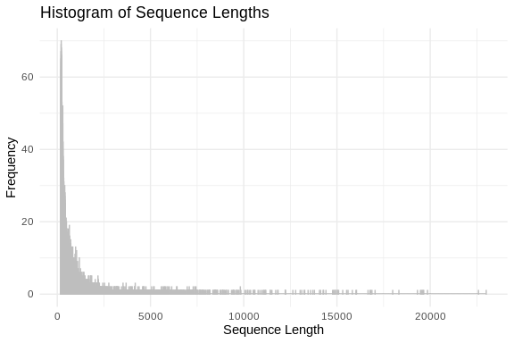
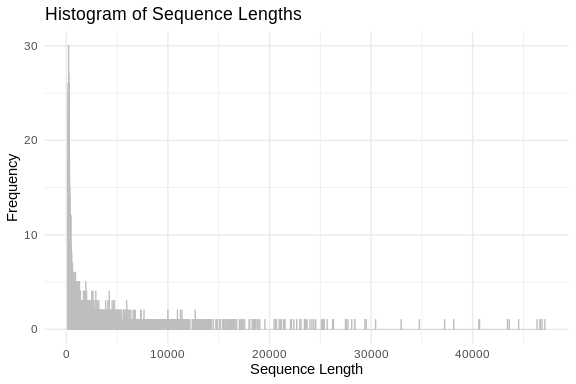
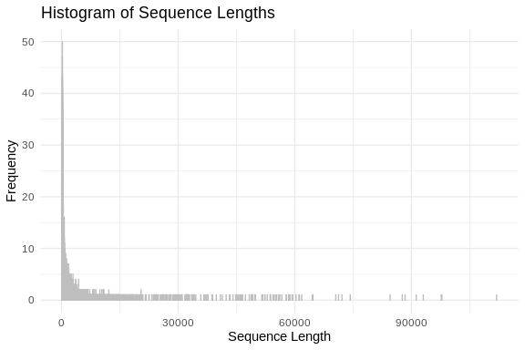
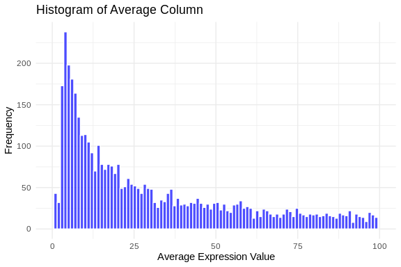

lncRNA Comparison
================
Steven Roberts
11 August, 2023

- <a href="#01-grabbing-3-fastas" id="toc-01-grabbing-3-fastas">0.1
  grabbing 3 fastas..</a>
- <a href="#02-file-format" id="toc-02-file-format">0.2 File format</a>
- <a href="#03-length-distribution" id="toc-03-length-distribution">0.3
  length distribution</a>
- <a href="#04-counts" id="toc-04-counts">0.4 counts</a>
- <a href="#05-peve-count-matrix" id="toc-05-peve-count-matrix">0.5 Peve
  Count matrix</a>
  - <a href="#051-avg-expression-distribution"
    id="toc-051-avg-expression-distribution">0.5.1 avg expression
    distribution</a>
- <a href="#06-blast-comparison" id="toc-06-blast-comparison">0.6 blast
  comparison</a>

## 0.1 grabbing 3 fastas..

``` bash
cd ../data

curl -O https://raw.githubusercontent.com/zbengt/coral-lncRNA/main/ouput/apul_bedtools_lncRNAs.fasta
```

``` bash
cd ../data

curl -O https://raw.githubusercontent.com/zbengt/coral-lncRNA/main/ouput/peve_bedtools_lncRNAs.fasta
```

``` bash
cd ../data

curl -O https://raw.githubusercontent.com/zbengt/coral-lncRNA/main/ouput/pmea_bedtools_lncRNAs.fasta
```

## 0.2 File format

``` bash

head ../data/*fasta
```

    ## ==> ../data/apul_bedtools_lncRNAs.fasta <==
    ## >::NC_058066.1:468618-469943
    ## taactgatcaaaacgtatcttcctacaacattaatttgacagtggcgtttctcaactgaccaatcaaaacttacatttgaaaatttggtgATGGTgcgtttacaactcgtgtatctttacgtcacacaaccatgtttgcATACTCTCTTGCaaccacgcctctcggccaatcagagcgcgcgcgtactatcttagttattttataaagatAAATACGCCCTAGGATTAGCACGCACGCTATGGTATAATTATTGATGATAACTTTGCTGGATTTACGTTTGGTTGAAGTTATCATGATATtccatcgtcgtcatcatcaacATTCTTATCGTTTATCTTCATCACAATCACCTGACACAACATGACTAAAAGCAAAGATGAAAACACTCTTACATCACCAGCCCGTGTGTGGCCATCAACGCATGCATGCGCATCACCATATCTCCTGGGTAGTGTCAGCCATGAACAGCAGTTTCGGTGTTGTTAGGTCTCgtctagtctccttcgcagccgtctttcgggacggggagcgttgcgtgacatcccgaaagacggctgcgaaggagactaggtctCGTCAAGAGTGGATCAGGTAGGAGTGTTCCTCAATCACCTTACGGTAATATCCCAGCACTGTCGGAAACCTCACCTTTAACCCAACAGCTTAAGTAATATTATTCAGCCATGTCTCGCTTACCCGGACATACTTCGTCGCTTCAATGTCATTAACAGTACTATTATTTCGGAAATGGACTTTTTGGGGAATCGTTACAGTTACAGCAACTTATTTTCAAGGAATTGTGTATTCTAATTTCCAAAGAAATTGTGGTGTTGCGTCGGTGAGACCGTAacagtgaaacatgaaaattgggtttttatcagacgagttggtaaaggtcgaattaccaccgtgaaagatttggaaagctgacttttcgagcgttagcccttcgtcagagcaagtGAATTATTCTAAAAATATACTGTGCTGGCTAGCCTGCATACATCCAATGGGAACACCCTTACCTGATCCCCTCTCGTTGTCACAGCATAGCCGTTGAACCATCTTCGGAAATGTCATAACCTCAACCTCTTTTTTGAACAAAATGTCTGTCACCACAGAAAcgacaaaataaataaatactcAAGAATTCATCGTTTAAAATAGCGATTCAAGAAGAACAGCTGTTACTGTAGTTGCGCCCACTAGCAAAGCCTCTTTTGTTGAccgctgcatgcagacgaggcttacgggtcaatacaatggaaaacgACCTGTCAGCTTCGTTTATGTGTGAAAACCGCTGTTAACTAGTACAGAATGT
    ## >::NC_058066.1:1144883-1148491
    ## AATAATCATACTTTCCAGCTCATAGTGAAAAATGAAACATGCGCCAACACTGATCCTAGTGAAAGGAAAATGACTTTCAGCTGGTGAGAGTCCAAAAGCATAATTTACCTAGAAAATCTCATTGAAATCGAAATAAATTATGTCACTTCTCGGCTGAAATTTGCATAATGTACTGGTACTCACAAGGCTTTGAAAATTATTATCAAATTTCAGTCAatataaaatgcagactgcagattTCAGACTcttctcattaattttgtttttggtgGCAGCATTTTGGGTTTTACTGTAAAATATGATGTTCTGTTGGCTTGCAAGGATTGTGAGTTATTTTCATTACAATCTAATCTTTTTAGGCTGTGTaatttttgtgcactgaaaCAAAACCATTTGTAAATGGGCATCTTGCACTAAaagttgaatgtttttttttttttaaatctcaaCTGCACATACTTTTTTAAACTGGCACAATTCCCTGGCTTTGCCccaaaagcaacaaaacaacaaaaggcaaggaacaaaaaaaaaaccttgaaagTTATGTTTACAGAATCAATGAATACTTTTCATTCAACTAACTCTTTCATGTTTTAATAACACCATGTTCCCAGAAGTAGCAGTTCCACCACTTCCTAAATAGGTCAAGAAGAACCCTCACTTACACTATTTGCTCTGATGACGGGCTAACAGCTGAAAGATCATCTTTGcaacttttaataataattattagtaatcTGACCTctatcaacttgtttaataccaaaCCATTGTACTTCACTTTCCCCAATGATGTGACACCACAGTTTCTCAAGAAACTAGACACTTCATTTGTTTGACAATGCTGTAGTCCAATTAAGCAAGATCACTTATCACCAACACATTACTCTGTCACCAATATTTCTGAGCAAGCCCTTGAAATTGAAACTTCAGTCCCACCCACAAATAAGTAAATTGAATCTATAAGTAATAGTGTACATTATGCAGTGCAAAAGGAGAACTGTGCTTAGAGTACAAGTATGATATACATGAGCCCCTTGATGTTCAAAGGTCTGACAGTGCTATTCAGTGGAGAAATGAATATCTATTGGATAAGTAccaccaaaacctattgagttatccagtggatggtgatttatccaatagatagtgctatccaccaTTTGAACATCAGGGACCAAGACAAAAGTACTGACTCTGTCTTTTGAAACTGGTCCAGAAATCCAGAAACCACAAATTCCATTCATGATTGCCATGCATATTTCTTGTCAGGCTTTCTTTGGTCAAAAGTAAGCTAGATAATATGCAATGTCATAAGCCTTTTGCTACAATAAAATACAAGAGAAAACTTCCCTCCACATTCTCACTAATTTGTTGGGGTTTAGAGCTTGTAATTATCATCTTTACTATCCATTATTTCTTGCTTGCTACTATGATTAGTACTGCTGTTCCTTCTTTGTCAGTTTGTTGTGCTGGTGAAATGCATTTGGGTATGAATCTACACAGTTACTGCAAAGATAAAAGATGAGCTGCACCTTcttcaaaaaaattattgtttgaaattgtGCACATGATCCTTTCTTGATGGACATTACATAACAAAGCAGACTTTTAAAGTAACATAGCATTTGTAAGGAAAGGAATTAGATGCAATATTAAAGTAGTTTGCAGTTATGCATTTGTGCGTAtttttgaaggaaaataatattgcagaataattattttctatgCCACTCTGATTTGCAAATTTGTTATGATAATTTTGCAACCATGAAAACATTTTGTATTATTACCATCTTACCATCTCACCATTACCAGGTCACATGACCATGGTTTATTAAAGTAAATGCAAAAATTCTCAATTCCTTTCCATAAAATTAACTGGCATACTAgcacaaagaacaaaaaacatcATCTTGGGACAGTACACAGTTCGCAAAGATCTTTCAATTTTTCGTAATGAAGACTGGTGATCAGCTTTAAACCTAATTCTTTGCTTATTTCTATTGACACAAGTCAAActgcttttttacactgatgaatgGCTCTGCCCGAAatatttgtacattttttaatgtaaatttaactttatttttgtttttatagtGTCACGCactgttttccaattttttgaTGCTTCAAATTTTGTATGTGCTGTCTGCTTTTACAGTGCAATGTTTGACTGGCTGCCAAGAGTAAggttttctttgctttgctttCGTATCATTCCATCAATTTCGTTGAGCTTTCTAATAGTTTGTTAGGTTTGGTTTGCTTTAAGTTTGCATCATTTGATTGATTGTTTGAGCTGTTTATTTGAATGACTACTATTCATTCGATCAGCTGGAGCATTTGAGCctttttttaagtttgtttGAGCGTTGTTTGAATCTGTTCAAAATTTGAATCACTTACTATTTCTTTGATCTTTTTACAGAGAGAACTGATATTTAAGACAAACTGTTCTGTTATGACCTAATACTCTTCACgtggaaaaacaaaagagcaaaattaatgcaCAAATGAAAAGCCAAATTTCccaaattttttctttttttttccccccACATttaataagaaagaaaaatgtttgggaTTCATGGTATTTATTTTTCCCTTGAAAGCTTATTTTTCATACTTCAAAATGATatctatttataaataaatgttgATGATTCTTTTTTCTGCCAACTAGCATTTCTCACAAAAATTAGCACTCATTTAAACTCTCCTTTTTCTGATTCTTCCAGCACAGTTTGTTGCAATCATCACCTTTCAATACATTTCAATCAGGTACTACTAATGTACAGTAGATAAGAATCAGTAGATTGAATAAAATTCAGTTTTCCCTGGACTGAACTGTAAGTTCCCTTGGTTTGAAGGCTTATGCCATTATCCATTTTCCTGACACATGACAATCATAAAATCAAAAACCTCCCAAATAAATCAAGAGCTGCTCAATATCTATCATACTTGTTTCTTGCACAACAGTTTTCCTTTTGTGATATACTTGGCTCACTTatgaaagaacaaaagaaaagatcaTAATTATAGCTACATCATCCTGCTTGCCTTGACTTTTGGATAATGGGTCTCCATCTGTCTGTTGTACCATTCTGTTAATTGAAGCAAATAAAGATTGAAAAGTTGGCATTAAAAGACGAACTTAAGCAAAAGCATTTAAGGCAGTTTTCAGAATGTTCTGAatccatttttttcatttatggcTCTGTTAACTTAATGTATAATTTTCGCAAAGGCTTTAACTAAATTTTGACACACAATTGACTCATATTGATCAGAGGGTACAAAGTTGGCCGCATAGCACTAGTGATTAAtagaatacaccttattccaaagtggcggccaataaattattcttttgtttgcatgttaattagccctcttcgccatgtataaaaaacaaaagaattttgaagcgaaaatgaggcaaagagagctaataaacatgcaaacaaaagattatttattggccgccattttggaataaggtgtatacagtagtcaataattattattagaaggTTTAGCACTTTTGTTCACCACGTTCTCATACACAGATGGATCAcattaaattcatcatc
    ## >::NC_058066.1:1153398-1165634
    ## GCGAGCGTGATCTTCAGTTCGTTTCGAGGTTCAAAAAAACACATTGCCAACAACAGTGGAGTAAAGGGGTATTATTCTTGCACAGTACCTCAACAGTTCTTGCTTTTGcttcacaaacaataatatgGATTCGTACCAGttggattattattttttgggaAAGAAATGTCGGATGAAACATGAATTACGACCTACTTTGTTTACGGATCTCGTCCGTTGCAACTCAAGCGTTTTCACTGGTTTTCGTCATCAAATAACCGTTCTTGGCTTCGTCGAAATAAACCGTTGGCGAAGAAAATTGTCATGATCCATTGACAGCGTTATGGAAGCGTTATGTAAGCTAAAACAAGTGACACAGGAGGTAAGCACGTAAAGCTTAAACACATTCGATTCATCGCCATGGTTATGAACCTATTATGCgcttaagtttaagttttattgCAAAGGATGTAATCTTTTCCAAAATCTGTGGGAACTCCTCACGACAATTTGCAAGCTCAGGCAAAGCATTTTTGCAACGTTTGTCGTTTGCCAGcattcataatattatttactaTTAAAGATAATGGCAGTGGCATAAAACTGAAGTGTTTCcgaaattttcaaatgtgttgTGTTTCTCTTAAAGCTAACGTCTCACTAATGGAATGTAACACATGTTACTCTGCCCAAGCAATATGAGGAATGTTATTAATGGCTTTGAACCATGAGAGCAATTCCCATGCTGCATCAGCTGGGGCCATAGTGAGAAATGCACCACTTGTTCCATGATAATAGTTGTCAGTTATTCCATTTCGTGTTGGGatgaaagccacagttttgtcaTTGATGATGTAGAGACAAGCTGTCTTGGTCATGTTACGGGCTTGTAGAAAGTAATATGGAAGACATGCTGATTGTATCTGCTCTCTGGTGATACTTGCTGGTAACTCTCCAGACATGTGTATACTGCCAAGAACTCTGGCCTGCTGCATTTTGGTAGCTGAATCTTGGACACCAAACATCTGCCCAGAGTTGCCAGCAAATTTGTCATAGAACTTGTTGCCAATCATAATACCGGCAAGGGTGCGATGCATCCAGGTGTTGCTCAATGGCTGGCTACTGTTGTGAGTTTCAGGCGAGGAGAAATATAGTTTACTGTATGAGAGTGCAATGAAAGTGCATGCATTGCTACCTAATCGGCCAGTCAAAGTAGATTGGGAGTATTGGGGTGGAAAGTGCCAGCTTATGACTCTGTCAGATGTTGAAGGATTTATTAGTAGATGCTGAGTGACGGAATGGATTTCTACTGTTGAGGACTGAGGTTGGTTGTGAGCATGAGAGGCTTGTGCATTTGCATGTTTCGGTTGATCAATGCCCCCAATTCCTGTTAGGATATTGTCTACTTTCTGCTCCCAAACTCCAGGCCCgggttgttcaaacgatggatagcactatccaccggataaatcgctatccacaggataagtaatagcgaaaccaattattgcgatatccaatggatagtgatttatcaggtggatagcgttatccaccttttgaacaactggggccagatgtaTAATACTGCTCAGCATTTGTATCAGTGACTTCATTGTTTCCGTCAATTGTATCATCATCAGTGTCAGACTCACTTAGGTTGTCATCAGTGTCTGTATTTTGTacgtttttaaagcaaatgtcaTTTCTAATTTCGTAGCATGTATCTCCAGTTTACTCAAACAAGGTATACAGTACCTGatgctgtttccttctcttgtagggttgtgtcaagttgtttttcaagagttgGTGCAGAACATTCCCGAGAAgttccaattattttttatagtaattttgtcattgtttcacaTTATATacgattatcattattattattatcatcatcaccattgTGATACTTGTTTATCATTAGGAGATTGACCATTGCTCGTAATGGAGGTTTTAGCTTGTCTCTTAAATCAAATGAGTAGAAAGCTATTTATCGTTGTTTAATCCTGAAATTTTatacatttgtttgtttttgatagtttaATAGTGGCATTGGATAAGCTGTCCTTTTGTATTTATATGCTAAACAAAGATTAGCTAAAAAGACAATAGAAAAAAGTGTGGGCGCAACAAAAGTCCactgtttaattgttttcttttatcttaaaaacCGTGGAAATATTGTCTTGCTTTGGCTTTTTCCCTCAAGACAACAGCCAGGTATGTTATTGACTATTGTTGGTAAAACATAACGTACTTTTGGGGGAGGATTCTAGTCTGGTTCTTGCGAGAAAACAGTATCCGCGATTGTGGCGCACTTGTTGCATCAGCGTGCTCCGGGACGGTAATTGGTGGATATTCGTCCCTATCCTATCAAACAACCTGTTAAGTCTCTTGGGGATTTTCCTTCTTGAAAGTTCACTCGAGTGTTGTTGTAGCGGACAGGAGCAGAAAGCATTAGCCTCTCGGGTGGCTCTCATCAAGTGGCGAGAACAAGTCCGGCAATTTAAGTTCCCACCCACAAAACGGGCAGTTGCATCGTCAAGTCTCCTCATAAGACCTCGGCATTCTCCTCCAGCTCTggtttttttctgaaaccagTAGATCCTCCCTTCAGGTTGAGCATTTGTCCTCAAAAGTATTATCGCGTATGCGGCACAACAGGACATGATTTTATCGCGAACAAAACTTCGGTGTTCGTTCACTTTTTTCACTGCTTGCACAAATTTTAAACCACTTTGTACAAACAACGACAGGATTGGGCTGTTAGGAGGGGCATATGTTCAAAAGTTCAAGCTAGTGTTTACAGGTTAACTCTAGTTTTTCACGAGAAACCGGGGGCTattcacaaaattttgaaatagccGCCATTTTCAATCGAATTGTTGTCATGTCCAATCTTCGCGCGCCATAACTGtgcacatgcgcagacgttattcagccctgtcGATGGGTAGGGCATACTCCCACACTACATGTCAGCTCGCCCCAGATCCTGTGTGCAAGACTTACACGCCTAGCGATCATTTACCATGCACCAACCAGAAGGTTCCATTGTCCACAATAATATATTGACTTCTCATGTCGTATACTTGAACAAGTAGAGCATGAGTTTCCAGCTGTAATTGGCTGATTTTGTATATGTAATAGGACTACATGctgtccaatttggaaataattgaaTGAGAAAAATTCTGAAGACAGCCAAAATTggacgaggccgtaggccgagtccAATTTGGCAATTATTACCAATTATTTCCTAATTTCCCAATTATTTCTTAATTTCCTAATTGGATATTTCAAATTTAGACAGTTGGCAAAAGTTAATAAAAAATAGATCTGTTGGCAATATTGGATTTTGATGCAGCTATATAGATAATTAAGCAAGAGTACAAGAATGTCTCTTGACAATAACATGCACAatgcaaatacccaaatatacTCAAATTAGAACAAAATTCAGACTCAGAAAAGACTAAGAAAACAAATCTGTTACAATGATCCAGGAGCcaacaataatgttattattcTTTTCCTTCCTGTCTGAAAGGGATTGGTGTTTGAAAGCTAGCTAAAAGTACCAGAAACTGATGTATCAGTATCTCAAGATGAATCAGCATAATTTGTACAATCAATGCTCCAGCAAAGCTTATACTGTACTATATACTGTTTCAGCTGCTGGTATCATTATTTTCACCTCAAGGCTAAGGTAAAAATAATTGAGTGATTAACTTTCCTTATTGAAGCAAGCCATAGCTCAATCACTAAGATGTTATTTCCTTTTAGTGTCCTGATAACTTTGTTCTGGTGTACTGTCTTTTACACAGTATCAAATGACTTTCTGTAAATGTTGAAGTTGGTTGCCTTTAGGTTTTACCTACTACTACCTTTATCCTACTTCTTCTCTTAATTATGGCGCCCacatcataataataaattatgtcACCAATGATAATTTATTACTCTTCTTGTAAGTAAAGATACAGTAGAATCTAAATATAAAAGGCCATCATAATCACTGAGGATTATCCTGTACAGTTGTGACATTACAGAACCTAATAAAAGAGTTTTGGTTTTCACATAAATAACACAAGTCAATACattaattgaaggggtgtgtggaataaggccttaagtgacttttgatgcaatgtcaaattctcctagtcattcacaactgaatacaaggaaatttgcaaggagaatctggtaatttatcagaagtcacttaaggcttctctccaggcacccctgcaattgaaggggtgtgtggaataaggccttaagtgacttttgatgcaatgtcaaattctcctagtcgttcacaactgaatacaaggaaatttggaaggagagtctggtaatttatcagaagtcacttaaggcttttctccaggcatcccagcaatttttcttttaaatccaaCAAAAAATTTTACCAACTGAAATTCATCAACGAAAAGTAACACAAATTTAAAGCAGAAACATGCAGACTTCAAAACAGCTTCAGactaaatttaaattaaaatgcTTAAATATTTACAACAAATCATAATTTTCTTGCTCATCACAAAAAAGTGGACATCTTCATCACAAACCATCCTCACAATAATACAGTCATTACCTAGagaagacaacaacaaaaatctCAAATCAtttcacaaaacacaaaacGTTCCAATACTACACCATTCATTTGTAAGAAGGTTAGTGAGGGCATAGAAGCCACACATCACACAAAGAATTTCGTTCCCGTTACAAATCTGGAAACAGTTTATAAGGACTTAGTTCAGCCATATTTTGAATACTGTTTCCCCCCATGGGACAACTGCGACAAATAACTTAAAGATAAGATCCAAAGATTCCAGTCATGTGCTGCTAGAGTTCTTACAGTTGCTACTGTATTATGATATTCACTCCATAGACTTAATTGATTCTCTTTCTTGGGAAACACTAGATGACAGACAGCGCTATGCAAAGTCGATTTTTATGTTTGACAACATTAAATGATGGCACATCCCCAGCCTAAGAAACTCTTTTGTTAGAAGGAAGGTTGTTCAGGTTAATTaccatctaaaaaaaaagtaacaaagatATAAAGACCTGACACTACCTAAATCGTAAAGGGGATTTTtgaaaagaagttttaaatttAGTGGTGCTTATGCAGTGGAACCAGCTCTTGAATTAAACAAAACTTGTGAGTCAATCTCTTCATTTAAGAAGCTGACTACAAAATAGTTGGGTCATGACaagatatatatttttagacTAGTTAACTTTTATctcttttattgttattattattatggttattaTTACTAGCACGAAAACGAGAACAAACAGATGTATACGAGCAGGGTGTTAGAAGTGGAGCAAGGGACTTTCAGCCTATTAATGTTCACCATCACTGGAGGCATGCTGGACAAGTGCAAACACTATCACAGTAGAATCACCAAACTCATGTCTATCAAGAAAGGGAAGGATTACAGCACCACCATGGCATGGATAAGATCTAAAGTATCTTTCAGCTTGCTTACATCTGCTCTCCTCTGCCTACCAGGTTCACACACTACAAGGCGTGTCCCTCTGAACATTCAAGAGCACGACTTTGTTGTGGATAAAGAACTGGTGGGACTGGGggattaataaattattatgaactTTATTATGgcttctgtttttcttttcagattaagtgaaaaattttcataaatacaatttaattttttctatATTCTTAATTACAAAATGACAAGTCAAGTTTTCATTATAAAATCAAAGGTGTCAAACAATGtaacaatattttaaaataataggTATAATTATAGgagtttttatttaaattttttattattagcaataaagtaattggaccgagtggagtacaattcagggagtaatcactccagtaatttcaaaattggaCAAGTGCCAAGCTCGAGGCCaactttgaaattcaaatttgattttgaaaactcAAGTATTACCTCTGTCCCTACCTAACTCCAGTCCTTACCAAAAATCAATCAACAGCTTATTGATTTCATCTATATCTCCTAAAGCACGCTGCTTCAAACCATCATAATCACTTTCCAAACTCTTCTGTGCAATaactaaaaatacaaaattgttAACAACCATTACATCAACTGCATATATGAAGCACAAAATTATACATAAAACTACGTCACTTCCTGTTGGATTACAGAGTAGCTTAAAAGAACTACCTAAATATCTTTGACAACAAAATAAATCAGTTTTTAAAAGGTTAAATTAGTACAAAAATGTTTGTATAATATTTTTTAGTAAattccaactagtggtctattatcaatgctgccttctgattggttgagctactactaggctatattaTGTTATAGCCCCACTAGTTGGGAAAAGCGCCAGCCATAATTGAATGttttgacagaaaaaaaaaggattaaagtccaGCTTTAACTGCAAAAAGATGTTTTgcctcaatatttttttgagcaACTACTTGTATTTTACTacaacaattattcctctcgccctcatggcttCTGAGTAAATAGCCCATCCaaccttcggcctcatgggctattgactcagagcccaggGACAACTTAACTGACACAAACAAAGGATCCCTTTGAAATTCCAACATCAAAAAAGTGTGATTATATATGAAAAGTGTTATcatcaaaaaattgcaaaaacaacACATACATTCCTTCATGACAAAATTATTCTGCTCTAGGTGACACCATTTCCTCTCCAAATTCccaagctgaaaaaaaaagctcattattgaaaaaatacacatgaaaatgaaaacaacaaaacgtcATGCAACAACtaaatttataaaataataattattagaatagTATGCactctctcattggtcaatggGTGTGCTCAGATGAGAGTATATAGACACAGTTGTGACTTGATTGGTTGTGACTTGTTTCATGCACATTTGGTTGGCTGGTAGGAAATATGAACGCATATCCAAAAAATCTATTTCAATCAAGAAGTAAAATAAACAGCATTATCCTTCATTtgccgaatttttttttttatgagagaAGTAtcttacaaaaattaatgctaCACAGAACGTTTTTCTGTGTTGACATAGACTCTAAACACACAGGAAGTTGGAAGAACTATCAACAGTTACCAACACTGTGAACTGCGTCTgaggtttgcataactgtctcaaaCTCGGTGTTTggatgaggctatgtaaacacagaAAAAGACCTCTATTGCTTAAATTCAAACTTCCAACAACAAAACCTACCTGAGAATGAGTCTCATTTTCAATCAATTTACTCCTTGATGCATCATAAACAGCAGACAGCTTTTTAACATctgcaaggaaacaaaaaataataataaaaataataattgttaattaacctatagttcaattcaatttttcacAAGAACGcaattttacaaaaaaatttacatttcaTGTCTAGGTTTGTCCAGTAGTCcacacttctttttgtttttgttctcacttgtttcttagttcctcaataaactctaCGTCGGGttcaacaaaacgggaagccgTATTTGCAGAAGATTGTAATGAacaacaaatcttagcaataaccttgttgctaagcaactttaaaccaatcaggatcaagtaatCATCCCCTCTTGATTACTAAAAGTGCCTCATGTGATTAGgaaaaaaatgccctctgtctcagccagtCAGCCACTCAGTCATTTTTAAatgagtaaaattaaggattaatatcacgcgtgttttcagaagttgctgaaattacccgagtcgcgcatccttaattttacgaggatccattgcgattactgtaattttgccctcttcacgaagcaaaattaagaaaaaatactctcttcattgaccaatcagcattcagtaattttgtcctctatgttattaaaaaTCTAACAGGTTCAGTTGTTTCTTCTATATGCATTAAAACGTTGTTtatcattttacattttcagCAGAAccctcgaccaatcagattgctggaataAGGACATGTGACGGTCATACAGAGCGGGACAAATATTTTACTCAACTTGAAAACAGTGGATCCACTTTTCTTGCTGGCGCCAAAGCCAATCATATTACAGGATTTAGCGCACGTGACTTTTgattttgaaaggaaaacaaggaaaaacaataCATGGACTAAATGAGAAACAATGGTGTCTTCCCGAGGTAGGTGTTACACTATTGTTATATATTATgtattatgaaagaaatgttatatgcagtgcggtgtttgaaatcaaatgaagatatgatcctcgcacttgctggacaatttaagcaaatgtctcatgaacctgaaaaattcaggtgactcaacgggatttgaacccatgacctctgcgatgccggtgcagtgctctaaccaactgagctatgaagtcacacggtcatgttttcccgtgaaaggaatgtcatatgaaagaaatgttatatgcagcaagtgcgaggatcatatcttcatatttgatttcaaacaccgcactgcatataacatttctttcatagaaaaaaaattattgataaaaatTCCTAAAGAGCAAATTGTTTCACATACATGTAACTTGCAACAAGAGAAATAATACCTCTGACTTGAAGGAGATAATTCCTCTCTGCctttttcctgaaaaaaattaaaacaatacttTTTCAATACTTTCCCACAACCTAACTTGTGCAAGGCCGCTGTATTTGTTAAAATTATTTACCAACATATGCCCCTTACATAAAGTTTTACTTCCTTGACCTTTTCTTGGACTACTTTCACCCCTCACAATACAAGTGGACCTTTAAGAGGCCGATATATTAAGGTATTTTTCGTTatcatttgaatttttttcgtaaaaaCCAGTCAGATTGCGGTATATAGATCACCTGATTTTGACTGACCAATATTAAAGCGAGAAAATTACAATTGATGTTCTATACGGTTTTAAGTCTGGTTTcctcattgtttacattttctaTCTAATTTATGCATAgtccaaccaatcagattaaAGCATTTACCAATCAGGAAGCAGGAATTTTAATTGATGTACCATACGGTTTTTCACTCGTTTTCCCTGTTTCCTAATTGTTTACGTTTTCTCGACAATTTATGCATAATCGATCCAATCAGATTTGAGCATTTAGATGTGATcaaaactgaccaatcagaaagcgtgaattttgcttccttcatcggtagcaaaaaaaaaatgcaaattccagatttctcgctttctgatTGGCCAGTTTCTGggcacatgatttttttttcttacacttTTCGTATGTTTTTCCACATTTTTCTCCTCCCCTCCTTCACCCCTCCACCCCTTCTTCACCCCTTCACCCCTCCACCCTTGCGTCTTGGTCTTGGCACTAACCgtaaaccaataataataataataataataataataataactttattagcGAGTCAAGTAAAATAGAAGTTTCCCACTAAGTAAGGACAcctatctaaaaaaaaaaactagaagtACCCGTATAATCCCTATATGATCCCCTCAATAATCCCAcccacaatttaaaattaattacaatgttaAGAAAGACAAAGAGTACAGTTAATACAATTATTAGCTAAAATATGTTTAGCAAGATCTACCATCCTAATATAACGTTTTTAgttctctgaatttcctatcaATCTTAGACCAGAGCACCGGTCCTAAGTATCTGACTGAATGCTTACCATAACCCGTGGTGTTAACTCTAGGAACTACAAAATCGTTATTTCTTAAGTTATACTGATTACTTCTAAAAATAAACAACCTATAAAGATAATTTGGACATAAGCCGTTCTTAATCTTATACATTAAAATTGCAATGTCTTGTAACCTTCTATTGTATAAGGTTGGTAATTTCGCCCTTTTACTTCATGTCCTCTGTCTTCAACTGTCGTTCACTCAATGTGCGCTGTACTTACTTGCTATTTTCTTCGTATCCATTGTTCTTTCATGTTGTTTACTTCATGTCCTCTGTCTTCCCTTGCCCTTTTCTTCCTGTACACTGTTCACTTGCTTGAACACTTGACATTGGAATGAAATTTCGAAATGTCAGCAAAGCAacacattcatttttttttttgcctggaGACTGTGGAAAATTTTAACAGATGTACAGTATTGGCATGTACCAAGCCTAAACCATCTATATTCCTTGAGGTATATCATGCCTTAAATGTTGAAACTGTTTGTTTATTATTGAATTGCAGATGTGGGAATGTTGCAGCTATTTTAGAGTTGGACCAGTGTTCTCCcaaagttttagctcagcaggtaagggacaattcctgaccggtatatTTTTTATACAACTGATATAGTTtgagtaaaccttcaagaggttgcaggcggtaagaacagACTgttactgttgcttgaggcggtaaattttactggttaccgcttgataaggagaacactggttGGATGAGCATTTAAAAAGAGAATTTACAATCTTCGAAGCAGCGCCACAGGTTGGGGTTGGTTTTTACAAAAGGGGTTCATATTACTGAGAGTTCTTAGTCGGTCAAAAGAAAATCAGGGAACAGCATATTTGACTTtaagtgaaaaatgaatctttccAAAGGCCTGCGATTTGCAGAAGCAAGCACCTTTTAGTAGTAGTATTGGGGGAGGGGGCCTTGCATTTATATTTGTGCAGCTACTGCTTTTAGCACGTGATGGTATACTTTTTATGTGaatattgtttgttttggtttgtgaCTTTCAATTCTGCGTGAAGACttttaaaatagttttctttaTATAAATAGTGCCCTTCTACTTTGCTCGCCCATAGTGTCAGGAACATGATACCATGCTTTTGAACGAAGGGCTTTTCTCATCTATGGTACACTTTTATTGAATACTTCATACTCTTTATAATcatgatattaataattatttgattttattcCATAGGAGGTGAGAGGTATGCCAACTATTTCTAGGAATCCGCAGCCACATTACTTCCTTTGAATCTGCTACAGAAGTGTCCTTGGTCAACTTTTTTTGGAGATTTCCTTTCCTCTAAGCCACCGTTCAGCTATTAGGTGTGGATACTTCAGTGAACCGTGGGATCCGAGATATTGAGCATTGCACAGACGTCGAATATAGCTTGCAAGGCAATACAAATGGCTTTCGAGAGCACAAGCATAACTACATGGTGGTCttaaaagaacaataattgaTAGGCCttttgtggttttgtttttcttttttatatttagttttggaaaaagaaattcataGTTACAATTAGGAGATAACTGTATAATATACAACtacccgaaggggaggtgaatagtggtggatatatatatagtgaatagtggtggatatacatatccaccactcttcaccgaccctgagggaatagttgttttagtatttaccaaatcagatggataaaaaaacgcttcttcaatttcttcttctgaaactttcgcgaaacgacatttttctctccgttcgcaaaacagtgaatatccaaggatattccgagttacgggagccaatcagaacgcgcgaaaattgctatccactgatttggtagaTACTAAACTTGATTATTTGGGCTAACATTGTATATACCATACACTTTTATAATTGAAGtgaaaacattaatttattttacaaataaCTCAGTCATATGTTCTGCTCGTGGGAAACGTGCGACCAGGGTTACCTCCTGTTGAAAGACTAGTATCTAGTTTTGATTTGCTGGAAAGCCTGATACGCTGTATTCTTTTAATGCAAAGTGCTTAGTCTTCAATCCTTCTGTTGTTATCTGAGTCAATCATAAAACGTGTTCGAGTTTAGTATAGGAAGTGAAGCGATGCTTGAAAGACTTCTTAGGTTCTTTGGGGGAAATACTCATTTTTGAAAAATTCCCATCTCGATTCATTCTTGTTGTGAAGACTTTGAGAATAGCTAAGTGATGTCACTTGAATGGTACACAAAAAAAGCCTGAAGGGCAAGTTATTTCGCGATACGCACGCAGACGAGCAGGGCAACACGTCTCTCGAGGTGATACAGTGGTCTCGCGAGAAGGAAGTAACTTACTTTGGAGTGTACGGATTACTGGTTAAAAACTTATTTCTTGTAATAAAGGCTGTGATCGTCAGCTTGTGATTATTGCTCCAATATATAATGaacagtacatttttttt
    ## >::NC_058066.1:1153403-1165634
    ## CGTGATCTTCAGTTCGTTTCGAGGTTCAAAAAAACACATTGCCAACAACAGTGGAGTAAAGGGGTATTATTCTTGCACAGTACCTCAACAGTTCTTGCTTTTGcttcacaaacaataatatgGATTCGTACCAGttggattattattttttgggaAAGAAATGTCGGATGAAACATGAATTACGACCTACTTTGTTTACGGATCTCGTCCGTTGCAACTCAAGCGTTTTCACTGGTTTTCGTCATCAAATAACCGTTCTTGGCTTCGTCGAAATAAACCGTTGGCGAAGAAAATTGTCATGATCCATTGACAGCGTTATGGAAGCGTTATGTAAGCTAAAACAAGTGACACAGGAGGTAAGCACGTAAAGCTTAAACACATTCGATTCATCGCCATGGTTATGAACCTATTATGCgcttaagtttaagttttattgCAAAGGATGTAATCTTTTCCAAAATCTGTGGGAACTCCTCACGACAATTTGCAAGCTCAGGCAAAGCATTTTTGCAACGTTTGTCGTTTGCCAGcattcataatattatttactaTTAAAGATAATGGCAGTGGCATAAAACTGAAGTGTTTCcgaaattttcaaatgtgttgTGTTTCTCTTAAAGCTAACGTCTCACTAATGGAATGTAACACATGTTACTCTGCCCAAGCAATATGAGGAATGTTATTAATGGCTTTGAACCATGAGAGCAATTCCCATGCTGCATCAGCTGGGGCCATAGTGAGAAATGCACCACTTGTTCCATGATAATAGTTGTCAGTTATTCCATTTCGTGTTGGGatgaaagccacagttttgtcaTTGATGATGTAGAGACAAGCTGTCTTGGTCATGTTACGGGCTTGTAGAAAGTAATATGGAAGACATGCTGATTGTATCTGCTCTCTGGTGATACTTGCTGGTAACTCTCCAGACATGTGTATACTGCCAAGAACTCTGGCCTGCTGCATTTTGGTAGCTGAATCTTGGACACCAAACATCTGCCCAGAGTTGCCAGCAAATTTGTCATAGAACTTGTTGCCAATCATAATACCGGCAAGGGTGCGATGCATCCAGGTGTTGCTCAATGGCTGGCTACTGTTGTGAGTTTCAGGCGAGGAGAAATATAGTTTACTGTATGAGAGTGCAATGAAAGTGCATGCATTGCTACCTAATCGGCCAGTCAAAGTAGATTGGGAGTATTGGGGTGGAAAGTGCCAGCTTATGACTCTGTCAGATGTTGAAGGATTTATTAGTAGATGCTGAGTGACGGAATGGATTTCTACTGTTGAGGACTGAGGTTGGTTGTGAGCATGAGAGGCTTGTGCATTTGCATGTTTCGGTTGATCAATGCCCCCAATTCCTGTTAGGATATTGTCTACTTTCTGCTCCCAAACTCCAGGCCCgggttgttcaaacgatggatagcactatccaccggataaatcgctatccacaggataagtaatagcgaaaccaattattgcgatatccaatggatagtgatttatcaggtggatagcgttatccaccttttgaacaactggggccagatgtaTAATACTGCTCAGCATTTGTATCAGTGACTTCATTGTTTCCGTCAATTGTATCATCATCAGTGTCAGACTCACTTAGGTTGTCATCAGTGTCTGTATTTTGTacgtttttaaagcaaatgtcaTTTCTAATTTCGTAGCATGTATCTCCAGTTTACTCAAACAAGGTATACAGTACCTGatgctgtttccttctcttgtagggttgtgtcaagttgtttttcaagagttgGTGCAGAACATTCCCGAGAAgttccaattattttttatagtaattttgtcattgtttcacaTTATATacgattatcattattattattatcatcatcaccattgTGATACTTGTTTATCATTAGGAGATTGACCATTGCTCGTAATGGAGGTTTTAGCTTGTCTCTTAAATCAAATGAGTAGAAAGCTATTTATCGTTGTTTAATCCTGAAATTTTatacatttgtttgtttttgatagtttaATAGTGGCATTGGATAAGCTGTCCTTTTGTATTTATATGCTAAACAAAGATTAGCTAAAAAGACAATAGAAAAAAGTGTGGGCGCAACAAAAGTCCactgtttaattgttttcttttatcttaaaaacCGTGGAAATATTGTCTTGCTTTGGCTTTTTCCCTCAAGACAACAGCCAGGTATGTTATTGACTATTGTTGGTAAAACATAACGTACTTTTGGGGGAGGATTCTAGTCTGGTTCTTGCGAGAAAACAGTATCCGCGATTGTGGCGCACTTGTTGCATCAGCGTGCTCCGGGACGGTAATTGGTGGATATTCGTCCCTATCCTATCAAACAACCTGTTAAGTCTCTTGGGGATTTTCCTTCTTGAAAGTTCACTCGAGTGTTGTTGTAGCGGACAGGAGCAGAAAGCATTAGCCTCTCGGGTGGCTCTCATCAAGTGGCGAGAACAAGTCCGGCAATTTAAGTTCCCACCCACAAAACGGGCAGTTGCATCGTCAAGTCTCCTCATAAGACCTCGGCATTCTCCTCCAGCTCTggtttttttctgaaaccagTAGATCCTCCCTTCAGGTTGAGCATTTGTCCTCAAAAGTATTATCGCGTATGCGGCACAACAGGACATGATTTTATCGCGAACAAAACTTCGGTGTTCGTTCACTTTTTTCACTGCTTGCACAAATTTTAAACCACTTTGTACAAACAACGACAGGATTGGGCTGTTAGGAGGGGCATATGTTCAAAAGTTCAAGCTAGTGTTTACAGGTTAACTCTAGTTTTTCACGAGAAACCGGGGGCTattcacaaaattttgaaatagccGCCATTTTCAATCGAATTGTTGTCATGTCCAATCTTCGCGCGCCATAACTGtgcacatgcgcagacgttattcagccctgtcGATGGGTAGGGCATACTCCCACACTACATGTCAGCTCGCCCCAGATCCTGTGTGCAAGACTTACACGCCTAGCGATCATTTACCATGCACCAACCAGAAGGTTCCATTGTCCACAATAATATATTGACTTCTCATGTCGTATACTTGAACAAGTAGAGCATGAGTTTCCAGCTGTAATTGGCTGATTTTGTATATGTAATAGGACTACATGctgtccaatttggaaataattgaaTGAGAAAAATTCTGAAGACAGCCAAAATTggacgaggccgtaggccgagtccAATTTGGCAATTATTACCAATTATTTCCTAATTTCCCAATTATTTCTTAATTTCCTAATTGGATATTTCAAATTTAGACAGTTGGCAAAAGTTAATAAAAAATAGATCTGTTGGCAATATTGGATTTTGATGCAGCTATATAGATAATTAAGCAAGAGTACAAGAATGTCTCTTGACAATAACATGCACAatgcaaatacccaaatatacTCAAATTAGAACAAAATTCAGACTCAGAAAAGACTAAGAAAACAAATCTGTTACAATGATCCAGGAGCcaacaataatgttattattcTTTTCCTTCCTGTCTGAAAGGGATTGGTGTTTGAAAGCTAGCTAAAAGTACCAGAAACTGATGTATCAGTATCTCAAGATGAATCAGCATAATTTGTACAATCAATGCTCCAGCAAAGCTTATACTGTACTATATACTGTTTCAGCTGCTGGTATCATTATTTTCACCTCAAGGCTAAGGTAAAAATAATTGAGTGATTAACTTTCCTTATTGAAGCAAGCCATAGCTCAATCACTAAGATGTTATTTCCTTTTAGTGTCCTGATAACTTTGTTCTGGTGTACTGTCTTTTACACAGTATCAAATGACTTTCTGTAAATGTTGAAGTTGGTTGCCTTTAGGTTTTACCTACTACTACCTTTATCCTACTTCTTCTCTTAATTATGGCGCCCacatcataataataaattatgtcACCAATGATAATTTATTACTCTTCTTGTAAGTAAAGATACAGTAGAATCTAAATATAAAAGGCCATCATAATCACTGAGGATTATCCTGTACAGTTGTGACATTACAGAACCTAATAAAAGAGTTTTGGTTTTCACATAAATAACACAAGTCAATACattaattgaaggggtgtgtggaataaggccttaagtgacttttgatgcaatgtcaaattctcctagtcattcacaactgaatacaaggaaatttgcaaggagaatctggtaatttatcagaagtcacttaaggcttctctccaggcacccctgcaattgaaggggtgtgtggaataaggccttaagtgacttttgatgcaatgtcaaattctcctagtcgttcacaactgaatacaaggaaatttggaaggagagtctggtaatttatcagaagtcacttaaggcttttctccaggcatcccagcaatttttcttttaaatccaaCAAAAAATTTTACCAACTGAAATTCATCAACGAAAAGTAACACAAATTTAAAGCAGAAACATGCAGACTTCAAAACAGCTTCAGactaaatttaaattaaaatgcTTAAATATTTACAACAAATCATAATTTTCTTGCTCATCACAAAAAAGTGGACATCTTCATCACAAACCATCCTCACAATAATACAGTCATTACCTAGagaagacaacaacaaaaatctCAAATCAtttcacaaaacacaaaacGTTCCAATACTACACCATTCATTTGTAAGAAGGTTAGTGAGGGCATAGAAGCCACACATCACACAAAGAATTTCGTTCCCGTTACAAATCTGGAAACAGTTTATAAGGACTTAGTTCAGCCATATTTTGAATACTGTTTCCCCCCATGGGACAACTGCGACAAATAACTTAAAGATAAGATCCAAAGATTCCAGTCATGTGCTGCTAGAGTTCTTACAGTTGCTACTGTATTATGATATTCACTCCATAGACTTAATTGATTCTCTTTCTTGGGAAACACTAGATGACAGACAGCGCTATGCAAAGTCGATTTTTATGTTTGACAACATTAAATGATGGCACATCCCCAGCCTAAGAAACTCTTTTGTTAGAAGGAAGGTTGTTCAGGTTAATTaccatctaaaaaaaaagtaacaaagatATAAAGACCTGACACTACCTAAATCGTAAAGGGGATTTTtgaaaagaagttttaaatttAGTGGTGCTTATGCAGTGGAACCAGCTCTTGAATTAAACAAAACTTGTGAGTCAATCTCTTCATTTAAGAAGCTGACTACAAAATAGTTGGGTCATGACaagatatatatttttagacTAGTTAACTTTTATctcttttattgttattattattatggttattaTTACTAGCACGAAAACGAGAACAAACAGATGTATACGAGCAGGGTGTTAGAAGTGGAGCAAGGGACTTTCAGCCTATTAATGTTCACCATCACTGGAGGCATGCTGGACAAGTGCAAACACTATCACAGTAGAATCACCAAACTCATGTCTATCAAGAAAGGGAAGGATTACAGCACCACCATGGCATGGATAAGATCTAAAGTATCTTTCAGCTTGCTTACATCTGCTCTCCTCTGCCTACCAGGTTCACACACTACAAGGCGTGTCCCTCTGAACATTCAAGAGCACGACTTTGTTGTGGATAAAGAACTGGTGGGACTGGGggattaataaattattatgaactTTATTATGgcttctgtttttcttttcagattaagtgaaaaattttcataaatacaatttaattttttctatATTCTTAATTACAAAATGACAAGTCAAGTTTTCATTATAAAATCAAAGGTGTCAAACAATGtaacaatattttaaaataataggTATAATTATAGgagtttttatttaaattttttattattagcaataaagtaattggaccgagtggagtacaattcagggagtaatcactccagtaatttcaaaattggaCAAGTGCCAAGCTCGAGGCCaactttgaaattcaaatttgattttgaaaactcAAGTATTACCTCTGTCCCTACCTAACTCCAGTCCTTACCAAAAATCAATCAACAGCTTATTGATTTCATCTATATCTCCTAAAGCACGCTGCTTCAAACCATCATAATCACTTTCCAAACTCTTCTGTGCAATaactaaaaatacaaaattgttAACAACCATTACATCAACTGCATATATGAAGCACAAAATTATACATAAAACTACGTCACTTCCTGTTGGATTACAGAGTAGCTTAAAAGAACTACCTAAATATCTTTGACAACAAAATAAATCAGTTTTTAAAAGGTTAAATTAGTACAAAAATGTTTGTATAATATTTTTTAGTAAattccaactagtggtctattatcaatgctgccttctgattggttgagctactactaggctatattaTGTTATAGCCCCACTAGTTGGGAAAAGCGCCAGCCATAATTGAATGttttgacagaaaaaaaaaggattaaagtccaGCTTTAACTGCAAAAAGATGTTTTgcctcaatatttttttgagcaACTACTTGTATTTTACTacaacaattattcctctcgccctcatggcttCTGAGTAAATAGCCCATCCaaccttcggcctcatgggctattgactcagagcccaggGACAACTTAACTGACACAAACAAAGGATCCCTTTGAAATTCCAACATCAAAAAAGTGTGATTATATATGAAAAGTGTTATcatcaaaaaattgcaaaaacaacACATACATTCCTTCATGACAAAATTATTCTGCTCTAGGTGACACCATTTCCTCTCCAAATTCccaagctgaaaaaaaaagctcattattgaaaaaatacacatgaaaatgaaaacaacaaaacgtcATGCAACAACtaaatttataaaataataattattagaatagTATGCactctctcattggtcaatggGTGTGCTCAGATGAGAGTATATAGACACAGTTGTGACTTGATTGGTTGTGACTTGTTTCATGCACATTTGGTTGGCTGGTAGGAAATATGAACGCATATCCAAAAAATCTATTTCAATCAAGAAGTAAAATAAACAGCATTATCCTTCATTtgccgaatttttttttttatgagagaAGTAtcttacaaaaattaatgctaCACAGAACGTTTTTCTGTGTTGACATAGACTCTAAACACACAGGAAGTTGGAAGAACTATCAACAGTTACCAACACTGTGAACTGCGTCTgaggtttgcataactgtctcaaaCTCGGTGTTTggatgaggctatgtaaacacagaAAAAGACCTCTATTGCTTAAATTCAAACTTCCAACAACAAAACCTACCTGAGAATGAGTCTCATTTTCAATCAATTTACTCCTTGATGCATCATAAACAGCAGACAGCTTTTTAACATctgcaaggaaacaaaaaataataataaaaataataattgttaattaacctatagttcaattcaatttttcacAAGAACGcaattttacaaaaaaatttacatttcaTGTCTAGGTTTGTCCAGTAGTCcacacttctttttgtttttgttctcacttgtttcttagttcctcaataaactctaCGTCGGGttcaacaaaacgggaagccgTATTTGCAGAAGATTGTAATGAacaacaaatcttagcaataaccttgttgctaagcaactttaaaccaatcaggatcaagtaatCATCCCCTCTTGATTACTAAAAGTGCCTCATGTGATTAGgaaaaaaatgccctctgtctcagccagtCAGCCACTCAGTCATTTTTAAatgagtaaaattaaggattaatatcacgcgtgttttcagaagttgctgaaattacccgagtcgcgcatccttaattttacgaggatccattgcgattactgtaattttgccctcttcacgaagcaaaattaagaaaaaatactctcttcattgaccaatcagcattcagtaattttgtcctctatgttattaaaaaTCTAACAGGTTCAGTTGTTTCTTCTATATGCATTAAAACGTTGTTtatcattttacattttcagCAGAAccctcgaccaatcagattgctggaataAGGACATGTGACGGTCATACAGAGCGGGACAAATATTTTACTCAACTTGAAAACAGTGGATCCACTTTTCTTGCTGGCGCCAAAGCCAATCATATTACAGGATTTAGCGCACGTGACTTTTgattttgaaaggaaaacaaggaaaaacaataCATGGACTAAATGAGAAACAATGGTGTCTTCCCGAGGTAGGTGTTACACTATTGTTATATATTATgtattatgaaagaaatgttatatgcagtgcggtgtttgaaatcaaatgaagatatgatcctcgcacttgctggacaatttaagcaaatgtctcatgaacctgaaaaattcaggtgactcaacgggatttgaacccatgacctctgcgatgccggtgcagtgctctaaccaactgagctatgaagtcacacggtcatgttttcccgtgaaaggaatgtcatatgaaagaaatgttatatgcagcaagtgcgaggatcatatcttcatatttgatttcaaacaccgcactgcatataacatttctttcatagaaaaaaaattattgataaaaatTCCTAAAGAGCAAATTGTTTCACATACATGTAACTTGCAACAAGAGAAATAATACCTCTGACTTGAAGGAGATAATTCCTCTCTGCctttttcctgaaaaaaattaaaacaatacttTTTCAATACTTTCCCACAACCTAACTTGTGCAAGGCCGCTGTATTTGTTAAAATTATTTACCAACATATGCCCCTTACATAAAGTTTTACTTCCTTGACCTTTTCTTGGACTACTTTCACCCCTCACAATACAAGTGGACCTTTAAGAGGCCGATATATTAAGGTATTTTTCGTTatcatttgaatttttttcgtaaaaaCCAGTCAGATTGCGGTATATAGATCACCTGATTTTGACTGACCAATATTAAAGCGAGAAAATTACAATTGATGTTCTATACGGTTTTAAGTCTGGTTTcctcattgtttacattttctaTCTAATTTATGCATAgtccaaccaatcagattaaAGCATTTACCAATCAGGAAGCAGGAATTTTAATTGATGTACCATACGGTTTTTCACTCGTTTTCCCTGTTTCCTAATTGTTTACGTTTTCTCGACAATTTATGCATAATCGATCCAATCAGATTTGAGCATTTAGATGTGATcaaaactgaccaatcagaaagcgtgaattttgcttccttcatcggtagcaaaaaaaaaatgcaaattccagatttctcgctttctgatTGGCCAGTTTCTGggcacatgatttttttttcttacacttTTCGTATGTTTTTCCACATTTTTCTCCTCCCCTCCTTCACCCCTCCACCCCTTCTTCACCCCTTCACCCCTCCACCCTTGCGTCTTGGTCTTGGCACTAACCgtaaaccaataataataataataataataataataataactttattagcGAGTCAAGTAAAATAGAAGTTTCCCACTAAGTAAGGACAcctatctaaaaaaaaaaactagaagtACCCGTATAATCCCTATATGATCCCCTCAATAATCCCAcccacaatttaaaattaattacaatgttaAGAAAGACAAAGAGTACAGTTAATACAATTATTAGCTAAAATATGTTTAGCAAGATCTACCATCCTAATATAACGTTTTTAgttctctgaatttcctatcaATCTTAGACCAGAGCACCGGTCCTAAGTATCTGACTGAATGCTTACCATAACCCGTGGTGTTAACTCTAGGAACTACAAAATCGTTATTTCTTAAGTTATACTGATTACTTCTAAAAATAAACAACCTATAAAGATAATTTGGACATAAGCCGTTCTTAATCTTATACATTAAAATTGCAATGTCTTGTAACCTTCTATTGTATAAGGTTGGTAATTTCGCCCTTTTACTTCATGTCCTCTGTCTTCAACTGTCGTTCACTCAATGTGCGCTGTACTTACTTGCTATTTTCTTCGTATCCATTGTTCTTTCATGTTGTTTACTTCATGTCCTCTGTCTTCCCTTGCCCTTTTCTTCCTGTACACTGTTCACTTGCTTGAACACTTGACATTGGAATGAAATTTCGAAATGTCAGCAAAGCAacacattcatttttttttttgcctggaGACTGTGGAAAATTTTAACAGATGTACAGTATTGGCATGTACCAAGCCTAAACCATCTATATTCCTTGAGGTATATCATGCCTTAAATGTTGAAACTGTTTGTTTATTATTGAATTGCAGATGTGGGAATGTTGCAGCTATTTTAGAGTTGGACCAGTGTTCTCCcaaagttttagctcagcaggtaagggacaattcctgaccggtatatTTTTTATACAACTGATATAGTTtgagtaaaccttcaagaggttgcaggcggtaagaacagACTgttactgttgcttgaggcggtaaattttactggttaccgcttgataaggagaacactggttGGATGAGCATTTAAAAAGAGAATTTACAATCTTCGAAGCAGCGCCACAGGTTGGGGTTGGTTTTTACAAAAGGGGTTCATATTACTGAGAGTTCTTAGTCGGTCAAAAGAAAATCAGGGAACAGCATATTTGACTTtaagtgaaaaatgaatctttccAAAGGCCTGCGATTTGCAGAAGCAAGCACCTTTTAGTAGTAGTATTGGGGGAGGGGGCCTTGCATTTATATTTGTGCAGCTACTGCTTTTAGCACGTGATGGTATACTTTTTATGTGaatattgtttgttttggtttgtgaCTTTCAATTCTGCGTGAAGACttttaaaatagttttctttaTATAAATAGTGCCCTTCTACTTTGCTCGCCCATAGTGTCAGGAACATGATACCATGCTTTTGAACGAAGGGCTTTTCTCATCTATGGTACACTTTTATTGAATACTTCATACTCTTTATAATcatgatattaataattatttgattttattcCATAGGAGGTGAGAGGTATGCCAACTATTTCTAGGAATCCGCAGCCACATTACTTCCTTTGAATCTGCTACAGAAGTGTCCTTGGTCAACTTTTTTTGGAGATTTCCTTTCCTCTAAGCCACCGTTCAGCTATTAGGTGTGGATACTTCAGTGAACCGTGGGATCCGAGATATTGAGCATTGCACAGACGTCGAATATAGCTTGCAAGGCAATACAAATGGCTTTCGAGAGCACAAGCATAACTACATGGTGGTCttaaaagaacaataattgaTAGGCCttttgtggttttgtttttcttttttatatttagttttggaaaaagaaattcataGTTACAATTAGGAGATAACTGTATAATATACAACtacccgaaggggaggtgaatagtggtggatatatatatagtgaatagtggtggatatacatatccaccactcttcaccgaccctgagggaatagttgttttagtatttaccaaatcagatggataaaaaaacgcttcttcaatttcttcttctgaaactttcgcgaaacgacatttttctctccgttcgcaaaacagtgaatatccaaggatattccgagttacgggagccaatcagaacgcgcgaaaattgctatccactgatttggtagaTACTAAACTTGATTATTTGGGCTAACATTGTATATACCATACACTTTTATAATTGAAGtgaaaacattaatttattttacaaataaCTCAGTCATATGTTCTGCTCGTGGGAAACGTGCGACCAGGGTTACCTCCTGTTGAAAGACTAGTATCTAGTTTTGATTTGCTGGAAAGCCTGATACGCTGTATTCTTTTAATGCAAAGTGCTTAGTCTTCAATCCTTCTGTTGTTATCTGAGTCAATCATAAAACGTGTTCGAGTTTAGTATAGGAAGTGAAGCGATGCTTGAAAGACTTCTTAGGTTCTTTGGGGGAAATACTCATTTTTGAAAAATTCCCATCTCGATTCATTCTTGTTGTGAAGACTTTGAGAATAGCTAAGTGATGTCACTTGAATGGTACACAAAAAAAGCCTGAAGGGCAAGTTATTTCGCGATACGCACGCAGACGAGCAGGGCAACACGTCTCTCGAGGTGATACAGTGGTCTCGCGAGAAGGAAGTAACTTACTTTGGAGTGTACGGATTACTGGTTAAAAACTTATTTCTTGTAATAAAGGCTGTGATCGTCAGCTTGTGATTATTGCTCCAATATATAATGaacagtacatttttttt
    ## >::NC_058066.1:1153409-1165634
    ## CTTCAGTTCGTTTCGAGGTTCAAAAAAACACATTGCCAACAACAGTGGAGTAAAGGGGTATTATTCTTGCACAGTACCTCAACAGTTCTTGCTTTTGcttcacaaacaataatatgGATTCGTACCAGttggattattattttttgggaAAGAAATGTCGGATGAAACATGAATTACGACCTACTTTGTTTACGGATCTCGTCCGTTGCAACTCAAGCGTTTTCACTGGTTTTCGTCATCAAATAACCGTTCTTGGCTTCGTCGAAATAAACCGTTGGCGAAGAAAATTGTCATGATCCATTGACAGCGTTATGGAAGCGTTATGTAAGCTAAAACAAGTGACACAGGAGGTAAGCACGTAAAGCTTAAACACATTCGATTCATCGCCATGGTTATGAACCTATTATGCgcttaagtttaagttttattgCAAAGGATGTAATCTTTTCCAAAATCTGTGGGAACTCCTCACGACAATTTGCAAGCTCAGGCAAAGCATTTTTGCAACGTTTGTCGTTTGCCAGcattcataatattatttactaTTAAAGATAATGGCAGTGGCATAAAACTGAAGTGTTTCcgaaattttcaaatgtgttgTGTTTCTCTTAAAGCTAACGTCTCACTAATGGAATGTAACACATGTTACTCTGCCCAAGCAATATGAGGAATGTTATTAATGGCTTTGAACCATGAGAGCAATTCCCATGCTGCATCAGCTGGGGCCATAGTGAGAAATGCACCACTTGTTCCATGATAATAGTTGTCAGTTATTCCATTTCGTGTTGGGatgaaagccacagttttgtcaTTGATGATGTAGAGACAAGCTGTCTTGGTCATGTTACGGGCTTGTAGAAAGTAATATGGAAGACATGCTGATTGTATCTGCTCTCTGGTGATACTTGCTGGTAACTCTCCAGACATGTGTATACTGCCAAGAACTCTGGCCTGCTGCATTTTGGTAGCTGAATCTTGGACACCAAACATCTGCCCAGAGTTGCCAGCAAATTTGTCATAGAACTTGTTGCCAATCATAATACCGGCAAGGGTGCGATGCATCCAGGTGTTGCTCAATGGCTGGCTACTGTTGTGAGTTTCAGGCGAGGAGAAATATAGTTTACTGTATGAGAGTGCAATGAAAGTGCATGCATTGCTACCTAATCGGCCAGTCAAAGTAGATTGGGAGTATTGGGGTGGAAAGTGCCAGCTTATGACTCTGTCAGATGTTGAAGGATTTATTAGTAGATGCTGAGTGACGGAATGGATTTCTACTGTTGAGGACTGAGGTTGGTTGTGAGCATGAGAGGCTTGTGCATTTGCATGTTTCGGTTGATCAATGCCCCCAATTCCTGTTAGGATATTGTCTACTTTCTGCTCCCAAACTCCAGGCCCgggttgttcaaacgatggatagcactatccaccggataaatcgctatccacaggataagtaatagcgaaaccaattattgcgatatccaatggatagtgatttatcaggtggatagcgttatccaccttttgaacaactggggccagatgtaTAATACTGCTCAGCATTTGTATCAGTGACTTCATTGTTTCCGTCAATTGTATCATCATCAGTGTCAGACTCACTTAGGTTGTCATCAGTGTCTGTATTTTGTacgtttttaaagcaaatgtcaTTTCTAATTTCGTAGCATGTATCTCCAGTTTACTCAAACAAGGTATACAGTACCTGatgctgtttccttctcttgtagggttgtgtcaagttgtttttcaagagttgGTGCAGAACATTCCCGAGAAgttccaattattttttatagtaattttgtcattgtttcacaTTATATacgattatcattattattattatcatcatcaccattgTGATACTTGTTTATCATTAGGAGATTGACCATTGCTCGTAATGGAGGTTTTAGCTTGTCTCTTAAATCAAATGAGTAGAAAGCTATTTATCGTTGTTTAATCCTGAAATTTTatacatttgtttgtttttgatagtttaATAGTGGCATTGGATAAGCTGTCCTTTTGTATTTATATGCTAAACAAAGATTAGCTAAAAAGACAATAGAAAAAAGTGTGGGCGCAACAAAAGTCCactgtttaattgttttcttttatcttaaaaacCGTGGAAATATTGTCTTGCTTTGGCTTTTTCCCTCAAGACAACAGCCAGGTATGTTATTGACTATTGTTGGTAAAACATAACGTACTTTTGGGGGAGGATTCTAGTCTGGTTCTTGCGAGAAAACAGTATCCGCGATTGTGGCGCACTTGTTGCATCAGCGTGCTCCGGGACGGTAATTGGTGGATATTCGTCCCTATCCTATCAAACAACCTGTTAAGTCTCTTGGGGATTTTCCTTCTTGAAAGTTCACTCGAGTGTTGTTGTAGCGGACAGGAGCAGAAAGCATTAGCCTCTCGGGTGGCTCTCATCAAGTGGCGAGAACAAGTCCGGCAATTTAAGTTCCCACCCACAAAACGGGCAGTTGCATCGTCAAGTCTCCTCATAAGACCTCGGCATTCTCCTCCAGCTCTggtttttttctgaaaccagTAGATCCTCCCTTCAGGTTGAGCATTTGTCCTCAAAAGTATTATCGCGTATGCGGCACAACAGGACATGATTTTATCGCGAACAAAACTTCGGTGTTCGTTCACTTTTTTCACTGCTTGCACAAATTTTAAACCACTTTGTACAAACAACGACAGGATTGGGCTGTTAGGAGGGGCATATGTTCAAAAGTTCAAGCTAGTGTTTACAGGTTAACTCTAGTTTTTCACGAGAAACCGGGGGCTattcacaaaattttgaaatagccGCCATTTTCAATCGAATTGTTGTCATGTCCAATCTTCGCGCGCCATAACTGtgcacatgcgcagacgttattcagccctgtcGATGGGTAGGGCATACTCCCACACTACATGTCAGCTCGCCCCAGATCCTGTGTGCAAGACTTACACGCCTAGCGATCATTTACCATGCACCAACCAGAAGGTTCCATTGTCCACAATAATATATTGACTTCTCATGTCGTATACTTGAACAAGTAGAGCATGAGTTTCCAGCTGTAATTGGCTGATTTTGTATATGTAATAGGACTACATGctgtccaatttggaaataattgaaTGAGAAAAATTCTGAAGACAGCCAAAATTggacgaggccgtaggccgagtccAATTTGGCAATTATTACCAATTATTTCCTAATTTCCCAATTATTTCTTAATTTCCTAATTGGATATTTCAAATTTAGACAGTTGGCAAAAGTTAATAAAAAATAGATCTGTTGGCAATATTGGATTTTGATGCAGCTATATAGATAATTAAGCAAGAGTACAAGAATGTCTCTTGACAATAACATGCACAatgcaaatacccaaatatacTCAAATTAGAACAAAATTCAGACTCAGAAAAGACTAAGAAAACAAATCTGTTACAATGATCCAGGAGCcaacaataatgttattattcTTTTCCTTCCTGTCTGAAAGGGATTGGTGTTTGAAAGCTAGCTAAAAGTACCAGAAACTGATGTATCAGTATCTCAAGATGAATCAGCATAATTTGTACAATCAATGCTCCAGCAAAGCTTATACTGTACTATATACTGTTTCAGCTGCTGGTATCATTATTTTCACCTCAAGGCTAAGGTAAAAATAATTGAGTGATTAACTTTCCTTATTGAAGCAAGCCATAGCTCAATCACTAAGATGTTATTTCCTTTTAGTGTCCTGATAACTTTGTTCTGGTGTACTGTCTTTTACACAGTATCAAATGACTTTCTGTAAATGTTGAAGTTGGTTGCCTTTAGGTTTTACCTACTACTACCTTTATCCTACTTCTTCTCTTAATTATGGCGCCCacatcataataataaattatgtcACCAATGATAATTTATTACTCTTCTTGTAAGTAAAGATACAGTAGAATCTAAATATAAAAGGCCATCATAATCACTGAGGATTATCCTGTACAGTTGTGACATTACAGAACCTAATAAAAGAGTTTTGGTTTTCACATAAATAACACAAGTCAATACattaattgaaggggtgtgtggaataaggccttaagtgacttttgatgcaatgtcaaattctcctagtcattcacaactgaatacaaggaaatttgcaaggagaatctggtaatttatcagaagtcacttaaggcttctctccaggcacccctgcaattgaaggggtgtgtggaataaggccttaagtgacttttgatgcaatgtcaaattctcctagtcgttcacaactgaatacaaggaaatttggaaggagagtctggtaatttatcagaagtcacttaaggcttttctccaggcatcccagcaatttttcttttaaatccaaCAAAAAATTTTACCAACTGAAATTCATCAACGAAAAGTAACACAAATTTAAAGCAGAAACATGCAGACTTCAAAACAGCTTCAGactaaatttaaattaaaatgcTTAAATATTTACAACAAATCATAATTTTCTTGCTCATCACAAAAAAGTGGACATCTTCATCACAAACCATCCTCACAATAATACAGTCATTACCTAGagaagacaacaacaaaaatctCAAATCAtttcacaaaacacaaaacGTTCCAATACTACACCATTCATTTGTAAGAAGGTTAGTGAGGGCATAGAAGCCACACATCACACAAAGAATTTCGTTCCCGTTACAAATCTGGAAACAGTTTATAAGGACTTAGTTCAGCCATATTTTGAATACTGTTTCCCCCCATGGGACAACTGCGACAAATAACTTAAAGATAAGATCCAAAGATTCCAGTCATGTGCTGCTAGAGTTCTTACAGTTGCTACTGTATTATGATATTCACTCCATAGACTTAATTGATTCTCTTTCTTGGGAAACACTAGATGACAGACAGCGCTATGCAAAGTCGATTTTTATGTTTGACAACATTAAATGATGGCACATCCCCAGCCTAAGAAACTCTTTTGTTAGAAGGAAGGTTGTTCAGGTTAATTaccatctaaaaaaaaagtaacaaagatATAAAGACCTGACACTACCTAAATCGTAAAGGGGATTTTtgaaaagaagttttaaatttAGTGGTGCTTATGCAGTGGAACCAGCTCTTGAATTAAACAAAACTTGTGAGTCAATCTCTTCATTTAAGAAGCTGACTACAAAATAGTTGGGTCATGACaagatatatatttttagacTAGTTAACTTTTATctcttttattgttattattattatggttattaTTACTAGCACGAAAACGAGAACAAACAGATGTATACGAGCAGGGTGTTAGAAGTGGAGCAAGGGACTTTCAGCCTATTAATGTTCACCATCACTGGAGGCATGCTGGACAAGTGCAAACACTATCACAGTAGAATCACCAAACTCATGTCTATCAAGAAAGGGAAGGATTACAGCACCACCATGGCATGGATAAGATCTAAAGTATCTTTCAGCTTGCTTACATCTGCTCTCCTCTGCCTACCAGGTTCACACACTACAAGGCGTGTCCCTCTGAACATTCAAGAGCACGACTTTGTTGTGGATAAAGAACTGGTGGGACTGGGggattaataaattattatgaactTTATTATGgcttctgtttttcttttcagattaagtgaaaaattttcataaatacaatttaattttttctatATTCTTAATTACAAAATGACAAGTCAAGTTTTCATTATAAAATCAAAGGTGTCAAACAATGtaacaatattttaaaataataggTATAATTATAGgagtttttatttaaattttttattattagcaataaagtaattggaccgagtggagtacaattcagggagtaatcactccagtaatttcaaaattggaCAAGTGCCAAGCTCGAGGCCaactttgaaattcaaatttgattttgaaaactcAAGTATTACCTCTGTCCCTACCTAACTCCAGTCCTTACCAAAAATCAATCAACAGCTTATTGATTTCATCTATATCTCCTAAAGCACGCTGCTTCAAACCATCATAATCACTTTCCAAACTCTTCTGTGCAATaactaaaaatacaaaattgttAACAACCATTACATCAACTGCATATATGAAGCACAAAATTATACATAAAACTACGTCACTTCCTGTTGGATTACAGAGTAGCTTAAAAGAACTACCTAAATATCTTTGACAACAAAATAAATCAGTTTTTAAAAGGTTAAATTAGTACAAAAATGTTTGTATAATATTTTTTAGTAAattccaactagtggtctattatcaatgctgccttctgattggttgagctactactaggctatattaTGTTATAGCCCCACTAGTTGGGAAAAGCGCCAGCCATAATTGAATGttttgacagaaaaaaaaaggattaaagtccaGCTTTAACTGCAAAAAGATGTTTTgcctcaatatttttttgagcaACTACTTGTATTTTACTacaacaattattcctctcgccctcatggcttCTGAGTAAATAGCCCATCCaaccttcggcctcatgggctattgactcagagcccaggGACAACTTAACTGACACAAACAAAGGATCCCTTTGAAATTCCAACATCAAAAAAGTGTGATTATATATGAAAAGTGTTATcatcaaaaaattgcaaaaacaacACATACATTCCTTCATGACAAAATTATTCTGCTCTAGGTGACACCATTTCCTCTCCAAATTCccaagctgaaaaaaaaagctcattattgaaaaaatacacatgaaaatgaaaacaacaaaacgtcATGCAACAACtaaatttataaaataataattattagaatagTATGCactctctcattggtcaatggGTGTGCTCAGATGAGAGTATATAGACACAGTTGTGACTTGATTGGTTGTGACTTGTTTCATGCACATTTGGTTGGCTGGTAGGAAATATGAACGCATATCCAAAAAATCTATTTCAATCAAGAAGTAAAATAAACAGCATTATCCTTCATTtgccgaatttttttttttatgagagaAGTAtcttacaaaaattaatgctaCACAGAACGTTTTTCTGTGTTGACATAGACTCTAAACACACAGGAAGTTGGAAGAACTATCAACAGTTACCAACACTGTGAACTGCGTCTgaggtttgcataactgtctcaaaCTCGGTGTTTggatgaggctatgtaaacacagaAAAAGACCTCTATTGCTTAAATTCAAACTTCCAACAACAAAACCTACCTGAGAATGAGTCTCATTTTCAATCAATTTACTCCTTGATGCATCATAAACAGCAGACAGCTTTTTAACATctgcaaggaaacaaaaaataataataaaaataataattgttaattaacctatagttcaattcaatttttcacAAGAACGcaattttacaaaaaaatttacatttcaTGTCTAGGTTTGTCCAGTAGTCcacacttctttttgtttttgttctcacttgtttcttagttcctcaataaactctaCGTCGGGttcaacaaaacgggaagccgTATTTGCAGAAGATTGTAATGAacaacaaatcttagcaataaccttgttgctaagcaactttaaaccaatcaggatcaagtaatCATCCCCTCTTGATTACTAAAAGTGCCTCATGTGATTAGgaaaaaaatgccctctgtctcagccagtCAGCCACTCAGTCATTTTTAAatgagtaaaattaaggattaatatcacgcgtgttttcagaagttgctgaaattacccgagtcgcgcatccttaattttacgaggatccattgcgattactgtaattttgccctcttcacgaagcaaaattaagaaaaaatactctcttcattgaccaatcagcattcagtaattttgtcctctatgttattaaaaaTCTAACAGGTTCAGTTGTTTCTTCTATATGCATTAAAACGTTGTTtatcattttacattttcagCAGAAccctcgaccaatcagattgctggaataAGGACATGTGACGGTCATACAGAGCGGGACAAATATTTTACTCAACTTGAAAACAGTGGATCCACTTTTCTTGCTGGCGCCAAAGCCAATCATATTACAGGATTTAGCGCACGTGACTTTTgattttgaaaggaaaacaaggaaaaacaataCATGGACTAAATGAGAAACAATGGTGTCTTCCCGAGGTAGGTGTTACACTATTGTTATATATTATgtattatgaaagaaatgttatatgcagtgcggtgtttgaaatcaaatgaagatatgatcctcgcacttgctggacaatttaagcaaatgtctcatgaacctgaaaaattcaggtgactcaacgggatttgaacccatgacctctgcgatgccggtgcagtgctctaaccaactgagctatgaagtcacacggtcatgttttcccgtgaaaggaatgtcatatgaaagaaatgttatatgcagcaagtgcgaggatcatatcttcatatttgatttcaaacaccgcactgcatataacatttctttcatagaaaaaaaattattgataaaaatTCCTAAAGAGCAAATTGTTTCACATACATGTAACTTGCAACAAGAGAAATAATACCTCTGACTTGAAGGAGATAATTCCTCTCTGCctttttcctgaaaaaaattaaaacaatacttTTTCAATACTTTCCCACAACCTAACTTGTGCAAGGCCGCTGTATTTGTTAAAATTATTTACCAACATATGCCCCTTACATAAAGTTTTACTTCCTTGACCTTTTCTTGGACTACTTTCACCCCTCACAATACAAGTGGACCTTTAAGAGGCCGATATATTAAGGTATTTTTCGTTatcatttgaatttttttcgtaaaaaCCAGTCAGATTGCGGTATATAGATCACCTGATTTTGACTGACCAATATTAAAGCGAGAAAATTACAATTGATGTTCTATACGGTTTTAAGTCTGGTTTcctcattgtttacattttctaTCTAATTTATGCATAgtccaaccaatcagattaaAGCATTTACCAATCAGGAAGCAGGAATTTTAATTGATGTACCATACGGTTTTTCACTCGTTTTCCCTGTTTCCTAATTGTTTACGTTTTCTCGACAATTTATGCATAATCGATCCAATCAGATTTGAGCATTTAGATGTGATcaaaactgaccaatcagaaagcgtgaattttgcttccttcatcggtagcaaaaaaaaaatgcaaattccagatttctcgctttctgatTGGCCAGTTTCTGggcacatgatttttttttcttacacttTTCGTATGTTTTTCCACATTTTTCTCCTCCCCTCCTTCACCCCTCCACCCCTTCTTCACCCCTTCACCCCTCCACCCTTGCGTCTTGGTCTTGGCACTAACCgtaaaccaataataataataataataataataataataactttattagcGAGTCAAGTAAAATAGAAGTTTCCCACTAAGTAAGGACAcctatctaaaaaaaaaaactagaagtACCCGTATAATCCCTATATGATCCCCTCAATAATCCCAcccacaatttaaaattaattacaatgttaAGAAAGACAAAGAGTACAGTTAATACAATTATTAGCTAAAATATGTTTAGCAAGATCTACCATCCTAATATAACGTTTTTAgttctctgaatttcctatcaATCTTAGACCAGAGCACCGGTCCTAAGTATCTGACTGAATGCTTACCATAACCCGTGGTGTTAACTCTAGGAACTACAAAATCGTTATTTCTTAAGTTATACTGATTACTTCTAAAAATAAACAACCTATAAAGATAATTTGGACATAAGCCGTTCTTAATCTTATACATTAAAATTGCAATGTCTTGTAACCTTCTATTGTATAAGGTTGGTAATTTCGCCCTTTTACTTCATGTCCTCTGTCTTCAACTGTCGTTCACTCAATGTGCGCTGTACTTACTTGCTATTTTCTTCGTATCCATTGTTCTTTCATGTTGTTTACTTCATGTCCTCTGTCTTCCCTTGCCCTTTTCTTCCTGTACACTGTTCACTTGCTTGAACACTTGACATTGGAATGAAATTTCGAAATGTCAGCAAAGCAacacattcatttttttttttgcctggaGACTGTGGAAAATTTTAACAGATGTACAGTATTGGCATGTACCAAGCCTAAACCATCTATATTCCTTGAGGTATATCATGCCTTAAATGTTGAAACTGTTTGTTTATTATTGAATTGCAGATGTGGGAATGTTGCAGCTATTTTAGAGTTGGACCAGTGTTCTCCcaaagttttagctcagcaggtaagggacaattcctgaccggtatatTTTTTATACAACTGATATAGTTtgagtaaaccttcaagaggttgcaggcggtaagaacagACTgttactgttgcttgaggcggtaaattttactggttaccgcttgataaggagaacactggttGGATGAGCATTTAAAAAGAGAATTTACAATCTTCGAAGCAGCGCCACAGGTTGGGGTTGGTTTTTACAAAAGGGGTTCATATTACTGAGAGTTCTTAGTCGGTCAAAAGAAAATCAGGGAACAGCATATTTGACTTtaagtgaaaaatgaatctttccAAAGGCCTGCGATTTGCAGAAGCAAGCACCTTTTAGTAGTAGTATTGGGGGAGGGGGCCTTGCATTTATATTTGTGCAGCTACTGCTTTTAGCACGTGATGGTATACTTTTTATGTGaatattgtttgttttggtttgtgaCTTTCAATTCTGCGTGAAGACttttaaaatagttttctttaTATAAATAGTGCCCTTCTACTTTGCTCGCCCATAGTGTCAGGAACATGATACCATGCTTTTGAACGAAGGGCTTTTCTCATCTATGGTACACTTTTATTGAATACTTCATACTCTTTATAATcatgatattaataattatttgattttattcCATAGGAGGTGAGAGGTATGCCAACTATTTCTAGGAATCCGCAGCCACATTACTTCCTTTGAATCTGCTACAGAAGTGTCCTTGGTCAACTTTTTTTGGAGATTTCCTTTCCTCTAAGCCACCGTTCAGCTATTAGGTGTGGATACTTCAGTGAACCGTGGGATCCGAGATATTGAGCATTGCACAGACGTCGAATATAGCTTGCAAGGCAATACAAATGGCTTTCGAGAGCACAAGCATAACTACATGGTGGTCttaaaagaacaataattgaTAGGCCttttgtggttttgtttttcttttttatatttagttttggaaaaagaaattcataGTTACAATTAGGAGATAACTGTATAATATACAACtacccgaaggggaggtgaatagtggtggatatatatatagtgaatagtggtggatatacatatccaccactcttcaccgaccctgagggaatagttgttttagtatttaccaaatcagatggataaaaaaacgcttcttcaatttcttcttctgaaactttcgcgaaacgacatttttctctccgttcgcaaaacagtgaatatccaaggatattccgagttacgggagccaatcagaacgcgcgaaaattgctatccactgatttggtagaTACTAAACTTGATTATTTGGGCTAACATTGTATATACCATACACTTTTATAATTGAAGtgaaaacattaatttattttacaaataaCTCAGTCATATGTTCTGCTCGTGGGAAACGTGCGACCAGGGTTACCTCCTGTTGAAAGACTAGTATCTAGTTTTGATTTGCTGGAAAGCCTGATACGCTGTATTCTTTTAATGCAAAGTGCTTAGTCTTCAATCCTTCTGTTGTTATCTGAGTCAATCATAAAACGTGTTCGAGTTTAGTATAGGAAGTGAAGCGATGCTTGAAAGACTTCTTAGGTTCTTTGGGGGAAATACTCATTTTTGAAAAATTCCCATCTCGATTCATTCTTGTTGTGAAGACTTTGAGAATAGCTAAGTGATGTCACTTGAATGGTACACAAAAAAAGCCTGAAGGGCAAGTTATTTCGCGATACGCACGCAGACGAGCAGGGCAACACGTCTCTCGAGGTGATACAGTGGTCTCGCGAGAAGGAAGTAACTTACTTTGGAGTGTACGGATTACTGGTTAAAAACTTATTTCTTGTAATAAAGGCTGTGATCGTCAGCTTGTGATTATTGCTCCAATATATAATGaacagtacatttttttt
    ## 
    ## ==> ../data/peve_bedtools_lncRNAs.fasta <==
    ## >::Porites_evermani_scaffold_1:422643-423512
    ## GGCAAAGCCACAATCCATGATAAATGAGGGCATAAGCCCGAGGAAGAAGAACTCATAGATCTTGTCCTAATCCCTTTTGGGAGAGCACATTTTTTTCTTTATGCACTCACTGTGGATAAACACTCAATGGATTTTAGAGAAAAGGTGGACTGTAAGCAGTATAATACCTCCTGGAATTTGCCAGTAACTGAAAGAATCTAATCTGAAAAGTCTCTAGGTGTATACTGGGCAACATAGTAATAATTAGTGCATTTTAGAAGATAGGAATGAACGTGGCACATGTATCAAAATTGCATCTTACAAAATAGTTATATTATCAAGAAATCCCTTGCTAAATAATAATTGTAAATCAAGACATGTTTCTAGAACTGGAAACTCCTGGAAATCTGTATGCATCATGTCAATCACTGTACCAATGTTCCCTCATAGAGGGTTTTATATACTAGAAACACTTTGTGAGACTTAAATGTGTTATGCAATTCCAGGTTTGACTACTGTTCCAGGGTCTCAGTCAGTTAAGATGCAGGCATAAGTGAGAGACAGCCCTCCATTCCTTCCTCTCCCTTTTTTTTGGCACTTGGTTTTCTATTTGCTGAATGCCAGTAACTGAGAGCCTAGAACAACCTAGGTTTATGAAAAGTTTCAAGTAATGCTGATACAACTGTGGGAGTTTTGAACCCAGGAGTCACTTCAAAAGTAGGTTGAGTTTGATCGTCCAGGTGAACGTAGTCCTGAATAGGACTGTTGTTGTTGACAGTGACTGACGTTTCGACAACCTGTGCGGTAGTCATTTTCCTATTCAGGATTCATTCACCCGAACATACTTTTGGAATGCTGATACAGTTAACTATCCTTACACACAAACAATG
    ## >::Porites_evermani_scaffold_1:1084867-1089422
    ## AGGGATTAGCTGTTTTTAATTTTTGTGACTTCCAGAGAGTACCCAGTACCCAGCATTGATAATATTTTCGTTTTTATTGAGTATGTGCAATAGTCTAAGATAGAAATACATACTTTCAAACAATACGGTGTGAATACAGTGTGCATGCCCTATGCAAACCAGTATTTCAGTGTATACCATTCTGTTTCTGAACTAGGGGAATGAAACAAGTTGTAACAATTTTGAACAGACACACTTGTGTAGCGAATTTAAGTTAGAGAATATTTACTTCGGAATAAACAATTAAAAAAATAGCAAACATTAGAACCCACAAAAATTTCAGCAAAATAAAATAATAACACAGCAATTAACAATTTTTCATCCTCCAGTCAACTTGTAATTGGCTAATTAAAATGAACAAAACTACCTTTATGAGCATCATGGACACAAATATAGTACTACATGTAACAACAGTATTCTTTTCAATCTCACTGAATAGTGGCCACAAGAATAATAATTATTTTGCTCTATATTCAACGCCTAGCACACTTATTTCAATGCTGTAGTTAGACTGCATATTGCACATCTGATTTGAGAAAATCAACTGGCCCTCATACGGCATCTTTCCTGCTTTTTTCTTTTTCTAGGATATTCACAAGAATGATCCCCATTCCCTTTCAAAAAAGGGAAGGGAAGCAGAGTATAAGCGAAAGACTAGAGGGGAAACAGAGGTTTGAGGCCTTCCTCAGAGCAGCACCGAAAAGTGTGGGTGTTTTTATAAAACTTCATGAAGCATATGAGGAAATGACTAAAAGCCCACTCTTTAAGAACATTGAACAGGAGATCCAACCACTTGATCTTGACGTTCGGTCACAATCAAATTTAGCAGTTCTCCTTTATTCCACTGGCAAGGTACTAATAAAGAACAAAGTAGATAAAAATAATAATTAATACTGTGAAATTCTAAAATGCCCTGGGCCGAGTTGTTCAAAGCTGGGTTAAGATAACCCAGGGTTATTTGAAGAGATTTGAATTCAGATTTGAAAGCTTAAAAAGCATTTCGGTTTAAGTTCTTTGTGTTGACAAGTTGATGATTGGAAGCTCTAAAAATAACAGAGAAAATTTCCGAGAAAATACTTTAGAACACAAGAACAAGAAACCCGGGTTAAATTTAACCCCAGGTTAAGCGCTAACCAGCCTTTGAAGAACTGGGCCCTGGTTACTTTCTACTTAAATAAGCAAAAGGGGCCACTACTTTAAGGTTGTTGTTGTCTTGGGGTAATCATTCCTTTTGGATGGTTAAAAAAAACTTAGTAGTTTTTTTTGAGGGTGGCATTTATTGGTACTTATGCTTCCATGTGTGGCATTTGTTCGAGGGTGGCATTTAATCGAATAATAATAGTTCACAGTTTTAGTCGAGACAGTTTCGCACATATGGTACCATAGTTCACAGATTATGACACATTGAGGCTTTTATTAAATTGATTTGTTACTATGAATGGTGCTAGCTGTGTTTTGGAAAAAAACTTGTTATTATAGTGTAGTTAGAATAAACTTCATCTGGTGTGACTTTAATCCTTTCCTGAACTGAAATTATTTCATCGGAAAGTGTATGAATTTATCACTTTATTATTATCCATGCTGTAAGGATGTGAAACTAAGTCTAAGGAAAAATAATGTATGTCACACCTTCTTTAATTTTGTGTACAATGTTGTTACAGATCTTGGATTATATTGGAATGAAAAACCGGTACTGGGCAGACATACTTCTATTTATAAAAGAAGTTATGGTCCCGAAGTACCAAGCTCTGCTGGTTGGTAACATTGAGAAAATGCAGAACATGTCCTCCAATCAGCAATTCAGTGGCATGGAAGATTCTTGCCTTCAGGCAATTGAACAGATTGTTCGAACTGCCATGGAATACCCAAATAAGGTAAGCGTTTGTATTTTTATTAATCACTATTACATGTATTATTTTAATAAGACATTTACCGGATGGTACATGTAGGTAGTGGACCATGAAGCCCCGGGCGGGGGGAAGGAGTTGGCTAAGGTACATGTAGCCTTCCCCAATGTATGCTCAGTTGTATCTTTAAAGCCTTATTCATGAATAAAAGCACACTAATATTTTAAGATACCAACAAAAATCCAAAGCCCAAGGGTTTAAATTGGGCATCAATTTAGATAAAGATTTCAAGAGATGAAGAGCTAAACTGGTCACAATAGACTGTAATATCCTTAATCTCCTTTGTCTTCCTTCACAGGCCAAAGACTACCTCAAACCTAAAAGTGCAACAACAAGTTGCCTTTGTGGTGAAGTGGTATCCTTCAATGTTCCCCAAGCATTCCAACATGCGGGTATTACTGTTTCTTCTACAATCTTCAGACAGTATATAAAAAAAAAATGAGTTGGGCTGTACTGGAAAAAACATGCACTTACCTAGTGGGAAAAATGTAACTTGCGTCCACCTTAGCCGAGGAAAACTGCCACAAGAAATTCTGGAAATCCTAAACAAAGGTAATTTGATTTTTATTAAGTATTGACGCATTTAACTTAAAGATAAAACTTTGGCATTCTTCTGGCATACCAAAATTTACATCAAACCATTAAACCTTCAATGCATTTACAGCCACAAGCAGCTCTACTACTGTTACCACTTCCTCAGAATCTCTTGATGTTGCACCAGTAATGGAAGCACAAAAGTCAGGTATATAGTGCTATTTTAATTAATTAAACAAAGAAAACAGTGTGGAGACAGAAACGATCCTTCCTTTTCGTATATGTTGTAGTTAATTAATTTTTTTTTTATCTCGGGTAATTTTTATTTTTCCTTTCATAAGAATACATTACCATATCCAAAAACAAAAGAAAAAAAAAGTACCCTGGGCTAAAAAATTAACTACAATAGACACTCTCAACCAATGAAAGTGAAGTCAAGGTGGGTGGTGGACCAGATGAGACAAACACCCAAACATAGAACATGTGGAAATACATGTAACAACAATCAAATCTATTATGAGATCACATTGTTTGTTTAGGATGAAACTAGATGATAAGCAATCTACAAAAATTAGTGCTAGACTAAATTATACATGTATACATGTATAAGAGGTAATGTGCTCAAGGCTGACATTTAATATTTATTATTATTACTAATATTATTATTTGGTAGATAAAATGCATTTAGTTAAGTTAAGTTAAACAGGAAATTAAATGGGCAGTCCAATCTAGTATTTAAAGTAGAATTAAAGATGACAAATTTGGCATTCTTCTGGTATATCAGAATTTATCTTCTGTCTAATAATAACCCTTTTCACCCTGAAATTGTGTTTGCAGCCACCAGTAGCTCTACTACTGTAAAAACCTCCTCAGAATCTCTTAATGCTGCAGAGGTGGTGGAAGTACAAATGTCAGGTAAGAGCTATTCCCCGCTTATACTCTACATATAATAACAAAGATTGCATGTTTGTATCTTAATAATTATTTTTTTACTATTAATAGGCCAGTTCCCCCGGGCCTCTGTTTCAAAACTAGGGTAGGTGCTCAGCCTTTGGTATGGAGATCACTTTTTCATTCTCATGCAAATAAAACTCATTTTCGCAATAAAGGTTGTGCACCCAGCTTCATTTTGAAAGTGAGGGTTTTTGGAGCTCGCAGTTGGCCTATTTTAATGAGAGACAAGATTGTGTGATTATTATGTCACTGCAACCATCCACTGGCATGGCATTGCATGGTCTCTTTTCCTATAACCCTTACTAATTACAGTGGAGTCTCTATTAAAGGGGACACCCTCGGGACCAAGGCAAGAGGAGGTTGGGTTTTTAGTTAATATTGATAAAGGCATAAAATGTTTTCCTTTCATTTTGCCTTAAATCTGCTGTTGCCATAATTTTAAGCAGCTTGATAAAGCATTGCAAAATCATGAATAACAAACGTGTATTTCTGCGATGTTGCATGTTGAATTTCCAAAACTAGTACAATACAAATGATAATTGATGTACGTGAGATAATTCATGATTGACAAGCTGTTGTAATTATGACAAATGTACCCTTAAACTTATCAACAGGTTTCGTGGTCAGTCACTTTTTGTGTGCTAAGTTATCCCCTGAATGGTAAAGAGGTTAAACACAGGTTTTTCCTTTCTAAAAATAGAGGTGTCCCTTCAAGAGAGGTAACAAATAGTAATACAACAAAATATTTACATGTACCTCTCCAATCTTTACCCAGCTGCTGTTGCTTCTAATAATACTGTAGAAGAATCTAACATTGATGCTGAACCTGCAATGGTGGAAAACCAAGTGTCAGGTAAGTAAACAAATTGCTTGTTATAATAGGCCGACATTTTACAGTTATGACTTATGGATGGAAGCGAGAGTGGAGGTGACCTTATTTTGATACAAACCTCCTTCTTTGCCATGAAAATTGTCCTTCAAAAATAATAGTTAGCATAAGAACAACTTGATTCAACTTGAATCCAGTCAATTGTATGAAAGCTACGTAAACATACTCACTTAAGAACAAGGACGCTTTTCCTGGTGAGCCTTTCAGACGCCTTTTTTTTTTTAATTTCAAC
    ## >::Porites_evermani_scaffold_1:372245-372449
    ## GCCTTTTCTAGTTCCAGGTTTTAGTCTTTTTCAATAACGTTGGTTGTAAATTTTGTTTTTCCAACCTTTTTAACACTTAGAGTCTATTTGTAAGCCATTTTTATATTGTAAGGCAGGTTTTTTATCTCTGTGAAGCAGAAAACAGGGCATTATTTTTATGGATATACAGTGGAACCTCTCTAATACAGACACCGAAGGGACAGA
    ## >::Porites_evermani_scaffold_1:683878-684280
    ## TCTTGACTTTTACTTTTCGCTTTCTCTCCTCCCTTCTTTTTTCGCTTTTCTTGCCTCATTTTTTTTTCTCTTGCTGGGCATTTAGTAGGCTTCATTTTGGTGGGAAGAGTTTTTAGGAAAGCTTTTAGGATCTTAGGATTAGGTGAAAGGAAAGGTAGGTGGGTAATGGAACAAGATTTTCATGGAGATTTTCAGGTCCTTGTCACGTGGTTTTTTGCTTCTTTCTCCGGTGTCCTTGACTGAATTGTGCTCATTCTGGTATGGTTTGAAAGATCTCTTCACTCTGCACAAGTTAGCGAAGAAAGTTGTCCTTGACCGTTAAAACTGATGACGTCACAAAGGGTAGAAAGGACCTGGATCCGCACGGGCGGTTACGGGCGGTTCAGGGGCGAATGGGTTAAG
    ## >::Porites_evermani_scaffold_1:1202044-1202328
    ## GGGAGTAGCCTATGGATGAAAACATTTTGAGAACATGGTCAGGCAATGGTTTCGACTCCCTTTGGTCATAGCCTGCTCCAGGCGTTCTGATTGTGGAGCGTGGCGGCGTCGCTGTTTTTCCCGTCCCCACGATCTGAACGCCTGGAACAGGCTACTTTCGGCATTGCTAAACTTCTTACCCACAATTCGCGTTCCGTTTGTTTTTGTTGCTGTTGGCGGTTTTGTTGTTTTTTGTTGATGATGTTGTTGTTTTTTTAGTTCAGAGTGTTTCTCGACGTCTAGCG
    ## 
    ## ==> ../data/pmea_bedtools_lncRNAs.fasta <==
    ## >::Pocillopora_meandrina_HIv1___Sc0000000:164391-165433
    ## TGTCACGTTTATCTTCATGTAAAATGTTTTCGATTTCTTGTGAGCGACGAAAACCATCTGGTGAGTCGACAGTAAGAACGGTCACCTACACAAAGGCGTTGTTTGAAGGCCAAACCCATATCTTAGATCATTTCTAATTTACTGAAAATCGGGCGTCACCCGAATTTAAACAATTTGAAGCAAATTATAAAGTTATTTGATAAAGACTTTGGAGATAAAGCTATGCACCGAAAGTGGAAATGACAACGAGATAAAAAGGAGCCTAAAAATTGCCTGAGAGCTCCATCAAACTGTCTTTGATCAGTTACCGTCACGTTTCAACTACACATATCAATAAGGCGCTTTTCTTTCTTTTAAAATACTCAGAAGCTAACCGTAAACATTATGTGAAAAGCGAATAGTTGCCATAATAATGGCATTGATTTAACCAGGTCAGGTTGTGTTTGTTGCCTTTACCTGCTAATTTGACTATGATGTCGTGTTTATTTTCTTTAAGAGAAATAGCGTGTTGATCATACCGTCCAATAACGTGCTTTACATCAGGAACTATTTAAATGAAGGGGGAATGGATTGTCGAGTGATCCACGATTATTTAACTGCTTAATTTCTTGCCAAAATCCCTCGTTTCTTATGTAATTTGCGTTTTTCTTTGCTTCTAGTGAACAGCAGTTTCCATACAAAAAGAATCACACAAGCGTCGCTGTATGACAAGAGACTAATAATAGTCAGATTTACACGGATTTTTCAAAGAAACTCATTTCTTTTCGTAACGAAGTTCCAACAAGCCAGCTTATTCCAGAAGCATTAGACTAAGTTTCTTTTTCTATATTCCCTTTGAAGGCGGTTAAAAGACTAAGTGTCAAAGGCTGGGATGCGTTTCAACAAATCTCTGCGAATATCCGTTCATCAATTTATGATAATTTTTGCCACTGGTCGCACTTTGTGTACAATTTATGTATCAGTGTCTTCCATTTAAGTGATGAATGCCTTTCATGTTTCGTTCATTTTTCTCTTTTTTTAAGTTAAATGATAATCGATACAC
    ## >::Pocillopora_meandrina_HIv1___Sc0000000:164762-165433
    ## AACCGTAAACATTATGTGAAAAGCGAATAGTTGCCATAATAATGGCATTGATTTAACCAGGTCAGGTTGTGTTTGTTGCCTTTACCTGCTAATTTGACTATGATGTCGTGTTTATTTTCTTTAAGAGAAATAGCGTGTTGATCATACCGTCCAATAACGTGCTTTACATCAGGAACTATTTAAATGAAGGGGGAATGGATTGTCGAGTGATCCACGATTATTTAACTGCTTAATTTCTTGCCAAAATCCCTCGTTTCTTATGTAATTTGCGTTTTTCTTTGCTTCTAGTGAACAGCAGTTTCCATACAAAAAGAATCACACAAGCGTCGCTGTATGACAAGAGACTAATAATAGTCAGATTTACACGGATTTTTCAAAGAAACTCATTTCTTTTCGTAACGAAGTTCCAACAAGCCAGCTTATTCCAGAAGCATTAGACTAAGTTTCTTTTTCTATATTCCCTTTGAAGGCGGTTAAAAGACTAAGTGTCAAAGGCTGGGATGCGTTTCAACAAATCTCTGCGAATATCCGTTCATCAATTTATGATAATTTTTGCCACTGGTCGCACTTTGTGTACAATTTATGTATCAGTGTCTTCCATTTAAGTGATGAATGCCTTTCATGTTTCGTTCATTTTTCTCTTTTTTTAAGTTAAATGATAATCGATACAC
    ## >::Pocillopora_meandrina_HIv1___Sc0000000:245809-248612
    ## GGAAGAATTAAGAATCTTAAACTGTTATTTTGGTCTTCTTAGATGCACCGCCGTAAAGATGGATGCATACAAAGGACATGAGTGGACAGAAAGGAACTGCGCTATGGTAAGCGACACTTTCCATTTTCACAGGCTCTTAATGTGTACATGTGGCTGCTTTTTGTAAGACAGTGTATTGATATTTGCGCAAAATACAAATGGATCTAACATGCCAAAAATATCTTGTCAAGGTGACGGGTTTCCTTTGTAGGCCATTTGAAAGATTTCAAAGTAGTGTAGAATGAATTTGAAAATCTTGCACAGGAAAATGTTTTCAAAAGGCCACGATCACTTTTGTAACTGTTCTGTCATTTGGGAAAATCGCAAAAATAAAGTATGTTAAGGAAGCATTTCTATATTTCAAATTTTTCTCTCGATCGTCAACCAGCCCGGAATCTTAACTGTTCAAGCTTATGATTTGTTGTTTGGGAGTAAAAGGAAAATACCGGTGAGTCATAAAAATTTTTTAGCCGTTTCGAGCTTTTTTGACGAATCTTAGATATTCTGTGCTACTTCTCTAATCCAAGGAGTAATCATATCATTCATGTGAAAGAAAACAATGAGAGAAGATTTCTTCATTTACATAAGATGAGATTACGCCAGAAAAATGCGCCACCGATAAAGAATGATCGGAATGTTAACAAAGGTTTTGGTGAGATTGAAGAATTTTGTTGAAAACTAGTGGTACATCTTTTCCATTTTTTCCCCCAAAAAATATGAAATTATCTTCCTTGTTGGATGTCAATAAGAGTAAAAATTTTGGAGGAAGTTTGTGACAGTGAAGCGTAGGAGTAAGTGTGTGCCATCCACTCTCGTTGATATACAACTTCGAATATTCGTAGTACACGCTTTGTTCGCACATTTTTGGTTCGAGGTGAAGACCGATTTTTATGGCATTTTGAGCGACGTCATTAATTACCTTTAAATTTTTAAAACTCGTAAGTTTCAGTGTTATGAATGTTTGCAGTTATTACACGTACGAATTTTCATCGACGAGAAACGATCTCTTGTAGAAGTCATTAGATTCCAATTTTAAACACAAGAAATTTCCAGAGTGTTGGAAACTGTACCATACGTTAATTATTCTTAATTTGATTGAAATTTATAAGCGATTTCGTTTATCTATACATAAGTAGAGCGATGTATATATTGTGGGAGGAAAAAGACAAATAAACTACTAGTTCATCCCATCCTGAGTGGTTGCCCACTCACAGGGATCCCCTGATGAGTGGGCAACCACGAAACAGGTCTGTAAGGATGAACTGGTAGTTTATTTGTCTTTTTCTTCCCTCGATATTTACATCGCTCTACTCCGATGTATTGAGCACTGTTTTACGTAAGTCAAAATTTTACACTGTAACTAAACAAATATGTAAACGGCACGTGTCTTATCGCCCCAAATATGGCATGGTTCCACGTGCTTCAGTACAACGGGACGTTTAGTGTGTTTCCTTAGAATAAGCCGAGAGTTGTGAGTGGGAGTTAACCGAAGCGTTGTGGTAAAATCGTTAAATCGAGTTAATAAACCGTGACTTAATAAGGAAGCATGGTACAGCTTTTTCGCATTTTCGACTCAGAATTTTTTCAATTCATTCGCGGAATTTTTGTCGAACGCACTGAAATATTTTAAACAACAATGTTTTTTTTGCGCAAACATGAATACATTGCCCTTTTATTTTGTGAATATAACAAGTCTAGAAAACATTAGTGAGTAAGACGTTTTCAATCCTGCTATATCATTGAAATCTCAAATTTGAAATAGAATCTTTGAATTCATAAGGGAGGTAATTATAATGACTTTAGGCAGGTTGGGTTAAATGTCATGAACTCTTGGCTTTGCTTTAACCTAAGAAAAGTAACACGGGAAGAAATAAGACTTGAATATATCACGCTTAACGAAAGTGTTTTCTTTTAGTGACCATCAACTCTGAACAAAACCAATTTTTCGTATCACCTAAATCGCTTTTATATCACGCATTTTGGAATATTTTCTTACTATTCCCTGAAGATGCCGTAGACCAGCGAAGGCTCAGAATAAAAAGGAAATACAGAAGCTCAAGGTCTCAATCGATAAGTCCATTTAATCAACATGCTACTGAGGAACAACTAGCTTCAAACATTTTCTAAACAAACCATTCAGAAAGGCAGAGAAATGTTGACATTTGTAACAGTTTTGTTGTAAGTTTAGTTTTTTCGTATTTTAACAACTACGTTTGTATTCTCTTGCAGTTCATTTAACACCTCTTGCTGAAGCCGATCACAAGCAAGGAGAGAAAGACGAAAAGATCGAAAAGGCTGAACAAGAAAGACAGTTGAAGATTAATTTTAGAGGTAAAACATGTTACTAAGCAAAGCCAAGTTCGTTTTAAGGCTAGTTTATTTTCTGCTTTCGAGACAGATTCACAATTTCGTACTGAATTTCAAAAGAAAGAAGTTTTGGATTTTAGAAACTGATTTCGTGAGTAGATTAGAAATCATTTGGCAAGAAACAAAACATTCTAATGCAACAGTTTCGGCTGAGTTTAATAGAGAGAACAAATCGTAGCTCGATATTTTTTCTACAGCTTATAAGGACATTGTAGAGTTAACATTTATCTATGGTCATAAGTATTTTGTTGAATTTCTTGTTTGATATTTTCTCCTCGAAATTTTCACTGCAAAATTCCAGAATTTCTTAGAGGTTGATGAATTTATCAGGCTTATTATATTATTGCTCAGTTAAGTTCAGCAATTTGCTTGTGACAGTCTTTTGGCGCGAATTTTC
    ## >::Pocillopora_meandrina_HIv1___Sc0000000:540344-541981
    ## CCTGACTTTCGCTACATGTTAAATTTCACTCAAAATTATTGATTGACATGCTACATACAGCAGCAGCACTACTATTGTTGTCTCGGCCTTCTTGTCAACGATTGATATGTATTTAAAAACAAACCACGATCAAGTGCTGAGAGAAATTTTAAAAGCTTGCGCCATCGTTCCAGCCAATTAGAGGCAAAACTTTTACCAATCGCGCCTTGGCCACTTACGTTTCCCCGCGCCTAAGGTCGTTTGCTTTTTTCGCTTTAAGTTCTCATTAAGTTGTTATATTTTTCTTGATCTGACGAGCTGTGGTAATACGCCATTCTTTAGCTACACTAAAAACTCACTGAAAACGTTCTTTAAGACAGGAAGTACATTTTTTAAATATCTTATAGTTACATTCTTCTTCTTTAACGTGATTATTATTGTATAAAAGATGCGTGTAGATACATATTAATAATTACTTAATGTACACAGTTTCACATTTCCTGCGTAAATCCATTGGTTATTTTAAATACAGATGAGAGAAATACTCTTTAAATAAAACTAATAACGTGAGTCATTCACTGCTTAAATTCAATCATACTTTTCTGCAGAGAACGAATGAAAAGTGACAACATGGTGCAGATTGCGCACTTAATAAACCGTTGGACAAAATCAGTTATGAAATTTTTGGTGTTGATATCTTATAGAACCTATGTAGTTTACTGTTTGCAGAATAAAAGGAACTGGTGAGAATTTCTGAAGCGGTTACCACGCTGAAAGATTCTTACTGTCTAAACCTCTGAAAGATAGATAGTATGAAGTATTAATACGGTCATTCTGTCATCTAACAGCCTGTTGATCGATTTTCGAACCTACCCCTCCATTAAGCGCAATTTTATCTACACTATTGAGGCTTGAGATTCTTTCGAGACTCCAGCTTTCAGAGGACCAGGACACTATCAGGCTACATCAATGTCGATGAGTAAAGCTGTCATGTAAAGAAAAAAGCAAACCGGCGGCGAAACGACCAGAGGTGAAACTCCATTATGGGCCTTCTTGCTTTCGCTCACTGCTACTCCTTTGATGCTTTTACCTGGATCATTATATGGGATTTGCGTAATTTGTTTGGGATCAAAGACGAAACGAGTGTGAACCTCGAAATTTCGTCCAAAGCAGCAACTCACTAACACGATAGCACACCGATGCTCGCAAGTACGATAATTATTTTAATTTTATCAAAATTTTTTAATATTAGAACTTTGCCATACAAATCCTTAGAAGCTTCGGACATTTTTAAAGGGCATTAGGAAAACTCTGCGCATGCTTGGCCGCCATGATGTCCTTCATTTCTGCCCATGATTGATTGACATGCTACATACAGCAGCAGCACTACTACTTTGAAAACAAACCACGATCAAGTGCTGAGAGAAATTTTAAAAGCTTTTAAAAGCTTGCGCCATCGTTCCAGCCAATTAGAGGCAAAACTTTTACCAATCGCGCCTTGGCCACTTACGTTTCCCTGCGCCTAAGGTCGTTTGCTTTTTTCGCTTTAAGTTCTCATTAAGTTGTTATATTTTTCTTGATCGGACGAGCTGTGGTAATACGCCACTCTTTAGCTACACTAAAAACTCACTGAAAACGTTCTTTAAGGCAGGAAGTAC
    ## >::Pocillopora_meandrina_HIv1___Sc0000000:551803-553744
    ## TCAGTGAGCGAAATGCCAAGAATTTTGTTTTACAAATCGCTGAATGATCTCAGTACCGCGGATTTTTACACAGAGAGAAAGAGAAAAAAATCTAGATTCTACGAGATCGAAAGAGTCGTTTCAAAAAGAGTCAGTAAGAAAAAGGTAAGCGAATCTACTTTGCTCCGAGTGTTTGACTGAAATGAATCTCTCTTTCATAACGAATACTCGTTAAACCTTACTCAATCGTTGGTCTAGATTGAATATTTTTTCAAGTGGAAGGGCTACTCGAGCCTACAAAACTCCTGGGAGCCAGAAGAGAATTTAAACGCCTTTGCTTTGAGGTGAGATATCATGTGTGATTAACAGCTTTATAATTACACAAAAAACAGGAGAAATCCGTTACATTGGTTTTCTCTGTTGATATTCTCTGCTTGTATGTAATAATTTCCTATTCAATGTAAAAATTGTAATGCTATTTTTTAAGATGAATGTTTTTTCCTTGCCCTTAGGTCATTCAACAACCCAAGGCTCACACAGCAAGAGATTGCTGATGCCAGTGAGGGTCTCCACATTGGTATTTTAGAGCAATTAAAATCAAAGTCCCAATTACCCACTGTCATTGCTTTTAACCACACTTATTTTAACTTTTTGTTTAAAGATAAGGGACGGAAAAGTAATGACAGTGGATACATCCTCCTTGAAAAACAGGATTTTATAAGATGCCACTTTCCTAATGGATGGCACAGGCTAATAGATAGTATAGGGGATGGGGTGCAAATTGACTTTCCTGTGAAGGTCAGATTGTTTTTGTCATGGAGTCCAAAGACTCATAGCTTGACAGGGGAGTCAATTACACCTTGCCCACGATATAGGCCAGAAAAATTGAGTATTTCTTTTTGTAAAGCAGCATGTAGCCTGACATGAGACAAATTAAAGAAACCAAGACTTGATTTGATTCTATTTGGCATTGTGTATTTATTACAAAATAGAAAATCTATATTTTTGTAGTAGTTCATCACATATTCTTATATTGAGTCAAATTTTTCATATTTACAACCTAGAAGTACTTGCGGTGTGCAGGCTGTTTTTCAATTTGTTAAGTAAGTATAAAGGACACAAGAGTAGACCTCCACTTCATTGAATGCCAGAGAACATTTTTACAATCCAAAGAACAAAAAAATCAATAGTTTTGTAGTATTTGAGATTGCTATCCCAATCATTGTTGTTATTGTTCTATTTTTCAATACTGAGTTCTCTCCATTGTTCAGTGCAGTGGTGGTCTACTGAGACTACCCTAGATATATATGTTACCCTCATGGTAAACTAAGCGTTACTCAGGTTCTTCAGGATCAAATGTTGTTTTCCTTTTCTTGCTCCTTGCCTCAAGGAGATCTTTTTCCCAGTATTCTGTATTTGATTTATTATATGGCCTTTTCTCCCTTTCTGATTTACGTAGAGCCCATTGTCTGGCCTCAACTTTTAGGACATCTGAGGCAGCATCCCATTTATTTGATTTATGTAATACAATGTTTCTAGCATAATCATTGTTTTTCTCCACACCCTGCCCTGTGAAAATTTTTACAGACTTGTGGGTCCTGAAGAACTTGGGGATATGGAACACCATAGCATGGATATACGGTGTTATTCGTGCACGTTCATAGCCCTTTCTTTTGTCTCTTAGAGAAATGAAAAGGTTTACCCAGCTTTTAGCCTTTTCAAAAAAATCTGTAATTTGCTTATCTGAATTTTGACCACTTCCAATAAATGTATATAGTTCCCTAAAGTCTTCCCATATTTTCTTGACAGTATTTGAAGTTGAAGTCTGAACAACACTTAAAATTTTGCCTGGGAGCTCTCTCAGGAGTTGCTTTTTGTCATTCCCAAGCAAACTTGTAAAATCATAGGTGCCTGATCCCTTTCCATCAGCATTGGTTTTTTCCCAGATATCAAAACTAACCC

## 0.3 length distribution

``` r
# Read FASTA file
fasta_file <- "../data/apul_bedtools_lncRNAs.fasta"  # Replace with the name of your FASTA file
sequences <- readDNAStringSet(fasta_file)

# Calculate sequence lengths
sequence_lengths <- width(sequences)

# Create a data frame
sequence_lengths_df <- data.frame(Length = sequence_lengths)

# Plot histogram using ggplot2
ggplot(sequence_lengths_df, aes(x = Length)) +
  geom_histogram(binwidth = 1, color = "grey", fill = "blue", alpha = 0.75) +
  labs(title = "Histogram of Sequence Lengths",
       x = "Sequence Length",
       y = "Frequency") +
  theme_minimal()
```



``` r
# Read FASTA file
fasta_file <- "../data/peve_bedtools_lncRNAs.fasta"  # Replace with the name of your FASTA file
sequences <- readDNAStringSet(fasta_file)

# Calculate sequence lengths
sequence_lengths <- width(sequences)

# Create a data frame
sequence_lengths_df <- data.frame(Length = sequence_lengths)

# Plot histogram using ggplot2
ggplot(sequence_lengths_df, aes(x = Length)) +
  geom_histogram(binwidth = 1, color = "grey", fill = "blue", alpha = 0.75) +
  labs(title = "Histogram of Sequence Lengths",
       x = "Sequence Length",
       y = "Frequency") +
  theme_minimal()
```



``` r
# Read FASTA file
fasta_file <- "../data/pmea_bedtools_lncRNAs.fasta"  # Replace with the name of your FASTA file
sequences <- readDNAStringSet(fasta_file)

# Calculate sequence lengths
sequence_lengths <- width(sequences)

# Create a data frame
sequence_lengths_df <- data.frame(Length = sequence_lengths)

# Plot histogram using ggplot2
ggplot(sequence_lengths_df, aes(x = Length)) +
  geom_histogram(binwidth = 1, color = "grey", fill = "blue", alpha = 0.75) +
  labs(title = "Histogram of Sequence Lengths",
       x = "Sequence Length",
       y = "Frequency") +
  theme_minimal()
```



## 0.4 counts

``` bash
fgrep ">" -c ../data/*fasta
```

    ## ../data/apul_bedtools_lncRNAs.fasta:15854
    ## ../data/peve_bedtools_lncRNAs.fasta:7018
    ## ../data/pmea_bedtools_lncRNAs.fasta:12370

## 0.5 Peve Count matrix

### 0.5.1 avg expression distribution

<https://raw.githubusercontent.com/zbengt/coral-lncRNA/main/ouput/peve_lncRNA.isoform.counts.matrix>

``` bash
cd ../data

curl -O https://raw.githubusercontent.com/zbengt/coral-lncRNA/main/ouput/peve_lncRNA.isoform.counts.matrix
```

``` r
pevect <- read.csv("../data/peve_lncRNA.isoform.counts.matrix", sep = '\t')
```

``` r
pevect %>%
  rowwise() %>%
  mutate(avg = mean(c_across(2:5))) %>%
  ggplot(aes(x = avg)) +
  geom_histogram(bins = 100, fill = "blue", color = "white", alpha = 0.7) +
  xlim(0, 100) +
  labs(title = "Histogram of Average Column",
       x = "Average Expression Value",
       y = "Frequency") +
  theme_minimal()
```



## 0.6 blast comparison

``` bash
/home/shared/ncbi-blast-2.11.0+/bin/makeblastdb \
-in ../data/apul_bedtools_lncRNAs.fasta \
-dbtype nucl \
-out ../data/blast/apul_bedtools_lncRNAs
```

``` bash
/home/shared/ncbi-blast-2.11.0+/bin/makeblastdb \
-in ../data/peve_bedtools_lncRNAs.fasta \
-dbtype nucl \
-out ../data/blast/peve_bedtools_lncRNAs
```

``` bash
/home/shared/ncbi-blast-2.11.0+/bin/makeblastdb \
-in ../data/pmea_bedtools_lncRNAs.fasta \
-dbtype nucl \
-out ../data/blast/pmea_bedtools_lncRNAs
```

apul_bedtools_lncRNAs peve_bedtools_lncRNAs pmea_bedtools_lncRNAs

``` bash
/home/shared/ncbi-blast-2.11.0+/bin/blastn \
-task blastn \
-query ../data/apul_bedtools_lncRNAs.fasta \
-db ../data/blast/peve_bedtools_lncRNAs \
-out ../output/apul_peve_blastn.tab \
-evalue 1E-40 \
-num_threads 40 \
-max_target_seqs 1 \
-max_hsps 1 \
-outfmt 6

wc -l ../output/apul_peve_blastn.tab
```

``` bash
/home/shared/ncbi-blast-2.11.0+/bin/blastn \
-task blastn \
-query ../data/apul_bedtools_lncRNAs.fasta \
-db ../data/blast/pmea_bedtools_lncRNAs \
-out ../output/apul_pmea_blastn.tab \
-evalue 1E-40 \
-num_threads 40 \
-max_target_seqs 1 \
-max_hsps 1 \
-outfmt 6

wc -l ../output/apul_pmea_blastn.tab
```

``` bash
/home/shared/ncbi-blast-2.11.0+/bin/blastn \
-task blastn \
-query ../data/peve_bedtools_lncRNAs.fasta \
-db ../data/blast/pmea_bedtools_lncRNAs \
-out ../output/peve_pmea_blastn.tab \
-evalue 1E-40 \
-num_threads 40 \
-max_target_seqs 1 \
-max_hsps 1 \
-outfmt 6

wc -l ../output/peve_pmea_blastn.tab
```

``` bash
wc -l ../output/*tab
```

    ##   1117 ../output/apul_peve_blastn.tab
    ##   1008 ../output/apul_pmea_blastn.tab
    ##    483 ../output/peve_pmea_blastn.tab
    ##   2608 total
