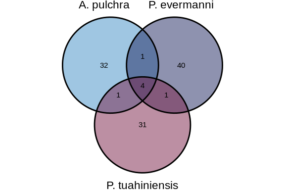
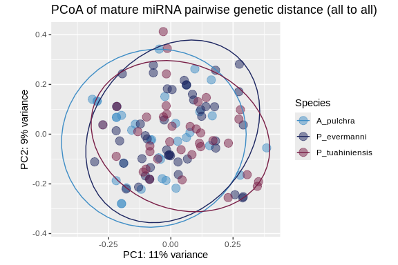
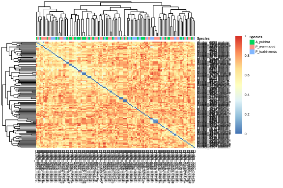

10-shortRNA-ShortStack-comparison
================
Kathleen Durkin
2024-05-28

- <a href="#1-prep-data" id="toc-1-prep-data">1 Prep data</a>
  - <a href="#11-isolate-mature-mirna-sequences"
    id="toc-11-isolate-mature-mirna-sequences">1.1 Isolate mature miRNA
    sequences</a>
  - <a href="#12-merge-the-three-mature-mirna-fastas"
    id="toc-12-merge-the-three-mature-mirna-fastas">1.2 Merge the three
    mature miRNA FASTAs</a>
- <a href="#2-blasts" id="toc-2-blasts">2 BLASTs</a>
  - <a href="#21-make-database-for-each-species"
    id="toc-21-make-database-for-each-species">2.1 Make database for each
    species:</a>
  - <a href="#22-run-blastn" id="toc-22-run-blastn">2.2 Run Blastn</a>
  - <a href="#23-join-blast-tables" id="toc-23-join-blast-tables">2.3 Join
    BLAST tables</a>
- <a href="#3-identify-conserved-mirnas"
  id="toc-3-identify-conserved-mirnas">3 Identify conserved miRNAs</a>
  - <a href="#31-conserved-across-all-three-species-apul-peve-and-pmea"
    id="toc-31-conserved-across-all-three-species-apul-peve-and-pmea">3.1
    Conserved across all three species (Apul, Peve, and Pmea)</a>
  - <a href="#32-conserved-among-subsets-of-the-three-species"
    id="toc-32-conserved-among-subsets-of-the-three-species">3.2 Conserved
    among subsets of the three species</a>
    - <a href="#321-apul-and-peve" id="toc-321-apul-and-peve">3.2.1 Apul and
      Peve</a>
    - <a href="#322-apul-and-pmea" id="toc-322-apul-and-pmea">3.2.2 Apul and
      Pmea</a>
    - <a href="#323-peve-and-pmea" id="toc-323-peve-and-pmea">3.2.3 Peve and
      Pmea</a>
  - <a href="#33-visualize" id="toc-33-visualize">3.3 Visualize</a>
    - <a href="#331-data-munging-of-the-results"
      id="toc-331-data-munging-of-the-results">3.3.1 Data munging of the
      results</a>
    - <a href="#332-venn-diagram" id="toc-332-venn-diagram">3.3.2 Venn
      diagram</a>
- <a href="#4-compare-sequence-similarity-across-all-species"
  id="toc-4-compare-sequence-similarity-across-all-species">4 Compare
  sequence similarity across all species</a>
  - <a href="#41-pcoa" id="toc-41-pcoa">4.1 PCoA</a>
  - <a href="#42-heatmap" id="toc-42-heatmap">4.2 Heatmap</a>
- <a href="#5-identify-mirnas-with-identical-mature-mirnas"
  id="toc-5-identify-mirnas-with-identical-mature-mirnas">5 Identify
  miRNAs with identical mature miRNAs</a>
  - <a href="#51-apul" id="toc-51-apul">5.1 Apul</a>
  - <a href="#52-peve" id="toc-52-peve">5.2 Peve</a>
  - <a href="#53-pmea" id="toc-53-pmea">5.3 Pmea</a>
- <a href="#6-look-at-the-database-matches"
  id="toc-6-look-at-the-database-matches">6 Look at the database
  matches</a>
  - <a href="#61-table" id="toc-61-table">6.1 Table</a>

I want to find miRNAs that are conserved among either a subset of or all
three species of interest (*A.pulchra*, *P.evermanni*, and
*P.meandrina*) using Blastn. I want to generally investigate sequence
similarity across and within species.

# 1 Prep data

## 1.1 Isolate mature miRNA sequences

Our ShortStack output contains sequences for the mature, star, and
precursor sequences for each identified miRNA. We just want to look at
the mature miRNA sequences right now, so let’s isolate those.

``` bash
cd ../data/10-shortRNA-ShortStack-comparison

# Copy all sequences whose headers contain "mature"
awk '/^>/ {p = /mature/} p' ../../../D-Apul/output/13.2.1-Apul-sRNAseq-ShortStack-31bp-fastp-merged-cnidarian_miRBase/ShortStack_out/mir.fasta > Apul_ShortStack_mature.fasta

awk '/^>/ {p = /mature/} p' ../../../E-Peve/output/08.2-Peve-sRNAseq-ShortStack-31bp-fastp-merged/ShortStack_out/mir.fasta > Peve_ShortStack_mature.fasta

awk '/^>/ {p = /mature/} p' ../../../F-Pmea/output/13.2.1-Pmea-sRNAseq-ShortStack-31bp-fastp-merged-cnidarian_miRBase/ShortStack_out/mir.fasta > Pmea_ShortStack_mature.fasta

grep "^>" Apul_ShortStack_mature.fasta | wc -l 
grep "^>" Peve_ShortStack_mature.fasta | wc -l
grep "^>" Pmea_ShortStack_mature.fasta | wc -l
```

    38
    46
    37

## 1.2 Merge the three mature miRNA FASTAs

``` bash
cd ../data/10-shortRNA-ShortStack-comparison

cat Apul_ShortStack_mature.fasta Peve_ShortStack_mature.fasta Pmea_ShortStack_mature.fasta > merged_all_ShortStack_mature.fasta

head merged_all_ShortStack_mature.fasta
tail merged_all_ShortStack_mature.fasta
```

    >Cluster_316.mature::NC_058066.1:12757146-12757168(-)
    TGATCTCTGCAATAGCCTGCCT
    >Cluster_514.mature::NC_058066.1:20088678-20088700(+)
    ACGCTAGGAAGGGATGCCGGGA
    >Cluster_548.mature::NC_058066.1:20346248-20346271(-)
    TTAACGAGTAGATAAATGAAGAG
    >Cluster_1506.mature::NC_058067.1:5656213-5656236(-)
    TTTGCTAGTTGCTTTTGTCCCGT
    >Cluster_1900.mature::NC_058067.1:16118269-16118291(-)
    aaaaatgtcggttgcttaagct
    >Cluster_4846.mature::Pocillopora_meandrina_HIv1___Sc0000018:6855520-6855542(+)
    TCACCCAACAGTTTTAATCTGA
    >Cluster_5275.mature::Pocillopora_meandrina_HIv1___Sc0000021:4351838-4351860(+)
    ACTGATATTCACCAAGTGATTA
    >Cluster_5642.mature::Pocillopora_meandrina_HIv1___Sc0000024:4808687-4808708(+)
    AGAACCCAAGAATCTCGAAGG
    >Cluster_5770.mature::Pocillopora_meandrina_HIv1___Sc0000026:1154771-1154793(-)
    TGTACTATGTTCATGATCTTGC
    >Cluster_6429.mature::Pocillopora_meandrina_HIv1___Sc0000035:1989841-1989863(+)
    TATTTACAACTCTCAAAACAAC

Let’s do a quick investigation of our mature miRNAs.

``` bash
# Extract sequence lengths and calculate statistics
lengths=$(awk '/^>/ {if (seqlen) print seqlen; seqlen=0; next} {seqlen += length($0)} END {print seqlen}' ../data/10-shortRNA-ShortStack-comparison/merged_all_ShortStack_mature.fasta)
min_length=$(echo "$lengths" | sort -n | head -n 1)
max_length=$(echo "$lengths" | sort -n | tail -n 1)
total_length=$(echo "$lengths" | awk '{sum += $1} END {print sum}')
num_sequences=$(grep -c '^>' ../data/10-shortRNA-ShortStack-comparison/merged_all_ShortStack_mature.fasta)
average_length=$(echo "scale=2; $total_length / $num_sequences" | bc)

# Output results
echo "Minimum sequence length: $min_length"
echo "Maximum sequence length: $max_length"
echo "Average sequence length: $average_length"
```

    Minimum sequence length: 21
    Maximum sequence length: 24
    Average sequence length: 21.99

# 2 BLASTs

## 2.1 Make database for each species:

Apul

``` bash
/home/shared/ncbi-blast-2.11.0+/bin/makeblastdb \
-in ../data/10-shortRNA-ShortStack-comparison/Apul_ShortStack_mature.fasta \
-dbtype nucl \
-out ../output/10-shortRNA-ShortStack-comparison/blasts/Apul-db/Apul_ShortStack_mature
```

    Building a new DB, current time: 06/06/2024 10:27:04
    New DB name:   /home/shared/8TB_HDD_02/shedurkin/deep-dive/DEF-cross-species/output/10-shortRNA-ShortStack-comparison/blasts/Apul-db/Apul_ShortStack_mature
    New DB title:  ../data/10-shortRNA-ShortStack-comparison/Apul_ShortStack_mature.fasta
    Sequence type: Nucleotide
    Deleted existing Nucleotide BLAST database named /home/shared/8TB_HDD_02/shedurkin/deep-dive/DEF-cross-species/output/10-shortRNA-ShortStack-comparison/blasts/Apul-db/Apul_ShortStack_mature
    Keep MBits: T
    Maximum file size: 1000000000B
    Adding sequences from FASTA; added 38 sequences in 0.002177 seconds.

Peve

``` bash
/home/shared/ncbi-blast-2.11.0+/bin/makeblastdb \
-in ../data/10-shortRNA-ShortStack-comparison/Peve_ShortStack_mature.fasta \
-dbtype nucl \
-out ../output/10-shortRNA-ShortStack-comparison/blasts/Peve-db/Peve_ShortStack_mature
```

    Building a new DB, current time: 06/06/2024 10:27:04
    New DB name:   /home/shared/8TB_HDD_02/shedurkin/deep-dive/DEF-cross-species/output/10-shortRNA-ShortStack-comparison/blasts/Peve-db/Peve_ShortStack_mature
    New DB title:  ../data/10-shortRNA-ShortStack-comparison/Peve_ShortStack_mature.fasta
    Sequence type: Nucleotide
    Deleted existing Nucleotide BLAST database named /home/shared/8TB_HDD_02/shedurkin/deep-dive/DEF-cross-species/output/10-shortRNA-ShortStack-comparison/blasts/Peve-db/Peve_ShortStack_mature
    Keep MBits: T
    Maximum file size: 1000000000B
    Adding sequences from FASTA; added 46 sequences in 0.00254607 seconds.

Pmea

``` bash
/home/shared/ncbi-blast-2.11.0+/bin/makeblastdb \
-in ../data/10-shortRNA-ShortStack-comparison/Pmea_ShortStack_mature.fasta \
-dbtype nucl \
-out ../output/10-shortRNA-ShortStack-comparison/blasts/Pmea-db/Pmea_ShortStack_mature
```

    Building a new DB, current time: 06/06/2024 10:27:05
    New DB name:   /home/shared/8TB_HDD_02/shedurkin/deep-dive/DEF-cross-species/output/10-shortRNA-ShortStack-comparison/blasts/Pmea-db/Pmea_ShortStack_mature
    New DB title:  ../data/10-shortRNA-ShortStack-comparison/Pmea_ShortStack_mature.fasta
    Sequence type: Nucleotide
    Deleted existing Nucleotide BLAST database named /home/shared/8TB_HDD_02/shedurkin/deep-dive/DEF-cross-species/output/10-shortRNA-ShortStack-comparison/blasts/Pmea-db/Pmea_ShortStack_mature
    Keep MBits: T
    Maximum file size: 1000000000B
    Adding sequences from FASTA; added 37 sequences in 0.00251293 seconds.

## 2.2 Run Blastn

Generate a list of blast results that, for each miRNA, shows the top hit
in each of two other species. We want to see the top hits no matter how
poor the match is, so we will not filter by e-value at this stage. We’ll
also include the “-word_size 4” option, which reduces the required
length of the initial match.

All to Apul:

``` bash
/home/shared/ncbi-blast-2.11.0+/bin/blastn \
-task blastn-short \
-query ../data/10-shortRNA-ShortStack-comparison/merged_all_ShortStack_mature.fasta \
-db ../output/10-shortRNA-ShortStack-comparison/blasts/Apul-db/Apul_ShortStack_mature \
-out ../output/10-shortRNA-ShortStack-comparison/blasts/Apul_to_all_blastn.tab \
-num_threads 40 \
-word_size 4 \
-max_target_seqs 1 \
-max_hsps 1 \
-outfmt 6

wc -l ../output/10-shortRNA-ShortStack-comparison/blasts/Apul_to_all_blastn.tab
```

    Warning: [blastn] Examining 5 or more matches is recommended
    121 ../output/10-shortRNA-ShortStack-comparison/blasts/Apul_to_all_blastn.tab

All to Peve:

``` bash
/home/shared/ncbi-blast-2.11.0+/bin/blastn \
-task blastn-short \
-query ../data/10-shortRNA-ShortStack-comparison/merged_all_ShortStack_mature.fasta \
-db ../output/10-shortRNA-ShortStack-comparison/blasts/Peve-db/Peve_ShortStack_mature \
-out ../output/10-shortRNA-ShortStack-comparison/blasts/Peve_to_all_blastn.tab \
-num_threads 40 \
-word_size 4 \
-max_target_seqs 1 \
-max_hsps 1 \
-outfmt 6

wc -l ../output/10-shortRNA-ShortStack-comparison/blasts/Peve_to_all_blastn.tab
```

    Warning: [blastn] Examining 5 or more matches is recommended
    121 ../output/10-shortRNA-ShortStack-comparison/blasts/Peve_to_all_blastn.tab

All to Pmea:

``` bash
/home/shared/ncbi-blast-2.11.0+/bin/blastn \
-task blastn-short \
-query ../data/10-shortRNA-ShortStack-comparison/merged_all_ShortStack_mature.fasta \
-db ../output/10-shortRNA-ShortStack-comparison/blasts/Pmea-db/Pmea_ShortStack_mature \
-out ../output/10-shortRNA-ShortStack-comparison/blasts/Pmea_to_all_blastn.tab \
-num_threads 40 \
-word_size 4 \
-max_target_seqs 1 \
-max_hsps 1 \
-outfmt 6

wc -l ../output/10-shortRNA-ShortStack-comparison/blasts/Pmea_to_all_blastn.tab
```

    Warning: [blastn] Examining 5 or more matches is recommended
    121 ../output/10-shortRNA-ShortStack-comparison/blasts/Pmea_to_all_blastn.tab

## 2.3 Join BLAST tables

``` r
apul_to_all_blastn <- read.table("../output/10-shortRNA-ShortStack-comparison/blasts/Apul_to_all_blastn.tab", sep="\t", header=FALSE)
peve_to_all_blastn <- read.table("../output/10-shortRNA-ShortStack-comparison/blasts/Peve_to_all_blastn.tab", sep="\t", header=FALSE)
pmea_to_all_blastn <- read.table("../output/10-shortRNA-ShortStack-comparison/blasts/Pmea_to_all_blastn.tab", sep="\t", header=FALSE)
```

Column labels: qseqid: Query sequence ID sseqid: Subject (database)
sequence ID pident: Percentage of identical matches length: Alignment
length (number of base pairs or amino acids) mismatch: Number of
mismatches gapopen: Number of gap openings qstart: Start of alignment in
the query qend: End of alignment in the query sstart: Start of alignment
in the subject send: End of alignment in the subject evalue: Expect
value (number of hits expected by chance) bitscore: Bit score

``` r
# Combine the three blast tables
combined_blastn <- rbind(apul_to_all_blastn, peve_to_all_blastn, pmea_to_all_blastn)

# Assign informative column labels
colnames(combined_blastn) <- c("qseqid", "sseqid", "pident", "length", "mismatch", "gapopen", "qstart", "qend", "sstart", "send", "evalue", "bitscore")

# Save this original, unfiltered blast table.
write.table(combined_blastn, "../output/10-shortRNA-ShortStack-comparison/combined_blast.tab", sep="\t", row.names=FALSE, quote=FALSE)
```

# 3 Identify conserved miRNAs

Filter our list of blast hits to remove instances where sequences match
themselves (e.g. from querying an Apul sequence against our combined
database which contained all Apul sequences), and to retain only the
significant hits (We’ll set this at eval \> 1E-5)

``` r
# Filter
filtered_combined_blastn <- combined_blastn %>%
  filter(qseqid != sseqid) %>%
  filter(evalue < 0.00001)

# View
nrow(filtered_combined_blastn)
```

    [1] 34

``` r
head(filtered_combined_blastn)
```

                                                                   qseqid
    1                   Cluster_2521.mature::NC_058068.1:597877-597899(+)
    2                Cluster_10726.mature::NC_058079.1:5232178-5232199(+)
    3               Cluster_16040.mature::NW_025322765.1:722296-722318(+)
    4  Cluster_1153.mature::Porites_evermani_scaffold_49:151639-151661(-)
    5 Cluster_5540.mature::Porites_evermani_scaffold_430:205886-205909(-)
    6   Cluster_6211.mature::Porites_evermani_scaffold_502:58996-59018(-)
                                                     sseqid pident length mismatch
    1     Cluster_2522.mature::NC_058068.1:598173-598195(+)    100     22        0
    2  Cluster_10729.mature::NC_058079.1:5261442-5261463(+)    100     21        0
    3 Cluster_16041.mature::NW_025322765.1:799181-799203(-)    100     22        0
    4 Cluster_6977.mature::NC_058073.1:12437102-12437124(+)    100     22        0
    5 Cluster_7025.mature::NC_058073.1:15996878-15996901(-)    100     23        0
    6   Cluster_7077.mature::NC_058074.1:2966522-2966545(+)    100     22        0
      gapopen qstart qend sstart send   evalue bitscore
    1       0      1   22      1   22 5.19e-10     44.1
    2       0      1   21      1   21 1.92e-09     42.1
    3       0      1   22      1   22 5.19e-10     44.1
    4       0      1   22      1   22 5.19e-10     44.1
    5       0      1   23      1   23 1.40e-10     46.1
    6       0      1   22      1   22 5.19e-10     44.1

``` r
write.table(filtered_combined_blastn, "../output/10-shortRNA-ShortStack-comparison/filtered_combined_blast.tab", sep="\t", row.names=FALSE, quote=FALSE)
```

Ok now we can start identifying conserved miRNAs. Keep in mind that this
list of filtered, combined blastn hits contains duplicates because, for
example, querying Apul sequences against a database containing Peve
sequences is functionally the same as querying those Peve sequences
against a databse which contains Apul. So, for example, this list would
contain a hit matching Apul.seq1 to Peve.seq2, *and* a hit matching
Peve.seq2 to Apul.seq1.

## 3.1 Conserved across all three species (Apul, Peve, and Pmea)

First, lets find miRNAs conserved among all three species. These would
show up as an miRNA from one species that has hits from both other
species (e.g., Apul.seq1 has a hit from Peve *and* a hit from Pmea).

``` r
# Find Apul miRNAs that have matches from both Peve and Pmea
present_in_all <- filtered_combined_blastn %>%
  # isolate Apul miRNAs with hits
  filter(!grepl("Porites_evermani|Pocillopora_meandrina", sseqid)) %>%
  group_by(sseqid) %>%
  filter(any(grepl("Porites_evermani", qseqid)) & any(grepl("Pocillopora_meandrina", qseqid)))

# View the miRNAs that match across all three species
# (recall this will include two entries for each conserved miRNA, it's Apul match in Peve, and its Apul match to Pmea)
head(present_in_all, nrow(present_in_all))
```

    # A tibble: 8 × 12
    # Groups:   sseqid [4]
      qseqid         sseqid pident length mismatch gapopen qstart  qend sstart  send
      <chr>          <chr>   <dbl>  <int>    <int>   <int>  <int> <int>  <int> <int>
    1 Cluster_1153.… Clust…    100     22        0       0      1    22      1    22
    2 Cluster_5540.… Clust…    100     23        0       0      1    23      1    23
    3 Cluster_6875.… Clust…    100     21        0       0      1    21      1    21
    4 Cluster_14865… Clust…    100     22        0       0      1    22      1    22
    5 Cluster_1108.… Clust…    100     22        0       0      1    22      1    22
    6 Cluster_1279.… Clust…    100     21        0       0      2    22      2    22
    7 Cluster_1783.… Clust…    100     21        0       0      1    21      1    21
    8 Cluster_4059.… Clust…    100     22        0       0      1    22      1    22
    # ℹ 2 more variables: evalue <dbl>, bitscore <dbl>

``` r
# Count the number of miRNAs conserved across all three species
paste("Number of miRNAs conserved across all three species:", nrow(distinct(present_in_all, sseqid)))
```

    [1] "Number of miRNAs conserved across all three species: 4"

## 3.2 Conserved among subsets of the three species

Now we want to find miRNAs that are conserved withing subsets of the
three species

### 3.2.1 Apul and Peve

Find Apul miRNAs that have hits to Peve miRNAs but *not* hits to Pmea
miRNAs (that would make them conserved among all three species, which
we’ve already identified)

``` r
# Find Apul miRNAs that have matches from only Peve
present_in_apul_peve <- filtered_combined_blastn %>%
  # isolate Apul miRNAs with hits
  filter(!grepl("Porites_evermani|Pocillopora_meandrina", sseqid)) %>%
  group_by(sseqid) %>%
  # filter for hits to Peve only
  filter(any(grepl("Porites_evermani", qseqid)) & !any(grepl("Pocillopora_meandrina", qseqid)))

# View the miRNAs that match between Apul and Peve
head(present_in_apul_peve, nrow(present_in_apul_peve))
```

    # A tibble: 1 × 12
    # Groups:   sseqid [1]
      qseqid         sseqid pident length mismatch gapopen qstart  qend sstart  send
      <chr>          <chr>   <dbl>  <int>    <int>   <int>  <int> <int>  <int> <int>
    1 Cluster_6211.… Clust…    100     22        0       0      1    22      1    22
    # ℹ 2 more variables: evalue <dbl>, bitscore <dbl>

``` r
# Count the number of miRNAs conserved across the two species
paste("Number of miRNAs conserved in Apul and Peve:", nrow(distinct(present_in_apul_peve, sseqid)))
```

    [1] "Number of miRNAs conserved in Apul and Peve: 1"

### 3.2.2 Apul and Pmea

Find Apul miRNAs that have hits to Pmea miRNAs but *not* hits to Peve
miRNAs

``` r
# Find Apul miRNAs that have matches from only Pmea
present_in_apul_pmea <- filtered_combined_blastn %>%
  # isolate Apul miRNAs with hits
  filter(!grepl("Porites_evermani|Pocillopora_meandrina", sseqid)) %>%
  group_by(sseqid) %>%
  # filter for hits to Pmea only
  filter(!any(grepl("Porites_evermani", qseqid)) & any(grepl("Pocillopora_meandrina", qseqid)))

# View the miRNAs that match between Apul and Pmea
head(present_in_apul_pmea, nrow(present_in_apul_pmea))
```

    # A tibble: 1 × 12
    # Groups:   sseqid [1]
      qseqid         sseqid pident length mismatch gapopen qstart  qend sstart  send
      <chr>          <chr>   <dbl>  <int>    <int>   <int>  <int> <int>  <int> <int>
    1 Cluster_1056.… Clust…    100     22        0       0      1    22      1    22
    # ℹ 2 more variables: evalue <dbl>, bitscore <dbl>

``` r
# Count the number of miRNAs conserved across the two species
paste("Number of miRNAs conserved in Apul and Pmea:", nrow(distinct(present_in_apul_pmea, sseqid)))
```

    [1] "Number of miRNAs conserved in Apul and Pmea: 1"

### 3.2.3 Peve and Pmea

Find Peve miRNAs that have hits to Pmea miRNAs but *not* hits to Apul
miRNAs

``` r
# Find Peve miRNAs that have matches from only Pmea
present_in_peve_pmea <- filtered_combined_blastn %>%
  # isolate Peve miRNAs with hits
  filter(grepl("Porites_evermani", sseqid)) %>%
  group_by(sseqid) %>%
  # filter for hits to Pmea only (note the Apul sequence IDs don't contain the species name, so we have to use a non-descriptive unique identifier for filtering)
  filter(!any(grepl("mature::N", qseqid)) & any(grepl("Pocillopora_meandrina", qseqid)))

# View the miRNAs that match between Peve and Pmea
head(present_in_peve_pmea, nrow(present_in_peve_pmea))
```

    # A tibble: 1 × 12
    # Groups:   sseqid [1]
      qseqid sseqid pident length mismatch gapopen qstart  qend sstart  send  evalue
      <chr>  <chr>   <dbl>  <int>    <int>   <int>  <int> <int>  <int> <int>   <dbl>
    1 Clust… Clust…   94.7     19        1       0      2    20      3    21 8.73e-6
    # ℹ 1 more variable: bitscore <dbl>

``` r
# Count the number of miRNAs conserved across the two species
paste("Number of miRNAs conserved in Peve and Pmea:", nrow(distinct(present_in_peve_pmea, sseqid)))
```

    [1] "Number of miRNAs conserved in Peve and Pmea: 1"

## 3.3 Visualize

### 3.3.1 Data munging of the results

``` bash
cd ../data/10-shortRNA-ShortStack-comparison
grep "^>"  merged_all_ShortStack_mature.fasta | sed 's/^>//' > merged_all_ShortStack_mature_IDs.txt

head -5 merged_all_ShortStack_mature_IDs.txt
```

    Cluster_316.mature::NC_058066.1:12757146-12757168(-)
    Cluster_514.mature::NC_058066.1:20088678-20088700(+)
    Cluster_548.mature::NC_058066.1:20346248-20346271(-)
    Cluster_1506.mature::NC_058067.1:5656213-5656236(-)
    Cluster_1900.mature::NC_058067.1:16118269-16118291(-)

``` r
# Read in and separate the ids of all miRNAs from the three species
merged_IDs <- readLines("../data/10-shortRNA-ShortStack-comparison/merged_all_ShortStack_mature_IDs.txt")

apul_IDs <- merged_IDs[grep("mature::N", merged_IDs)]
peve_IDs <- merged_IDs[grep("Porites_evermani", merged_IDs)]
pmea_IDs <- merged_IDs[grep("Pocillopora_meandrina", merged_IDs)]
length(apul_IDs)
```

    [1] 38

``` r
length(peve_IDs)
```

    [1] 46

``` r
length(pmea_IDs)
```

    [1] 37

``` r
# Assign shared miRNA IDs to conserved miRNAs

# Function to append IDs of matching miRNAs to the original query miRNA
append_IDs <- function(IDs_list, df) {
  appended_IDs_list <- vector("list", length(IDs_list))
  for (i in seq_along(IDs_list)) {
    matching_entries <- df$qseqid[df$sseqid == IDs_list[i]]
    if (length(matching_entries) > 0) {
      appended_IDs_list[[i]] <- paste(IDs_list[i], paste(matching_entries, collapse = "|"), sep = "|")
    } else {
      appended_IDs_list[[i]] <- IDs_list[i]
    }
  }
  return(appended_IDs_list)
}

# Apply the function to each set of conserved miRNAs
appendedIDs_apul_peve_pmea <- append_IDs(unique(present_in_all$sseqid), present_in_all)

appendedIDs_apul_peve <- append_IDs(unique(present_in_apul_peve$sseqid), present_in_apul_peve)
appendedIDs_apul_pmea <- append_IDs(unique(present_in_apul_pmea$sseqid), present_in_apul_pmea)
appendedIDs_peve_pmea <- append_IDs(unique(present_in_peve_pmea$sseqid), present_in_peve_pmea)

print(appendedIDs_apul_peve_pmea[1])
```

    [[1]]
    [1] "Cluster_6977.mature::NC_058073.1:12437102-12437124(+)|Cluster_1153.mature::Porites_evermani_scaffold_49:151639-151661(-)|Cluster_1279.mature::Pocillopora_meandrina_HIv1___Sc0000003:10366054-10366076(+)"

``` r
print(appendedIDs_apul_peve)
```

    [[1]]
    [1] "Cluster_7077.mature::NC_058074.1:2966522-2966545(+)|Cluster_6211.mature::Porites_evermani_scaffold_502:58996-59018(-)"

``` r
print(appendedIDs_apul_pmea)
```

    [[1]]
    [1] "Cluster_514.mature::NC_058066.1:20088678-20088700(+)|Cluster_1056.mature::Pocillopora_meandrina_HIv1___Sc0000002:15749309-15749331(+)"

``` r
print(appendedIDs_peve_pmea)
```

    [[1]]
    [1] "Cluster_8824.mature::Porites_evermani_scaffold_910:99254-99275(+)|Cluster_2786.mature::Pocillopora_meandrina_HIv1___Sc0000008:1783823-1783844(+)"

``` r
# combine the new appended IDs into a single list of conserved miRNAs
conserved_miRNAs_all_IDs <- c(appendedIDs_apul_peve_pmea, appendedIDs_apul_peve, appendedIDs_apul_pmea, appendedIDs_peve_pmea)
```

``` r
# For each species list of miRNA IDs, replace species-specific IDs of conserved miRNAs with our newly generated appended IDs. This will created lists of miRNA IDs that have shared IDs for the conserved mRNAs
replace_entries <- function(spec_list, new_conserved_IDs) {
  # Iterate over each entry in spec_list
  for (i in seq_along(spec_list)) {
    # Check if the current entry in spec_list exists in any entry in new_conserved_IDs
    matching_entry <- new_conserved_IDs[grep(spec_list[i], new_conserved_IDs, fixed = TRUE)]
    # If a match is found, replace the entry in spec_list with the matching entry from new_conserved_IDs
    if (length(matching_entry) > 0) {
      spec_list[i] <- matching_entry[[1]]  # Replace with the first element of matching_entry
    }
  }
  return(spec_list)  # Return the modified spec_list
}

apul_mature_newconservedID <- replace_entries(apul_IDs, conserved_miRNAs_all_IDs)
peve_mature_newconservedID <- replace_entries(peve_IDs, conserved_miRNAs_all_IDs)
pmea_mature_newconservedID <- replace_entries(pmea_IDs, conserved_miRNAs_all_IDs)
```

### 3.3.2 Venn diagram

``` r
# Note that mtORF data indicates our P.meandrina samples are actually P.tuahiniensis, so that's the species name we'll be using in figures
a <- list("A. pulchra" = apul_mature_newconservedID, 
          "P. evermanni" = peve_mature_newconservedID,
          "P. tuahiniensis" = pmea_mature_newconservedID)

venn_conserved <- ggvenn(a, show_percentage = FALSE)
venn_conserved
```



``` r
ggexport(filename = "../output/10-shortRNA-ShortStack-comparison/figures/venn_conserved_miRNA.png",
         plot   = venn_conserved,
         res    = 600,
         width  = 5000,
         height = 5000)
```

# 4 Compare sequence similarity across all species

Aligned all mature miRNA sequences from all three species in MEGA using
MUSCLE, then generated pairwise distance matrix

``` bash
# Remove description text at bottom of file
head -121 ../output/10-shortRNA-ShortStack-comparison/mature_miRNA_all_to_all_distance_06062024.csv > ../output/10-shortRNA-ShortStack-comparison/mature_miRNA_all_to_all_distance_06062024_nodescription.csv

# For some reason the last line was saved as just the row name, with no comma-delimitation to mark each empty column. We need to reintroduce the (empty) comma-delimited columns in the final row.
# Create the string of commas
append_string=$(printf ', %.0s' {1..121})

# Remove the last comma and add a space at the end
append_string="${append_string%,}"

# Use sed to remove existing trailing whitespace and then append the string of commas to row 120
sed -i 's/\s*$//' ../output/10-shortRNA-ShortStack-comparison/mature_miRNA_all_to_all_distance_06062024_nodescription.csv
sed -i '121s/$/ '"$append_string"'/' ../output/10-shortRNA-ShortStack-comparison/mature_miRNA_all_to_all_distance_06062024_nodescription.csv

# MEGA sometimes can't compute a pairwise distance for statistical reasons, and these are noted in the file as "?" entries. MEGA documentation indicates this notation is associated with being unable to identify any shared sites (i.e., the sequences are too different to even compare). Non-numeric entries will mess with our analysis down the line, so we need to replace those. Since they're associated with no shared sites, we'll replace them with 1s (indicating very high sequence distance).
# Replace all "?" entries with 1s
sed -i 's/?/1/g' ../output/10-shortRNA-ShortStack-comparison/mature_miRNA_all_to_all_distance_06062024_nodescription.csv
```

``` r
# load data
all_to_all <- read.table("../output/10-shortRNA-ShortStack-comparison/mature_miRNA_all_to_all_distance_06062024_nodescription.csv", sep=",", header = FALSE, na.strings = "")

# Assign column 1 entries to row names and column names (pairwise matrices have identical row and column names)
rownames(all_to_all) <- all_to_all[, 1]
all_to_all <- all_to_all[, -1]
colnames(all_to_all) <- rownames(all_to_all)

# Convert this upper triangular matrix to a full, symmetric distance matrix
all_to_all_full <- t(all_to_all)
all_to_all_full[upper.tri(all_to_all_full)] <- all_to_all[upper.tri(all_to_all)]
# Check the new distance matrix is symmetric
isSymmetric(all_to_all_full)
```

    [1] TRUE

``` r
# Convert matrix back to data frame
all_to_all_full <- as.data.frame(all_to_all_full)


# Replace the "NA" values with 0s (along the axis)
all_to_all_full <- replace(all_to_all_full, is.na(all_to_all_full), 0)
```

``` bash
cd ../output/10-shortRNA-ShortStack-comparison
# Isolate sequence names
awk -F ',' '{print $1}' mature_miRNA_all_to_all_distance_06062024_nodescription.csv > miRNA_names.txt

# Add full species name in second column based on the seq ID
# Note that mtORF data indicates our P.meandrina samples are actually P.tuahiniensis, so that's the species name we'll be using in figures
sed -i 's/\s*$//' miRNA_names.txt
sed '/mature::N/s/$/,A_pulchra/' miRNA_names.txt > miRNA_species.csv
sed -i '/mature::Porites/s/$/,P_evermanni/' miRNA_species.csv
sed -i '/mature::Pocillopora/s/$/,P_tuahiniensis/' miRNA_species.csv
```

``` r
# Read in
miRNA_species <- read.csv("../output/10-shortRNA-ShortStack-comparison/miRNA_species.csv", header = FALSE)

# Make the miRNA labels row names
colnames(miRNA_species) <- c("miRNA_ID", "Species")
rownames(miRNA_species) <- miRNA_species[, "miRNA_ID"]
```

## 4.1 PCoA

Principal Coordinates Analysis – similar to PCA, but can take a distance
matrix as input

``` r
pcoa <- pcoa(all_to_all_full, correction="none", rn=NULL)
pcoa_vec <- as.data.frame(pcoa$vectors)
pcoa_vec$rownames <- rownames(pcoa_vec)
pcoa_vec <- mutate(pcoa_vec, rownames = trimws(as.character(rownames)))
pcoa_vec_annot <- left_join(pcoa_vec, miRNA_species, by = c("rownames" = "miRNA_ID"))
rownames(pcoa_vec_annot) <- pcoa_vec_annot$rownames

percent_var <- round(pcoa[["values"]][["Relative_eig"]]*100)

# Note that mtORF data indicates our P.meandrina samples are actually P.tuahiniensis, so that's the species name we'll be using in figures
pcoa_plot <- ggplot(pcoa_vec_annot, aes(Axis.1, Axis.2, color=Species)) + 
  geom_point(size=4, alpha = 5/10) +
  ggtitle("PCoA of mature miRNA pairwise genetic distance (all to all)") +
  xlab(paste0("PC1: ",percent_var[1],"% variance")) +
  ylab(paste0("PC2: ",percent_var[2],"% variance")) + 
  scale_color_manual(labels = c("A. pulchra", "P. evermanni", "P. tuahiniensis"), values = c("red", "green", "blue")) +
  coord_fixed() +
  stat_ellipse()

pcoa_plot
```



``` r
# Save plot
ggexport(filename = "../output/10-shortRNA-ShortStack-comparison/figures/PCoA_all_species_sequence_similarity.png",
         plot   = pcoa_plot,
         res    = 600,
         width  = 5000,
         height = 5000)
```

## 4.2 Heatmap

``` r
# # Annotate heatmap
specID <- miRNA_species %>% 
  select(Species)

all_to_all_full_shortnames <- all_to_all_full
colnames(all_to_all_full_shortnames) <- substr(colnames(all_to_all_full), 1, 20)
rownames(all_to_all_full_shortnames) <- colnames(all_to_all_full_shortnames)

# Run pheatmap
all.spec.seqsim.heat <- pheatmap(all_to_all_full_shortnames, 
                     cluster_rows = T, 
                     show_rownames = T,
                     annotation = specID, 
                     border_color = NA, 
                     fontsize = 5, 
                     fontsize_row = 5, 
                     height = 20)
```



``` r
# Save plot
ggexport(filename = "../output/10-shortRNA-ShortStack-comparison/figures/heatmap_all_species_sequence_similarity.png",
         plot   = all.spec.seqsim.heat,
         res    = 600,
         width  = 5000,
         height = 5000)
```

# 5 Identify miRNAs with identical mature miRNAs

It’s possible for identical mature miRNAs to arise from non-identical
precursor miRNAs. These would be classified by ShortStack as different
miRNAs, but could still have similar/identical functions. Let’s see if
we have any of those in our data.

We’ve already eliminated instances of miRNAs matching to themselves, so
to identify distinct miRNAs from with identical mature sequences we can
just look for hits within the same species (e.g. Apul.seq1 matching
Apul.seq4)

## 5.1 Apul

``` r
# Identify sets of identical miRNAs
apul_identical_miRNAs <- filtered_combined_blastn %>%
  filter(grepl("mature::N", sseqid)) %>%
  filter(grepl("mature::N", qseqid))
         
head(apul_identical_miRNAs)
```

                                                     qseqid
    1     Cluster_2521.mature::NC_058068.1:597877-597899(+)
    2  Cluster_10726.mature::NC_058079.1:5232178-5232199(+)
    3 Cluster_16040.mature::NW_025322765.1:722296-722318(+)
                                                     sseqid pident length mismatch
    1     Cluster_2522.mature::NC_058068.1:598173-598195(+)    100     22        0
    2  Cluster_10729.mature::NC_058079.1:5261442-5261463(+)    100     21        0
    3 Cluster_16041.mature::NW_025322765.1:799181-799203(-)    100     22        0
      gapopen qstart qend sstart send   evalue bitscore
    1       0      1   22      1   22 5.19e-10     44.1
    2       0      1   21      1   21 1.92e-09     42.1
    3       0      1   22      1   22 5.19e-10     44.1

``` r
# Save
write.table(apul_identical_miRNAs, "../output/10-shortRNA-ShortStack-comparison/Apul_identical_miRNAs.tab", sep="\t", row.names = FALSE, col.names = TRUE)
```

``` bash
# First pair
head -2 ../output/10-shortRNA-ShortStack-comparison/Apul_identical_miRNAs.tab | tail -1

seq1=$(awk 'NR==2 {print $1}' FS='\t' ../output/10-shortRNA-ShortStack-comparison/Apul_identical_miRNAs.tab | sed 's/.mature::.*//' | sed 's/"//g')
seq2=$(awk 'NR==2 {print $2}' FS='\t' ../output/10-shortRNA-ShortStack-comparison/Apul_identical_miRNAs.tab | sed 's/.mature::.*//' | sed 's/"//g')

echo ""
echo $seq1
echo $seq2
echo ""

# grab the precursor, star, and mature fasta sequences for the two miRNAs
awk -v seq="$seq1" 'BEGIN {RS=">"; FS="\n"} $1 ~ seq {print ">"$0}' ../../D-Apul/output/13.2.1-Apul-sRNAseq-ShortStack-31bp-fastp-merged-cnidarian_miRBase/ShortStack_out/mir.fasta

awk -v seq="$seq2" 'BEGIN {RS=">"; FS="\n"} $1 ~ seq {print ">"$0}' ../../D-Apul/output/13.2.1-Apul-sRNAseq-ShortStack-31bp-fastp-merged-cnidarian_miRBase/ShortStack_out/mir.fasta
```

    "Cluster_2521.mature::NC_058068.1:597877-597899(+)" "Cluster_2522.mature::NC_058068.1:598173-598195(+)" 100 22  0   0   1   22  1   22  5.19e-10    44.1

    Cluster_2521
    Cluster_2522

    >Cluster_2521::NC_058068.1:597826-597919(+)
    TGAAAATTGGCCATAGTCACATTTCACTAGATAAGCGCTAACTGTTATTGTTCTGCGTTATCGGTGAAATTGTAACTGTCGCCTCCTATTGCT

    >Cluster_2521.mature::NC_058068.1:597877-597899(+)
    TCTGCGTTATCGGTGAAATTGT

    >Cluster_2521.star::NC_058068.1:597846-597868(+)
    ATTTCACTAGATAAGCGCTAAC

    >Cluster_2522::NC_058068.1:598122-598215(+)
    TGAAAACTGACAATAGTTACATTTCACTAGATGAGCGCTAACTGTTATTGTTCTGCGTTATCGGTGAAATTGTAACTGTTGTCTCCTGTTGTT

    >Cluster_2522.mature::NC_058068.1:598173-598195(+)
    TCTGCGTTATCGGTGAAATTGT

    >Cluster_2522.star::NC_058068.1:598142-598164(+)
    ATTTCACTAGATGAGCGCTAAC

``` bash
# Second pair
head -3 ../output/10-shortRNA-ShortStack-comparison/Apul_identical_miRNAs.tab | tail -1

seq1=$(awk 'NR==3 {print $1}' FS='\t' ../output/10-shortRNA-ShortStack-comparison/Apul_identical_miRNAs.tab | sed 's/.mature::.*//' | sed 's/"//g')
seq2=$(awk 'NR==3 {print $2}' FS='\t' ../output/10-shortRNA-ShortStack-comparison/Apul_identical_miRNAs.tab | sed 's/.mature::.*//' | sed 's/"//g')

echo ""
echo $seq1
echo $seq2
echo ""

# grab the precursor, star, and mature fasta sequences for the two miRNAs
awk -v seq="$seq1" 'BEGIN {RS=">"; FS="\n"} $1 ~ seq {print ">"$0}' ../../D-Apul/output/13.2.1-Apul-sRNAseq-ShortStack-31bp-fastp-merged-cnidarian_miRBase/ShortStack_out/mir.fasta

awk -v seq="$seq2" 'BEGIN {RS=">"; FS="\n"} $1 ~ seq {print ">"$0}' ../../D-Apul/output/13.2.1-Apul-sRNAseq-ShortStack-31bp-fastp-merged-cnidarian_miRBase/ShortStack_out/mir.fasta
```

    "Cluster_10726.mature::NC_058079.1:5232178-5232199(+)"  "Cluster_10729.mature::NC_058079.1:5261442-5261463(+)"  100 21  0   0   1   21  1   21  1.92e-09    42.1

    Cluster_10726
    Cluster_10729

    >Cluster_10726::NC_058079.1:5232123-5232219(+)
    GGCACGCGATCGTGTGGGTGTCCAATTACAGCTGTCCAATTTGAACTTTTTGTAATTGGACACCTGTAATTGGATACCCACGTGATTTTCACGCCA

    >Cluster_10726.mature::NC_058079.1:5232178-5232199(+)
    TTGGACACCTGTAATTGGATA

    >Cluster_10726.star::NC_058079.1:5232143-5232164(+)
    TCCAATTACAGCTGTCCAATT

    >Cluster_10729::NC_058079.1:5261387-5261483(+)
    GGCACGCGATCATGTGGGTGTCCAATTACAGCTGTCCAATTTGAACTTTTTGTAATTGGACACCTGTAATTGGATACCACGTGATTTTCACGCCAA

    >Cluster_10729.mature::NC_058079.1:5261442-5261463(+)
    TTGGACACCTGTAATTGGATA

    >Cluster_10729.star::NC_058079.1:5261407-5261428(+)
    TCCAATTACAGCTGTCCAATT

``` bash
# Third pair
head -4 ../output/10-shortRNA-ShortStack-comparison/Apul_identical_miRNAs.tab | tail -1

seq1=$(awk 'NR==4 {print $1}' FS='\t' ../output/10-shortRNA-ShortStack-comparison/Apul_identical_miRNAs.tab | sed 's/.mature::.*//' | sed 's/"//g')
seq2=$(awk 'NR==4 {print $2}' FS='\t' ../output/10-shortRNA-ShortStack-comparison/Apul_identical_miRNAs.tab | sed 's/.mature::.*//' | sed 's/"//g')

echo ""
echo $seq1
echo $seq2
echo ""

# grab the precursor, star, and mature fasta sequences for the two miRNAs
awk -v seq="$seq1" 'BEGIN {RS=">"; FS="\n"} $1 ~ seq {print ">"$0}' ../../D-Apul/output/13.2.1-Apul-sRNAseq-ShortStack-31bp-fastp-merged-cnidarian_miRBase/ShortStack_out/mir.fasta

awk -v seq="$seq2" 'BEGIN {RS=">"; FS="\n"} $1 ~ seq {print ">"$0}' ../../D-Apul/output/13.2.1-Apul-sRNAseq-ShortStack-31bp-fastp-merged-cnidarian_miRBase/ShortStack_out/mir.fasta
```

    "Cluster_16040.mature::NW_025322765.1:722296-722318(+)" "Cluster_16041.mature::NW_025322765.1:799181-799203(-)" 100 22  0   0   1   22  1   22  5.19e-10    44.1

    Cluster_16040
    Cluster_16041

    >Cluster_16040::NW_025322765.1:722245-722338(+)
    TTGaatgactgactgactgactgacgaCTGTTGCGCCATTGCTTGAACGACTATGGGTTGACAGTCGACGgtcagtcggccgacagttggtgG

    >Cluster_16040.mature::NW_025322765.1:722296-722318(+)
    TATGGGTTGACAGTCGACGgtc

    >Cluster_16040.star::NW_025322765.1:722265-722287(+)
    ctgacgaCTGTTGCGCCATTGC

    >Cluster_16041::NW_025322765.1:799159-799254(-)
    TTGAacgactgactgactgactgacgaCTGTTGCGCCATTGCTTGAACGACTATGGGTTGACAGTCGACGgtcagtcggccgacagttggtgGAC

    >Cluster_16041.mature::NW_025322765.1:799181-799203(-)
    TATGGGTTGACAGTCGACGgtc

    >Cluster_16041.star::NW_025322765.1:799212-799234(-)
    ctgacgaCTGTTGCGCCATTGC

For all three of these sets of identical miRNAs, the mature and star
sequences are identical but the precursors have a couple of mismatches,
in addition to being located in different places on the chromosome.

## 5.2 Peve

``` r
# Identify sets of identical miRNAs
peve_identical_miRNAs <- filtered_combined_blastn %>%
  filter(grepl("Porites_evermani", sseqid)) %>%
  filter(grepl("Porites_evermani", qseqid))
         
head(peve_identical_miRNAs)
```

                                                                 qseqid
    1 Cluster_7604.mature::Porites_evermani_scaffold_730:81384-81406(-)
                                                                 sseqid pident
    1 Cluster_7605.mature::Porites_evermani_scaffold_730:82422-82444(-)    100
      length mismatch gapopen qstart qend sstart send   evalue bitscore
    1     22        0       0      1   22      1   22 6.19e-10     44.1

``` r
# Save
write.table(peve_identical_miRNAs, "../output/10-shortRNA-ShortStack-comparison/Peve_identical_miRNAs.tab", sep="\t", row.names = FALSE, col.names = TRUE)
```

``` bash
# First pair
head -2 ../output/10-shortRNA-ShortStack-comparison/Peve_identical_miRNAs.tab | tail -1

seq1=$(awk 'NR==2 {print $1}' FS='\t' ../output/10-shortRNA-ShortStack-comparison/Peve_identical_miRNAs.tab | sed 's/.mature::.*//' | sed 's/"//g')
seq2=$(awk 'NR==2 {print $2}' FS='\t' ../output/10-shortRNA-ShortStack-comparison/Peve_identical_miRNAs.tab | sed 's/.mature::.*//' | sed 's/"//g')

echo ""
echo $seq1
echo $seq2
echo ""

# grab the precursor, star, and mature fasta sequences for the two miRNAs
awk -v seq="$seq1" 'BEGIN {RS=">"; FS="\n"} $1 ~ seq {print ">"$0}' ../../E-Peve/output/08.2-Peve-sRNAseq-ShortStack-31bp-fastp-merged/ShortStack_out/mir.fasta

awk -v seq="$seq2" 'BEGIN {RS=">"; FS="\n"} $1 ~ seq {print ">"$0}' ../../E-Peve/output/08.2-Peve-sRNAseq-ShortStack-31bp-fastp-merged/ShortStack_out/mir.fasta
```

    "Cluster_7604.mature::Porites_evermani_scaffold_730:81384-81406(-)" "Cluster_7605.mature::Porites_evermani_scaffold_730:82422-82444(-)" 100 22  0   0   1   22  1   22  6.19e-10    44.1

    Cluster_7604
    Cluster_7605

    >Cluster_7604::Porites_evermani_scaffold_730:81362-81456(-)
    TCAACAGTAAAACTAACAAAACGCTAACTGTAAAACTAACAAGTTCAACTTGTTAGTTTACAGTTAGTGTTTTGTTAGCGTGGCTCAAACCCTG

    >Cluster_7604.mature::Porites_evermani_scaffold_730:81384-81406(-)
    TGTTAGTTTACAGTTAGTGTTT

    >Cluster_7604.star::Porites_evermani_scaffold_730:81413-81436(-)
    ACGCTAACTGTAAAACTAACAAG

    >Cluster_7605::Porites_evermani_scaffold_730:82400-82494(-)
    TCAACAGTAAAACTAACAAAACGCTAACTGTAAAACTAACAAGTTCAACTTGTTAGTTTACAGTTAGTGTTTTGTTAGCCTGGCTCAAACCCTG

    >Cluster_7605.mature::Porites_evermani_scaffold_730:82422-82444(-)
    TGTTAGTTTACAGTTAGTGTTT

    >Cluster_7605.star::Porites_evermani_scaffold_730:82451-82474(-)
    ACGCTAACTGTAAAACTAACAAG

For this set of identical miRNAs, the mature and star sequences are
identical and the precursors only have a single mismatch, despite being
located in different places on the chromosome.

## 5.3 Pmea

``` r
# Identify sets of identical miRNAs
pmea_identical_miRNAs <- filtered_combined_blastn %>%
  filter(grepl("Pocillopora_meandrina", sseqid)) %>%
  filter(grepl("Pocillopora_meandrina", qseqid))
         
head(pmea_identical_miRNAs)
```

     [1] qseqid   sseqid   pident   length   mismatch gapopen  qstart   qend    
     [9] sstart   send     evalue   bitscore
    <0 rows> (or 0-length row.names)

There are 0 sets of identical miRNAs identified by ShortStack in
P.meandrina

# 6 Look at the database matches

``` bash
# isolate the full "Results" annotation for each mature miRNA, which includes sequence detail and database matches

# Apul
awk -F'\t' 'NR==1 || $20 == "Y"' ../../D-Apul/output/13.2.1-Apul-sRNAseq-ShortStack-31bp-fastp-merged-cnidarian_miRBase/ShortStack_out/Results.txt > ../output/10-shortRNA-ShortStack-comparison/Apul_results_mature.txt

# Peve
awk -F'\t' 'NR==1 || $20 == "Y"' ../../E-Peve/output/08.2-Peve-sRNAseq-ShortStack-31bp-fastp-merged/ShortStack_out/Results.txt > ../output/10-shortRNA-ShortStack-comparison/Peve_results_mature.txt

# Pmea
awk -F'\t' 'NR==1 || $20 == "Y"' ../../F-Pmea/output/13.2.1-Pmea-sRNAseq-ShortStack-31bp-fastp-merged-cnidarian_miRBase/ShortStack_out/Results.txt > ../output/10-shortRNA-ShortStack-comparison/Pmea_results_mature.txt
```

Annotate our mature miRNA fasta files with associated database matches

Apul

``` bash
cd ../output/10-shortRNA-ShortStack-comparison

while IFS= read -r line; do
    if [[ $line == ">"* ]]; then
        # Extract sequence header (without ">") and the accession string
        header="${line:1}"
        accession=$(echo "$header" | awk -F '.' '{print $1}')

        # Search for the accession string in the metadata file
        metadata_line=$(grep -i "$accession" Apul_results_mature.txt)

        # Extract the last column entry from the metadata line
        last_column=$(echo "$metadata_line" | awk '{print $NF}')

        # Append the last column entry to the sequence header
        new_header="$header $last_column"

        # Output the new header
        echo ">$new_header"
    else
        # Output the sequence line unchanged
        echo "$line"
    fi
done < ../../data/10-shortRNA-ShortStack-comparison/Apul_ShortStack_mature.fasta > Apul_ShortStack_mature_annotated.fasta
```

Peve

``` bash
cd ../output/10-shortRNA-ShortStack-comparison

while IFS= read -r line; do
    if [[ $line == ">"* ]]; then
        # Extract sequence header (without ">") and the accession string
        header="${line:1}"
        accession=$(echo "$header" | awk -F '.' '{print $1}')

        # Search for the accession string in the metadata file
        metadata_line=$(grep -i "$accession" Peve_results_mature.txt)

        # Extract the last column entry from the metadata line
        last_column=$(echo "$metadata_line" | awk '{print $NF}')

        # Append the last column entry to the sequence header
        new_header="$header $last_column"

        # Output the new header
        echo ">$new_header"
    else
        # Output the sequence line unchanged
        echo "$line"
    fi
done < ../../data/10-shortRNA-ShortStack-comparison/Peve_ShortStack_mature.fasta > Peve_ShortStack_mature_annotated.fasta
```

Pmea

``` bash
cd ../output/10-shortRNA-ShortStack-comparison

while IFS= read -r line; do
    if [[ $line == ">"* ]]; then
        # Extract sequence header (without ">") and the accession string
        header="${line:1}"
        accession=$(echo "$header" | awk -F '.' '{print $1}')

        # Search for the accession string in the metadata file
        metadata_line=$(grep -i "$accession" Pmea_results_mature.txt)

        # Extract the last column entry from the metadata line
        last_column=$(echo "$metadata_line" | awk '{print $NF}')

        # Append the last column entry to the sequence header
        new_header="$header $last_column"

        # Output the new header
        echo ">$new_header"
    else
        # Output the sequence line unchanged
        echo "$line"
    fi
done < ../../data/10-shortRNA-ShortStack-comparison/Pmea_ShortStack_mature.fasta > Pmea_ShortStack_mature_annotated.fasta
```

## 6.1 Table

``` r
Apul_shortstack_results <- read.csv("../../D-Apul/output/13.2.1-Apul-sRNAseq-ShortStack-31bp-fastp-merged-cnidarian_miRBase/ShortStack_out/Results.txt", sep="\t")

Peve_shortstack_results <- read.csv("../../E-Peve/output/08.2-Peve-sRNAseq-ShortStack-31bp-fastp-merged/ShortStack_out/Results.txt", sep="\t")

Pmea_shortstack_results <- read.csv("../../F-Pmea/output/13.2.1-Pmea-sRNAseq-ShortStack-31bp-fastp-merged-cnidarian_miRBase/ShortStack_out/Results.txt", sep="\t")

Apul_num_miRNA <- Apul_shortstack_results %>% filter(MIRNA == "Y") %>% nrow()
Apul_num_miRNAmatch <- Apul_shortstack_results %>% filter(MIRNA == "Y" ) %>% filter(!is.na(known_miRNAs)) %>% nrow()

Peve_num_miRNA <- Peve_shortstack_results %>% filter(MIRNA == "Y") %>% nrow()
Peve_num_miRNAmatch <- Peve_shortstack_results %>% filter(MIRNA == "Y" ) %>% filter(!is.na(known_miRNAs)) %>% nrow()

Pmea_num_miRNA <- Pmea_shortstack_results %>% filter(MIRNA == "Y") %>% nrow()
Pmea_num_miRNAmatch <- Pmea_shortstack_results %>% filter(MIRNA == "Y" ) %>% filter(!is.na(known_miRNAs)) %>% nrow()

table_data <- data.frame(
  Species = c("A. pulchra", "P. evermanni", "P. tuaheniensis"),
  miRNA = c(Apul_num_miRNA, Peve_num_miRNA, Pmea_num_miRNA),
  miRNAmatch = c(Apul_num_miRNAmatch, Peve_num_miRNAmatch, Pmea_num_miRNAmatch)
)
colnames(table_data) <- c("Species", "miRNA", "miRNA with database match(es)")
```

``` r
table <- tableGrob(table_data, rows=NULL)
miRNA_matches_table <- grid.arrange(table)
```


``` r
png("../output/10-shortRNA-ShortStack-comparison/figures/table_miRNA_matches.png", width = 400, height = 100)
grid.arrange(table)
```
