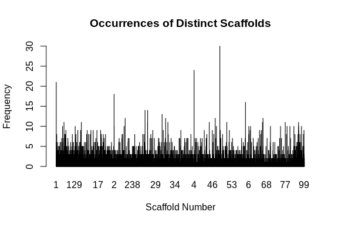
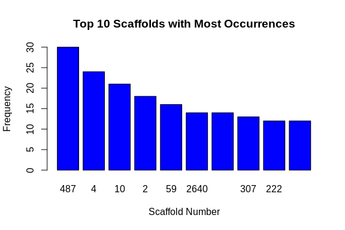

02 Peve lncRNA distribution
================
Steven Roberts
08 September, 2023

- <a href="#01-lncrna-fasta" id="toc-01-lncrna-fasta">0.1 lncRNA fasta</a>

Lets take lncRNA file and see where in genome we find

## 0.1 lncRNA fasta

``` bash
head ../../DEF-cross-species/data/peve_bedtools_lncRNAs.fasta

fgrep ">" -c ../../DEF-cross-species/data/peve_bedtools_lncRNAs.fasta
```

    ## >::Porites_evermani_scaffold_1:422643-423512
    ## GGCAAAGCCACAATCCATGATAAATGAGGGCATAAGCCCGAGGAAGAAGAACTCATAGATCTTGTCCTAATCCCTTTTGGGAGAGCACATTTTTTTCTTTATGCACTCACTGTGGATAAACACTCAATGGATTTTAGAGAAAAGGTGGACTGTAAGCAGTATAATACCTCCTGGAATTTGCCAGTAACTGAAAGAATCTAATCTGAAAAGTCTCTAGGTGTATACTGGGCAACATAGTAATAATTAGTGCATTTTAGAAGATAGGAATGAACGTGGCACATGTATCAAAATTGCATCTTACAAAATAGTTATATTATCAAGAAATCCCTTGCTAAATAATAATTGTAAATCAAGACATGTTTCTAGAACTGGAAACTCCTGGAAATCTGTATGCATCATGTCAATCACTGTACCAATGTTCCCTCATAGAGGGTTTTATATACTAGAAACACTTTGTGAGACTTAAATGTGTTATGCAATTCCAGGTTTGACTACTGTTCCAGGGTCTCAGTCAGTTAAGATGCAGGCATAAGTGAGAGACAGCCCTCCATTCCTTCCTCTCCCTTTTTTTTGGCACTTGGTTTTCTATTTGCTGAATGCCAGTAACTGAGAGCCTAGAACAACCTAGGTTTATGAAAAGTTTCAAGTAATGCTGATACAACTGTGGGAGTTTTGAACCCAGGAGTCACTTCAAAAGTAGGTTGAGTTTGATCGTCCAGGTGAACGTAGTCCTGAATAGGACTGTTGTTGTTGACAGTGACTGACGTTTCGACAACCTGTGCGGTAGTCATTTTCCTATTCAGGATTCATTCACCCGAACATACTTTTGGAATGCTGATACAGTTAACTATCCTTACACACAAACAATG
    ## >::Porites_evermani_scaffold_1:1084867-1089422
    ## AGGGATTAGCTGTTTTTAATTTTTGTGACTTCCAGAGAGTACCCAGTACCCAGCATTGATAATATTTTCGTTTTTATTGAGTATGTGCAATAGTCTAAGATAGAAATACATACTTTCAAACAATACGGTGTGAATACAGTGTGCATGCCCTATGCAAACCAGTATTTCAGTGTATACCATTCTGTTTCTGAACTAGGGGAATGAAACAAGTTGTAACAATTTTGAACAGACACACTTGTGTAGCGAATTTAAGTTAGAGAATATTTACTTCGGAATAAACAATTAAAAAAATAGCAAACATTAGAACCCACAAAAATTTCAGCAAAATAAAATAATAACACAGCAATTAACAATTTTTCATCCTCCAGTCAACTTGTAATTGGCTAATTAAAATGAACAAAACTACCTTTATGAGCATCATGGACACAAATATAGTACTACATGTAACAACAGTATTCTTTTCAATCTCACTGAATAGTGGCCACAAGAATAATAATTATTTTGCTCTATATTCAACGCCTAGCACACTTATTTCAATGCTGTAGTTAGACTGCATATTGCACATCTGATTTGAGAAAATCAACTGGCCCTCATACGGCATCTTTCCTGCTTTTTTCTTTTTCTAGGATATTCACAAGAATGATCCCCATTCCCTTTCAAAAAAGGGAAGGGAAGCAGAGTATAAGCGAAAGACTAGAGGGGAAACAGAGGTTTGAGGCCTTCCTCAGAGCAGCACCGAAAAGTGTGGGTGTTTTTATAAAACTTCATGAAGCATATGAGGAAATGACTAAAAGCCCACTCTTTAAGAACATTGAACAGGAGATCCAACCACTTGATCTTGACGTTCGGTCACAATCAAATTTAGCAGTTCTCCTTTATTCCACTGGCAAGGTACTAATAAAGAACAAAGTAGATAAAAATAATAATTAATACTGTGAAATTCTAAAATGCCCTGGGCCGAGTTGTTCAAAGCTGGGTTAAGATAACCCAGGGTTATTTGAAGAGATTTGAATTCAGATTTGAAAGCTTAAAAAGCATTTCGGTTTAAGTTCTTTGTGTTGACAAGTTGATGATTGGAAGCTCTAAAAATAACAGAGAAAATTTCCGAGAAAATACTTTAGAACACAAGAACAAGAAACCCGGGTTAAATTTAACCCCAGGTTAAGCGCTAACCAGCCTTTGAAGAACTGGGCCCTGGTTACTTTCTACTTAAATAAGCAAAAGGGGCCACTACTTTAAGGTTGTTGTTGTCTTGGGGTAATCATTCCTTTTGGATGGTTAAAAAAAACTTAGTAGTTTTTTTTGAGGGTGGCATTTATTGGTACTTATGCTTCCATGTGTGGCATTTGTTCGAGGGTGGCATTTAATCGAATAATAATAGTTCACAGTTTTAGTCGAGACAGTTTCGCACATATGGTACCATAGTTCACAGATTATGACACATTGAGGCTTTTATTAAATTGATTTGTTACTATGAATGGTGCTAGCTGTGTTTTGGAAAAAAACTTGTTATTATAGTGTAGTTAGAATAAACTTCATCTGGTGTGACTTTAATCCTTTCCTGAACTGAAATTATTTCATCGGAAAGTGTATGAATTTATCACTTTATTATTATCCATGCTGTAAGGATGTGAAACTAAGTCTAAGGAAAAATAATGTATGTCACACCTTCTTTAATTTTGTGTACAATGTTGTTACAGATCTTGGATTATATTGGAATGAAAAACCGGTACTGGGCAGACATACTTCTATTTATAAAAGAAGTTATGGTCCCGAAGTACCAAGCTCTGCTGGTTGGTAACATTGAGAAAATGCAGAACATGTCCTCCAATCAGCAATTCAGTGGCATGGAAGATTCTTGCCTTCAGGCAATTGAACAGATTGTTCGAACTGCCATGGAATACCCAAATAAGGTAAGCGTTTGTATTTTTATTAATCACTATTACATGTATTATTTTAATAAGACATTTACCGGATGGTACATGTAGGTAGTGGACCATGAAGCCCCGGGCGGGGGGAAGGAGTTGGCTAAGGTACATGTAGCCTTCCCCAATGTATGCTCAGTTGTATCTTTAAAGCCTTATTCATGAATAAAAGCACACTAATATTTTAAGATACCAACAAAAATCCAAAGCCCAAGGGTTTAAATTGGGCATCAATTTAGATAAAGATTTCAAGAGATGAAGAGCTAAACTGGTCACAATAGACTGTAATATCCTTAATCTCCTTTGTCTTCCTTCACAGGCCAAAGACTACCTCAAACCTAAAAGTGCAACAACAAGTTGCCTTTGTGGTGAAGTGGTATCCTTCAATGTTCCCCAAGCATTCCAACATGCGGGTATTACTGTTTCTTCTACAATCTTCAGACAGTATATAAAAAAAAAATGAGTTGGGCTGTACTGGAAAAAACATGCACTTACCTAGTGGGAAAAATGTAACTTGCGTCCACCTTAGCCGAGGAAAACTGCCACAAGAAATTCTGGAAATCCTAAACAAAGGTAATTTGATTTTTATTAAGTATTGACGCATTTAACTTAAAGATAAAACTTTGGCATTCTTCTGGCATACCAAAATTTACATCAAACCATTAAACCTTCAATGCATTTACAGCCACAAGCAGCTCTACTACTGTTACCACTTCCTCAGAATCTCTTGATGTTGCACCAGTAATGGAAGCACAAAAGTCAGGTATATAGTGCTATTTTAATTAATTAAACAAAGAAAACAGTGTGGAGACAGAAACGATCCTTCCTTTTCGTATATGTTGTAGTTAATTAATTTTTTTTTTATCTCGGGTAATTTTTATTTTTCCTTTCATAAGAATACATTACCATATCCAAAAACAAAAGAAAAAAAAAGTACCCTGGGCTAAAAAATTAACTACAATAGACACTCTCAACCAATGAAAGTGAAGTCAAGGTGGGTGGTGGACCAGATGAGACAAACACCCAAACATAGAACATGTGGAAATACATGTAACAACAATCAAATCTATTATGAGATCACATTGTTTGTTTAGGATGAAACTAGATGATAAGCAATCTACAAAAATTAGTGCTAGACTAAATTATACATGTATACATGTATAAGAGGTAATGTGCTCAAGGCTGACATTTAATATTTATTATTATTACTAATATTATTATTTGGTAGATAAAATGCATTTAGTTAAGTTAAGTTAAACAGGAAATTAAATGGGCAGTCCAATCTAGTATTTAAAGTAGAATTAAAGATGACAAATTTGGCATTCTTCTGGTATATCAGAATTTATCTTCTGTCTAATAATAACCCTTTTCACCCTGAAATTGTGTTTGCAGCCACCAGTAGCTCTACTACTGTAAAAACCTCCTCAGAATCTCTTAATGCTGCAGAGGTGGTGGAAGTACAAATGTCAGGTAAGAGCTATTCCCCGCTTATACTCTACATATAATAACAAAGATTGCATGTTTGTATCTTAATAATTATTTTTTTACTATTAATAGGCCAGTTCCCCCGGGCCTCTGTTTCAAAACTAGGGTAGGTGCTCAGCCTTTGGTATGGAGATCACTTTTTCATTCTCATGCAAATAAAACTCATTTTCGCAATAAAGGTTGTGCACCCAGCTTCATTTTGAAAGTGAGGGTTTTTGGAGCTCGCAGTTGGCCTATTTTAATGAGAGACAAGATTGTGTGATTATTATGTCACTGCAACCATCCACTGGCATGGCATTGCATGGTCTCTTTTCCTATAACCCTTACTAATTACAGTGGAGTCTCTATTAAAGGGGACACCCTCGGGACCAAGGCAAGAGGAGGTTGGGTTTTTAGTTAATATTGATAAAGGCATAAAATGTTTTCCTTTCATTTTGCCTTAAATCTGCTGTTGCCATAATTTTAAGCAGCTTGATAAAGCATTGCAAAATCATGAATAACAAACGTGTATTTCTGCGATGTTGCATGTTGAATTTCCAAAACTAGTACAATACAAATGATAATTGATGTACGTGAGATAATTCATGATTGACAAGCTGTTGTAATTATGACAAATGTACCCTTAAACTTATCAACAGGTTTCGTGGTCAGTCACTTTTTGTGTGCTAAGTTATCCCCTGAATGGTAAAGAGGTTAAACACAGGTTTTTCCTTTCTAAAAATAGAGGTGTCCCTTCAAGAGAGGTAACAAATAGTAATACAACAAAATATTTACATGTACCTCTCCAATCTTTACCCAGCTGCTGTTGCTTCTAATAATACTGTAGAAGAATCTAACATTGATGCTGAACCTGCAATGGTGGAAAACCAAGTGTCAGGTAAGTAAACAAATTGCTTGTTATAATAGGCCGACATTTTACAGTTATGACTTATGGATGGAAGCGAGAGTGGAGGTGACCTTATTTTGATACAAACCTCCTTCTTTGCCATGAAAATTGTCCTTCAAAAATAATAGTTAGCATAAGAACAACTTGATTCAACTTGAATCCAGTCAATTGTATGAAAGCTACGTAAACATACTCACTTAAGAACAAGGACGCTTTTCCTGGTGAGCCTTTCAGACGCCTTTTTTTTTTTAATTTCAAC
    ## >::Porites_evermani_scaffold_1:372245-372449
    ## GCCTTTTCTAGTTCCAGGTTTTAGTCTTTTTCAATAACGTTGGTTGTAAATTTTGTTTTTCCAACCTTTTTAACACTTAGAGTCTATTTGTAAGCCATTTTTATATTGTAAGGCAGGTTTTTTATCTCTGTGAAGCAGAAAACAGGGCATTATTTTTATGGATATACAGTGGAACCTCTCTAATACAGACACCGAAGGGACAGA
    ## >::Porites_evermani_scaffold_1:683878-684280
    ## TCTTGACTTTTACTTTTCGCTTTCTCTCCTCCCTTCTTTTTTCGCTTTTCTTGCCTCATTTTTTTTTCTCTTGCTGGGCATTTAGTAGGCTTCATTTTGGTGGGAAGAGTTTTTAGGAAAGCTTTTAGGATCTTAGGATTAGGTGAAAGGAAAGGTAGGTGGGTAATGGAACAAGATTTTCATGGAGATTTTCAGGTCCTTGTCACGTGGTTTTTTGCTTCTTTCTCCGGTGTCCTTGACTGAATTGTGCTCATTCTGGTATGGTTTGAAAGATCTCTTCACTCTGCACAAGTTAGCGAAGAAAGTTGTCCTTGACCGTTAAAACTGATGACGTCACAAAGGGTAGAAAGGACCTGGATCCGCACGGGCGGTTACGGGCGGTTCAGGGGCGAATGGGTTAAG
    ## >::Porites_evermani_scaffold_1:1202044-1202328
    ## GGGAGTAGCCTATGGATGAAAACATTTTGAGAACATGGTCAGGCAATGGTTTCGACTCCCTTTGGTCATAGCCTGCTCCAGGCGTTCTGATTGTGGAGCGTGGCGGCGTCGCTGTTTTTCCCGTCCCCACGATCTGAACGCCTGGAACAGGCTACTTTCGGCATTGCTAAACTTCTTACCCACAATTCGCGTTCCGTTTGTTTTTGTTGCTGTTGGCGGTTTTGTTGTTTTTTGTTGATGATGTTGTTGTTTTTTTAGTTCAGAGTGTTTCTCGACGTCTAGCG
    ## 7018

``` r
# Read the text file into a character vector
lines <- readLines("../../DEF-cross-species/data/peve_bedtools_lncRNAs.fasta")

# Use a regular expression to find lines with scaffold information
scaffold_lines <- grep("^>::Porites_evermani_scaffold_([0-9]+)", lines, perl = TRUE, value = TRUE)

# Extract the distinct scaffold numbers
scaffold_numbers <- unique(gsub("^>::Porites_evermani_scaffold_([0-9]+).*", "\\1", scaffold_lines))

# Count the number of distinct scaffold numbers
count_distinct_scaffolds <- length(scaffold_numbers)

# Print the count
print(paste("Number of distinct scaffolds: ", count_distinct_scaffolds))
```

    ## [1] "Number of distinct scaffolds:  3271"

``` r
# Read the text file into a character vector
lines <- readLines("../../DEF-cross-species/data/peve_bedtools_lncRNAs.fasta")

# Use a regular expression to find lines with scaffold information
scaffold_lines <- grep("^>::Porites_evermani_scaffold_([0-9]+)", lines, perl = TRUE, value = TRUE)

# Extract the scaffold numbers
scaffold_numbers <- gsub("^>::Porites_evermani_scaffold_([0-9]+).*", "\\1", scaffold_lines)

# Count the number of distinct scaffold numbers
count_distinct_scaffolds <- length(unique(scaffold_numbers))

# Print the count
print(paste("Number of distinct scaffolds: ", count_distinct_scaffolds))
```

    ## [1] "Number of distinct scaffolds:  3271"

``` r
# Count the occurrences of each distinct scaffold
scaffold_counts <- table(scaffold_numbers)

# Generate a histogram (barplot) to visualize the occurrences of each distinct scaffold
barplot(scaffold_counts,
        main = "Occurrences of Distinct Scaffolds",
        xlab = "Scaffold Number",
        ylab = "Frequency",
        col = "blue")
```



``` r
# You can also optionally save the plot to a file
# png("scaffold_histogram.png")
# barplot(scaffold_counts,
#         main = "Occurrences of Distinct Scaffolds",
#         xlab = "Scaffold Number",
#         ylab = "Frequency",
#         col = "blue")
# dev.off()
```

``` r
# Read the text file into a character vector
lines <- readLines("../../DEF-cross-species/data/peve_bedtools_lncRNAs.fasta")

# Use a regular expression to find lines with scaffold information
scaffold_lines <- grep("^>::Porites_evermani_scaffold_([0-9]+)", lines, perl = TRUE, value = TRUE)

# Extract the scaffold numbers
scaffold_numbers <- gsub("^>::Porites_evermani_scaffold_([0-9]+).*", "\\1", scaffold_lines)

# Count the number of distinct scaffold numbers
count_distinct_scaffolds <- length(unique(scaffold_numbers))

# Print the count
print(paste("Number of distinct scaffolds: ", count_distinct_scaffolds))
```

    ## [1] "Number of distinct scaffolds:  3271"

``` r
# Count the occurrences of each distinct scaffold
scaffold_counts <- table(scaffold_numbers)

# Sort the counts in descending order
sorted_scaffold_counts <- sort(scaffold_counts, decreasing = TRUE)

# Select the top 10 scaffolds with most occurrences
top_10_scaffolds <- head(sorted_scaffold_counts, 10)

# Print the top 10 scaffolds
print("Top 10 scaffolds with most occurrences:")
```

    ## [1] "Top 10 scaffolds with most occurrences:"

``` r
print(top_10_scaffolds)
```

    ## scaffold_numbers
    ##  487    4   10    2   59 2640  270  307  222 3148 
    ##   30   24   21   18   16   14   14   13   12   12

``` r
# Generate a barplot to visualize the occurrences of the top 10 distinct scaffolds
barplot(top_10_scaffolds,
        main = "Top 10 Scaffolds with Most Occurrences",
        xlab = "Scaffold Number",
        ylab = "Frequency",
        col = "blue")
```



``` r
# You can also optionally save the plot to a file
# png("top_10_scaffolds_histogram.png")
# barplot(top_10_scaffolds,
#         main = "Top 10 Scaffolds with Most Occurrences",
#         xlab = "Scaffold Number",
#         ylab = "Frequency",
#         col = "blue")
# dev.off()
```

``` bash


fgrep "scaffold_487:" -c ../../DEF-cross-species/data/peve_bedtools_lncRNAs.fasta
```

    ## 30
