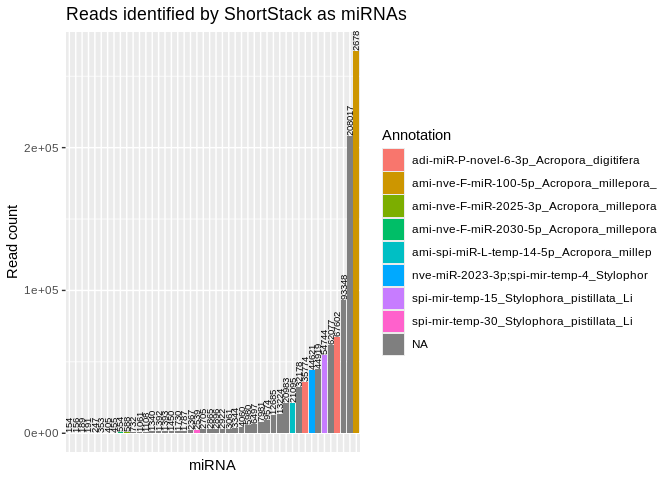
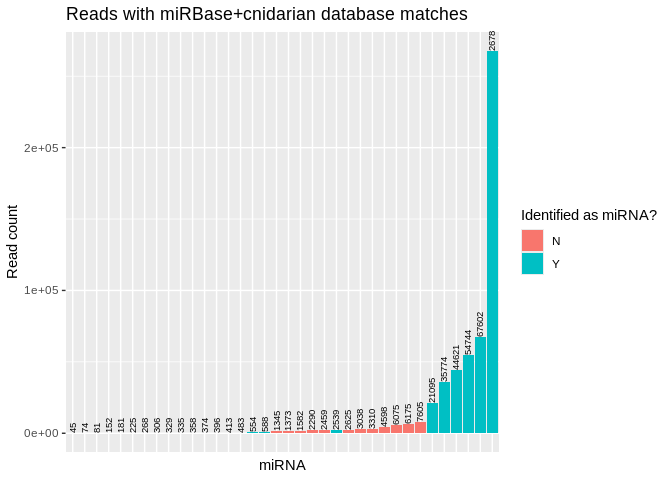
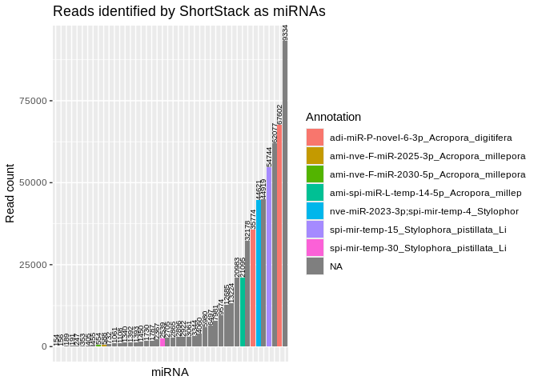
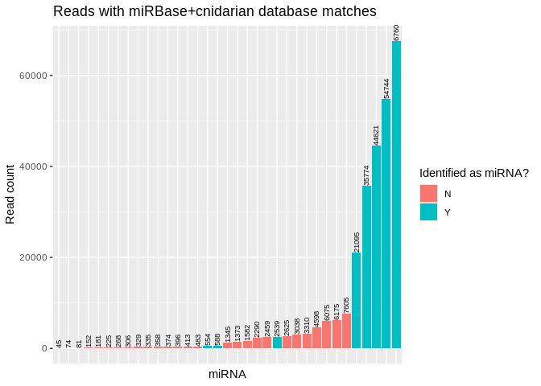
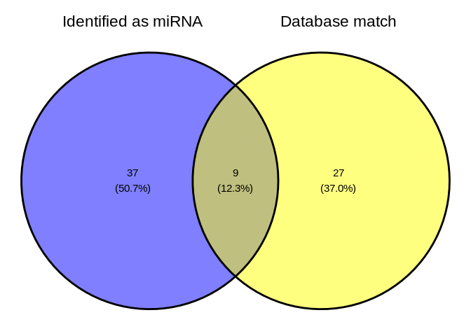

08.2-Peve-sRNAseq-ShortStack-31bp-fastp-merged
================
Sam White
2024-02-12

- <a href="#1-introduction" id="toc-1-introduction">1 Introduction</a>
- <a href="#2-set-r-variables" id="toc-2-set-r-variables">2 Set R
  variables</a>
- <a href="#3-create-a-bash-variables-file"
  id="toc-3-create-a-bash-variables-file">3 Create a Bash variables
  file</a>
- <a href="#4-load-shortstack-conda-environment"
  id="toc-4-load-shortstack-conda-environment">4 Load ShortStack conda
  environment</a>
- <a href="#5-run-shortstack" id="toc-5-run-shortstack">5 Run
  ShortStack</a>
  - <a href="#51-excecute-shortstack-command"
    id="toc-51-excecute-shortstack-command">5.1 Excecute ShortStack
    command</a>
    - <a
      href="#511-this-keeps-crashing-after-screening-of-possible-de-novo-micrornas"
      id="toc-511-this-keeps-crashing-after-screening-of-possible-de-novo-micrornas">5.1.1
      THIS KEEPS CRASHING AFTER Screening of possible de novo microRNAs</a>
  - <a href="#52-check-runtime" id="toc-52-check-runtime">5.2 Check
    runtime</a>
- <a href="#6-results" id="toc-6-results">6 Results</a>
  - <a href="#61-shortstack-synopsis" id="toc-61-shortstack-synopsis">6.1
    ShortStack synopsis</a>
  - <a href="#62-inspect-resultstxt" id="toc-62-inspect-resultstxt">6.2
    Inspect <code>Results.txt</code></a>
    - <a href="#621-directory-tree-of-all-shortstack-outputs"
      id="toc-621-directory-tree-of-all-shortstack-outputs">6.2.1 Directory
      tree of all ShortStack outputs</a>
  - <a href="#63-visualize" id="toc-63-visualize">6.3 Visualize</a>

# 1 Introduction

Use [ShortStack](https://github.com/MikeAxtell/ShortStack)
([**Axtell2013-xu?**](#ref-Axtell2013-xu); [Johnson et al.
2016](#ref-johnson2016); [**Shahid2014-lx?**](#ref-Shahid2014-lx)) to
perform alignment of sRNAseq data and annotation of sRNA-producing
genes.

------------------------------------------------------------------------

Inputs:

- Requires trimmed sRNAseq files generated by
  [06.2-Peve-sRNAseq-trimming-31bp-fastp-merged.Rmd](https://github.com/urol-e5/deep-dive/blob/main/E-Peve/code/06.2-Peve-sRNAseq-trimming-31bp-fastp-merged.Rmd)

  - Filenames formatted: `*fastp-R1-31bp-auto_adapters-polyG.fq.gz`

- Genome FastA. See
  [07-Peve-sRNAseq-MirMachine.md](https://github.com/urol-e5/deep-dive/blob/main/E-Peve/code/07-Peve-sRNAseq-MirMachine.md)
  for download info if needed.

- Modified MiRBase v22.1 FastA. Includes cnidarian miRNAs provided by
  Jill Ashley.

Outputs:

- See [ShortStack outputs
  documentation](https://github.com/MikeAxtell/ShortStack#outputs) for
  full list and detailed descriptions.

Software requirements:

- Utilizes a
  [ShortStack](https://github.com/MikeAxtell/ShortStack#installation)
  Conda/Mamba environment, per the installation instructions.

Replace with name of your ShortStack environment and the path to the
corresponding conda installation (find this *after* you’ve activated the
environment).

E.g.

``` bash
# Activate environment
conda activate ShortStack-4.0.3_env

# Find conda path
which conda
```

------------------------------------------------------------------------

# 2 Set R variables

``` r
shortstack_conda_env_name <- c("ShortStack-4.0.3_env")
shortstack_cond_path <- c("/home/sam/programs/mambaforge/condabin/conda")
```

# 3 Create a Bash variables file

This allows usage of Bash variables across R Markdown chunks.

``` bash
{
echo "#### Assign Variables ####"
echo ""

echo "# Trimmed FastQ naming pattern"
echo "export trimmed_fastqs_pattern='*fastp-adapters-polyG-31bp-merged.fq.gz'"

echo "# Data directories"
echo 'export deep_dive_dir=/home/shared/8TB_HDD_01/sam/gitrepos/deep-dive'
echo 'export deep_dive_data_dir="${deep_dive_dir}/data"'
echo 'export output_dir_top=${deep_dive_dir}/E-Peve/output/08.2-Peve-sRNAseq-ShortStack-31bp-fastp-merged'
echo 'export trimmed_fastqs_dir="${deep_dive_dir}/E-Peve/output/06.2-Peve-sRNAseq-trimming-31bp-fastp-merged/trimmed-reads"'
echo ""

echo "# Input/Output files"
echo 'export genome_fasta_dir=${deep_dive_dir}/E-Peve/data'
echo 'export genome_fasta_name="Porites_evermanni_v1.fa"'
echo 'export shortstack_genome_fasta_name="Porites_evermanni_v1.fa"'
echo 'export mirbase_mature_fasta_version=cnidarian-mirbase-mature-v22.1.fasta'
echo 'export genome_fasta="${genome_fasta_dir}/${shortstack_genome_fasta_name}"'
echo ""


echo "# Set number of CPUs to use"
echo 'export threads=40'
echo ""

echo "# Initialize arrays"
echo 'export trimmed_fastqs_array=()'


} > .bashvars

cat .bashvars
```

    #### Assign Variables ####

    # Trimmed FastQ naming pattern
    export trimmed_fastqs_pattern='*fastp-adapters-polyG-31bp-merged.fq.gz'
    # Data directories
    export deep_dive_dir=/home/shared/8TB_HDD_01/sam/gitrepos/deep-dive
    export deep_dive_data_dir="${deep_dive_dir}/data"
    export output_dir_top=${deep_dive_dir}/E-Peve/output/08.2-Peve-sRNAseq-ShortStack-31bp-fastp-merged
    export trimmed_fastqs_dir="${deep_dive_dir}/E-Peve/output/06.2-Peve-sRNAseq-trimming-31bp-fastp-merged/trimmed-reads"

    # Input/Output files
    export genome_fasta_dir=${deep_dive_dir}/E-Peve/data
    export genome_fasta_name="Porites_evermanni_v1.fa"
    export shortstack_genome_fasta_name="Porites_evermanni_v1.fa"
    export mirbase_mature_fasta_version=cnidarian-mirbase-mature-v22.1.fasta
    export genome_fasta="${genome_fasta_dir}/${shortstack_genome_fasta_name}"

    # Set number of CPUs to use
    export threads=40

    # Initialize arrays
    export trimmed_fastqs_array=()

# 4 Load [ShortStack](https://github.com/MikeAxtell/ShortStack) conda environment

If this is successful, the first line of output should show that the
Python being used is the one in your
$$ShortStack$$(<https://github.com/MikeAxtell/ShortStack> conda
environment path.

E.g.

`python:         /home/sam/programs/mambaforge/envs/mirmachine_env/bin/python`

``` r
use_condaenv(condaenv = shortstack_conda_env_name, conda = shortstack_cond_path)

# Check successful env loading
py_config()
```

    python:         /home/sam/programs/mambaforge/envs/ShortStack-4.0.3_env/bin/python
    libpython:      /home/sam/programs/mambaforge/envs/ShortStack-4.0.3_env/lib/libpython3.10.so
    pythonhome:     /home/sam/programs/mambaforge/envs/ShortStack-4.0.3_env:/home/sam/programs/mambaforge/envs/ShortStack-4.0.3_env
    version:        3.10.13 | packaged by conda-forge | (main, Dec 23 2023, 15:36:39) [GCC 12.3.0]
    numpy:          /home/sam/programs/mambaforge/envs/ShortStack-4.0.3_env/lib/python3.10/site-packages/numpy
    numpy_version:  1.26.4

    NOTE: Python version was forced by use_python() function

# 5 Run ShortStack

## 5.1 Excecute ShortStack command

### 5.1.1 THIS KEEPS CRASHING AFTER Screening of possible de novo microRNAs

Uses the `--dn_mirna` option to identify miRNAs in the genome, without
relying on the `--known_miRNAs`.

This part of the code redirects the output of `time` to the end of
`shortstack.log` file.

- `; } \ 2>> ${output_dir_top}/shortstack.log`

``` bash
# Load bash variables into memory
source .bashvars

# Make output directory, if it doesn't exist
mkdir --parents "${output_dir_top}"

# Create array of trimmed FastQs
trimmed_fastqs_array=(${trimmed_fastqs_dir}/${trimmed_fastqs_pattern})


# Pass array contents to new variable as space-delimited list
trimmed_fastqs_list=$(echo "${trimmed_fastqs_array[*]}")


###### Run ShortStack ######
{ time \
ShortStack \
--genomefile "${genome_fasta}" \
--readfile ${trimmed_fastqs_list} \
--known_miRNAs ${deep_dive_data_dir}/${mirbase_mature_fasta_version} \
--dn_mirna \
--threads ${threads} \
--outdir ${output_dir_top}/ShortStack_out \
&> ${output_dir_top}/shortstack.log ; } \
2>> ${output_dir_top}/shortstack.log
```

## 5.2 Check runtime

``` bash
# Load bash variables into memory
source .bashvars

tail -n 3 ${output_dir_top}/shortstack.log \
| grep "real" \
| awk '{print "ShortStack runtime:" "\t" $2}'
```

    ShortStack runtime: 32m32.272s

# 6 Results

## 6.1 ShortStack synopsis

``` bash
# Load bash variables into memory
source .bashvars

tail -n 25 ${output_dir_top}/shortstack.log
```

    Writing final files

    Found a total of 46 MIRNA loci


    Non-MIRNA loci by DicerCall:
    N 16529
    22 59
    23 47
    21 31
    24 24

    Creating visualizations of microRNA loci with strucVis
    <<< WARNING >>>
    Do not rely on these results alone to annotate new MIRNA loci!
    The false positive rate for de novo MIRNA identification is low, but NOT ZERO
    Insepct each mirna locus, especially the strucVis output, and see
    https://doi.org/10.1105/tpc.17.00851 , https://doi.org/10.1093/nar/gky1141

    Thu 09 May 2024 10:44:28 -0700 PDT
    Run Completed!

    real    32m32.272s
    user    441m7.302s
    sys 194m17.834s

ShortStack found 46 miRNAs.

## 6.2 Inspect `Results.txt`

``` bash
# Load bash variables into memory
source .bashvars

head ${output_dir_top}/ShortStack_out/Results.txt

echo ""
echo "----------------------------------------------------------"
echo ""

echo "Nummber of potential loci:"
awk '(NR>1)' ${output_dir_top}/ShortStack_out/Results.txt | wc -l
```

    Locus   Name    Chrom   Start   End Length  Reads   DistinctSequences   FracTop Strand  MajorRNA    MajorRNAReads   Short   Long    21  22  23  24  DicerCall   MIRNA   known_miRNAs
    Porites_evermani_scaffold_1:45711-46131 Cluster_1   Porites_evermani_scaffold_1 45711   46131   421 88  38  1.0 +   CAGUAGAGGUGGCCAAGAAUCAGU    8   24  27  9   8   9   11  N   N   NA
    Porites_evermani_scaffold_1:201507-201931   Cluster_2   Porites_evermani_scaffold_1 201507  201931  425 58  14  0.034482758620689655    -   UGUACUUCUGAUUAAACGAACCAGACAUCGC 12  0   50  0   0   0   8   N   N   NA
    Porites_evermani_scaffold_1:313446-313846   Cluster_3   Porites_evermani_scaffold_1 313446  313846  401 50  27  0.0 -   CUGACGUUUUAAGCUCAAUAGU  13  10  15  1   17  3   4   N   N   NA
    Porites_evermani_scaffold_1:406146-406734   Cluster_4   Porites_evermani_scaffold_1 406146  406734  589 175 61  0.06285714285714286 -   UGAGUGUAUUCUUGAACUGUUUUCCAAC    39  1   159 2   0   5   8   N   N   NA
    Porites_evermani_scaffold_1:409839-410269   Cluster_5   Porites_evermani_scaffold_1 409839  410269  431 169 43  0.005917159763313609    -   UGGAACUCCGAUUUAGAACUUGCAAACUUU  61  0   161 1   3   0   4   N   N   NA
    Porites_evermani_scaffold_1:465244-465668   Cluster_6   Porites_evermani_scaffold_1 465244  465668  425 169 49  0.0 -   AAGUUGCUCUGAAGAUUAUGU   39  34  52  48  8   20  7   N   N   NA
    Porites_evermani_scaffold_1:468473-468950   Cluster_7   Porites_evermani_scaffold_1 468473  468950  478 91900   807 0.0 -   AGCACUGAUGACUGUUCAGUUUUUCUGAAUU 68534   2227    88188   115 138 153 1079    N   N   NA
    Porites_evermani_scaffold_1:476827-477250   Cluster_8   Porites_evermani_scaffold_1 476827  477250  424 116 37  0.0 -   CGUGUCUUCGUAAUCGUCUCGUAC    14  33  38  0   12  15  18  N   N   NA
    Porites_evermani_scaffold_1:486441-486868   Cluster_9   Porites_evermani_scaffold_1 486441  486868  428 57  11  0.07017543859649122 -   AUAUUGACGAAUCCUGGCCUAGUGAACC    26  0   53  0   0   4   0   N   N   NA

    ----------------------------------------------------------

    Nummber of potential loci:
    16736

Column 20 of the `Results.txt` file identifies if a cluster is a miRNA
or not (`Y` or `N`).

``` bash
# Load bash variables into memory
source .bashvars

echo "Number of loci characterized as miRNA:"
awk '$20=="Y" {print $0}' ${output_dir_top}/ShortStack_out/Results.txt \
| wc -l
echo ""

echo "----------------------------------------------------------"

echo ""
echo "Number of loci _not_ characterized as miRNA:"
awk '$20=="N" {print $0}' ${output_dir_top}/ShortStack_out/Results.txt \
| wc -l
```

    Number of loci characterized as miRNA:
    46

    ----------------------------------------------------------

    Number of loci _not_ characterized as miRNA:
    16690

Column 21 of the `Results.txt` file identifies if a cluster aligned to a
known miRNA (miRBase) or not (`Y` or `NA`).

``` bash
# Load bash variables into memory
source .bashvars

echo "Number of loci matching miRBase miRNAs:"
awk '$21!="NA" {print $0}' ${output_dir_top}/ShortStack_out/Results.txt \
| wc -l
echo ""

echo "----------------------------------------------------------"

echo ""
echo "Number of loci _not_ matching miRBase miRNAs:"
awk '$21=="NA" {print $0}' ${output_dir_top}/ShortStack_out/Results.txt \
| wc -l
```

    Number of loci matching miRBase miRNAs:
    37

    ----------------------------------------------------------

    Number of loci _not_ matching miRBase miRNAs:
    16700

Although there are 46 loci with matches to miRBase miRNAs, ShortStack
did *not* annotate 9 of these clusters as miRNAs likely [because they do
not *also* match secondary structure
criteria](https://github.com/MikeAxtell/ShortStack#mirna-annotation).

This explains the difference between the 46 and 37 miRNAs.

### 6.2.1 Directory tree of all ShortStack outputs

Many of these are large (by GitHub standards) BAM files, so will not be
added to the repo.

Additionally, it’s unlikely we’ll utilize most of the other files
(bigwig) generated by ShortStack.

``` bash
# Load bash variables into memory
source .bashvars

tree -h ${output_dir_top}/
```

    /home/shared/8TB_HDD_01/sam/gitrepos/deep-dive/E-Peve/output/08.2-Peve-sRNAseq-ShortStack-31bp-fastp-merged/
    ├── [ 17K]  shortstack.log
    └── [240K]  ShortStack_out
        ├── [ 16K]  alignment_details.tsv
        ├── [1.1M]  Counts.txt
        ├── [212K]  known_miRNAs.gff3
        ├── [1.8M]  known_miRNAs_unaligned.fasta
        ├── [6.2M]  merged_alignments_21_m.bw
        ├── [6.3M]  merged_alignments_21_p.bw
        ├── [5.6M]  merged_alignments_22_m.bw
        ├── [5.7M]  merged_alignments_22_p.bw
        ├── [9.5M]  merged_alignments_23-24_m.bw
        ├── [9.5M]  merged_alignments_23-24_p.bw
        ├── [644M]  merged_alignments.bam
        ├── [336K]  merged_alignments.bam.csi
        ├── [ 41M]  merged_alignments_other_m.bw
        ├── [ 42M]  merged_alignments_other_p.bw
        ├── [ 32M]  merged_alignments_POR-73-S1-TP2-fastp-adapters-polyG-31bp-merged.bw
        ├── [ 44M]  merged_alignments_POR-79-S1-TP2-fastp-adapters-polyG-31bp-merged.bw
        ├── [ 50M]  merged_alignments_POR-82-S1-TP2-fastp-adapters-polyG-31bp-merged.bw
        ├── [ 15K]  mir.fasta
        ├── [185M]  POR-73-S1-TP2-fastp-adapters-polyG-31bp-merged.bam
        ├── [301K]  POR-73-S1-TP2-fastp-adapters-polyG-31bp-merged.bam.csi
        ├── [199M]  POR-79-S1-TP2-fastp-adapters-polyG-31bp-merged.bam
        ├── [307K]  POR-79-S1-TP2-fastp-adapters-polyG-31bp-merged.bam.csi
        ├── [227M]  POR-82-S1-TP2-fastp-adapters-polyG-31bp-merged.bam
        ├── [312K]  POR-82-S1-TP2-fastp-adapters-polyG-31bp-merged.bam.csi
        ├── [1.9M]  Results.gff3
        ├── [2.9M]  Results.txt
        └── [4.0K]  strucVis
            ├── [ 12K]  Cluster_10850.ps
            ├── [8.1K]  Cluster_10850.txt
            ├── [ 12K]  Cluster_10882.ps
            ├── [ 22K]  Cluster_10882.txt
            ├── [ 12K]  Cluster_11045.ps
            ├── [ 25K]  Cluster_11045.txt
            ├── [ 12K]  Cluster_11046.ps
            ├── [ 43K]  Cluster_11046.txt
            ├── [ 12K]  Cluster_1125.ps
            ├── [ 15K]  Cluster_1125.txt
            ├── [ 12K]  Cluster_1153.ps
            ├── [ 51K]  Cluster_1153.txt
            ├── [ 12K]  Cluster_11890.ps
            ├── [ 13K]  Cluster_11890.txt
            ├── [ 11K]  Cluster_14130.ps
            ├── [2.3K]  Cluster_14130.txt
            ├── [ 11K]  Cluster_14362.ps
            ├── [4.0K]  Cluster_14362.txt
            ├── [ 12K]  Cluster_14865.ps
            ├── [4.1K]  Cluster_14865.txt
            ├── [ 12K]  Cluster_15601.ps
            ├── [8.1K]  Cluster_15601.txt
            ├── [ 12K]  Cluster_15760.ps
            ├── [ 13K]  Cluster_15760.txt
            ├── [ 12K]  Cluster_16267.ps
            ├── [3.0K]  Cluster_16267.txt
            ├── [ 11K]  Cluster_16348.ps
            ├── [ 14K]  Cluster_16348.txt
            ├── [ 12K]  Cluster_2770.ps
            ├── [ 14K]  Cluster_2770.txt
            ├── [ 11K]  Cluster_2837.ps
            ├── [4.9K]  Cluster_2837.txt
            ├── [ 11K]  Cluster_2871.ps
            ├── [ 17K]  Cluster_2871.txt
            ├── [ 11K]  Cluster_29.ps
            ├── [ 32K]  Cluster_29.txt
            ├── [ 12K]  Cluster_4063.ps
            ├── [ 66K]  Cluster_4063.txt
            ├── [ 12K]  Cluster_4064.ps
            ├── [ 56K]  Cluster_4064.txt
            ├── [ 12K]  Cluster_4097.ps
            ├── [ 55K]  Cluster_4097.txt
            ├── [ 12K]  Cluster_4617.ps
            ├── [7.5K]  Cluster_4617.txt
            ├── [ 11K]  Cluster_4722.ps
            ├── [ 12K]  Cluster_4722.txt
            ├── [ 12K]  Cluster_5540.ps
            ├── [ 15K]  Cluster_5540.txt
            ├── [ 12K]  Cluster_5636.ps
            ├── [4.0K]  Cluster_5636.txt
            ├── [ 12K]  Cluster_578.ps
            ├── [ 20K]  Cluster_578.txt
            ├── [ 12K]  Cluster_5849.ps
            ├── [9.2K]  Cluster_5849.txt
            ├── [ 12K]  Cluster_6211.ps
            ├── [4.1K]  Cluster_6211.txt
            ├── [ 12K]  Cluster_6865.ps
            ├── [ 12K]  Cluster_6865.txt
            ├── [ 12K]  Cluster_6866.ps
            ├── [9.9K]  Cluster_6866.txt
            ├── [ 12K]  Cluster_6867.ps
            ├── [ 14K]  Cluster_6867.txt
            ├── [ 11K]  Cluster_6875.ps
            ├── [ 39K]  Cluster_6875.txt
            ├── [ 12K]  Cluster_7013.ps
            ├── [9.7K]  Cluster_7013.txt
            ├── [ 12K]  Cluster_7604.ps
            ├── [ 19K]  Cluster_7604.txt
            ├── [ 12K]  Cluster_7605.ps
            ├── [ 13K]  Cluster_7605.txt
            ├── [ 11K]  Cluster_7804.ps
            ├── [5.7K]  Cluster_7804.txt
            ├── [ 12K]  Cluster_786.ps
            ├── [ 58K]  Cluster_786.txt
            ├── [ 12K]  Cluster_8571.ps
            ├── [5.5K]  Cluster_8571.txt
            ├── [ 12K]  Cluster_8824.ps
            ├── [ 30K]  Cluster_8824.txt
            ├── [ 12K]  Cluster_8827.ps
            ├── [ 15K]  Cluster_8827.txt
            ├── [ 12K]  Cluster_8828.ps
            ├── [ 20K]  Cluster_8828.txt
            ├── [ 11K]  Cluster_8920.ps
            ├── [ 52K]  Cluster_8920.txt
            ├── [ 12K]  Cluster_9077.ps
            ├── [3.3K]  Cluster_9077.txt
            ├── [ 12K]  Cluster_9915.ps
            ├── [ 10K]  Cluster_9915.txt
            ├── [ 12K]  Cluster_9991.ps
            ├── [ 25K]  Cluster_9991.txt
            ├── [ 12K]  Cluster_9992.ps
            └── [ 27K]  Cluster_9992.txt

    2 directories, 119 files

## 6.3 Visualize

We noticed that a) not all of the identified miRNAs have database
matches, and b) some reads have a match in the database but are *not*
classified as miRNAs. Let’s look at this in more depth.

``` r
Peve_shortstack_results <- read.csv("../output/08.2-Peve-sRNAseq-ShortStack-31bp-fastp-merged/ShortStack_out/Results.txt", sep="\t")
```

``` r
# Reads identified as miRNAs (but not necessarily known)
Peve_shortstack_results %>% 
  filter(MIRNA == "Y") %>%
  mutate(known_miRNAs = str_sub(known_miRNAs, 1, 40)) %>%
  mutate(Locus = str_sub(Locus, 20, 40)) %>%
  ggplot(aes(x = reorder(Locus, Reads), y = Reads, fill = known_miRNAs)) +
  geom_bar(stat = "identity") +
   geom_text(aes(label = Reads), vjust = 0.5, hjust = 0, color = "black", size = 2.5, angle = 90) +
  labs(x = "miRNA", y = "Read count", 
       title = "Reads identified by ShortStack as miRNAs",
       fill = "Annotation") +
  theme(axis.text.x = element_blank(),
        axis.ticks.x = element_blank())
```

<!-- -->

``` r
ggsave("../output/08.2-Peve-sRNAseq-ShortStack-31bp-fastp-merged/figures/Peve_ShortStack_miRNA_histogram.png", width = 12, height = 7, units = "in")


# Reads matched in the reference db (but not necessarily identified as miRNA)
Peve_shortstack_results %>% 
  filter(!is.na(known_miRNAs)) %>%
  mutate(known_miRNAs = str_sub(known_miRNAs, 1, 40)) %>%
  mutate(Locus = str_sub(Locus, 20, 40)) %>%
  ggplot(aes(x = reorder(Locus, Reads), y = Reads, fill = MIRNA)) +
  geom_bar(stat = "identity") +
  geom_text(aes(label = Reads), vjust = 0.5, hjust = 0, color = "black", size = 2.5, angle = 90) +
  labs(x = "miRNA", y = "Read count", 
       title = "Reads with miRBase+cnidarian database matches",
       fill = "Identified as miRNA?") +
  theme(axis.text.x = element_blank(),
        axis.ticks.x = element_blank())
```

<!-- -->

``` r
ggsave("../output/08.2-Peve-sRNAseq-ShortStack-31bp-fastp-merged/figures/Peve_ShortStack_dbmatch_histogram.png", width = 12, height = 7, units = "in")
```

There’s one miRNA with a very high read count, and it’s making
visualization of the rest difficult. Let’s remove it and retry
visualizing the rest.

``` r
# Reads identified as miRNAs (but not necessarily known)
Peve_shortstack_results %>% 
  filter(MIRNA == "Y") %>%
  filter(Reads < 200000) %>%
  mutate(known_miRNAs = str_sub(known_miRNAs, 1, 40)) %>%
  mutate(Locus = str_sub(Locus, 20, 40)) %>%
  ggplot(aes(x = reorder(Locus, Reads), y = Reads, fill = known_miRNAs)) +
  geom_bar(stat = "identity") +
   geom_text(aes(label = Reads), vjust = 0.5, hjust = 0, color = "black", size = 2.5, angle = 90) +
  labs(x = "miRNA", y = "Read count", 
       title = "Reads identified by ShortStack as miRNAs",
       fill = "Annotation") +
  theme(axis.text.x = element_blank(),
        axis.ticks.x = element_blank())
```

<!-- -->

``` r
ggsave("../output/08.2-Peve-sRNAseq-ShortStack-31bp-fastp-merged/figures/Peve_ShortStack_miRNA_histogram_reduced.png", width = 12, height = 7, units = "in")


# Reads matched in the reference db (but not necessarily identified as miRNA)
Peve_shortstack_results %>% 
  filter(!is.na(known_miRNAs)) %>%
  filter(Reads < 200000) %>%
  mutate(known_miRNAs = str_sub(known_miRNAs, 1, 40)) %>%
  mutate(Locus = str_sub(Locus, 20, 40)) %>%
  ggplot(aes(x = reorder(Locus, Reads), y = Reads, fill = MIRNA)) +
  geom_bar(stat = "identity") +
  geom_text(aes(label = Reads), vjust = 0.5, hjust = 0, color = "black", size = 2.5, angle = 90) +
  labs(x = "miRNA", y = "Read count", 
       title = "Reads with miRBase+cnidarian database matches",
       fill = "Identified as miRNA?") +
  theme(axis.text.x = element_blank(),
        axis.ticks.x = element_blank())
```

<!-- -->

``` r
ggsave("../output/08.2-Peve-sRNAseq-ShortStack-31bp-fastp-merged/figures/Peve_ShortStack_dbmatch_histogram_reduced.png", width = 12, height = 7, units = "in")
```

``` r
# Make list
mirnas <- Peve_shortstack_results %>% filter(MIRNA == "Y") %>% pull(Locus)
matches <- Peve_shortstack_results %>% filter(!is.na(known_miRNAs)) %>% pull(Locus)

Peve_shortstack_vennlist <- list(
  "Identified as miRNA" = mirnas,
  "Database match" = matches
)

# Make venn diagrams
ggvenn(Peve_shortstack_vennlist)
```

<!-- -->

``` r
ggsave("../output/08.2-Peve-sRNAseq-ShortStack-31bp-fastp-merged/figures/Peve_ShortStack_venn.png", width = 12, height = 7, units = "in")
```

<div id="refs" class="references csl-bib-body hanging-indent">

<div id="ref-johnson2016" class="csl-entry">

Johnson, Nathan R, Jonathan M Yeoh, Ceyda Coruh, and Michael J Axtell.
2016. “Improved Placement of Multi-Mapping Small RNAs.” *G3
Genes\|Genomes\|Genetics* 6 (7): 2103–11.
<https://doi.org/10.1534/g3.116.030452>.

</div>

</div>
