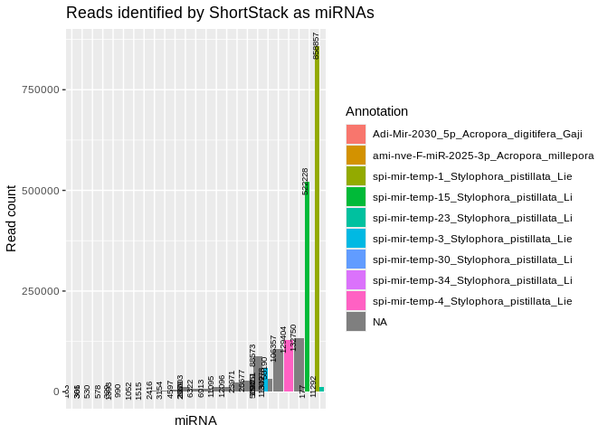

13.2.1-Pmea-sRNAseq-ShortStack-31bp-fastp-merged-cnidarian_miRBase
================
Sam White
2024-02-16

- [1 Set R variables](#1-set-r-variables)
- [2 Create a Bash variables file](#2-create-a-bash-variables-file)
- [3 Load ShortStack conda
  environment](#3-load-shortstack-conda-environment)
- [4 Run ShortStack](#4-run-shortstack)
  - [4.1 Modify genome filename for ShortStack
    compatability](#41-modify-genome-filename-for-shortstack-compatability)
  - [4.2 Excecute ShortStack command](#42-excecute-shortstack-command)
  - [4.3 Check runtime](#43-check-runtime)
- [5 Results](#5-results)
  - [5.1 ShortStack synopsis](#51-shortstack-synopsis)
  - [5.2 Inspect `Results.txt`](#52-inspect-resultstxt)
    - [5.2.1 Directory tree of all ShortStack
      outputs](#521-directory-tree-of-all-shortstack-outputs)
  - [5.3 Visualize](#53-visualize)
- [6 Citations](#6-citations)

Use [ShortStack](https://github.com/MikeAxtell/ShortStack) ([Axtell
2013](#ref-axtell2013a); [Shahid and Axtell 2014](#ref-shahid2014);
[Johnson et al. 2016](#ref-johnson2016a))to perform alignment of sRNAseq
data and annotation of sRNA-producing genes.

This is the same ShortStack analysis as seen in
[13.1-Pmea-sRNAseq-ShortStack-R1-reads.Rmd](https://github.com/urol-e5/deep-dive/blob/main/D-Apul/code/13.1-Pmea-sRNAseq-ShortStack-R1-reads.Rmd),
but this analysis uses a customized miRBase database, created by Jill
Ashley, which includes published cnidarian miRNAs:

- [`cnidarian_miRNAs.fasta`](https://github.com/urol-e5/deep-dive/blob/main/DEF-cross-species/data/cnidarian_miRNAs.fasta)

The *P.meandrina* genome will be used as the reference genome.

------------------------------------------------------------------------

Inputs:

- Requires trimmed sRNAseq files generated by
  [08.1-Pmea-sRNAseq-trimming-R1-only.Rmd](https://github.com/urol-e5/deep-dive/blob/main/F-Pmea/code/08.1-Pmea-sRNAseq-trimming-R1-only.Rmd)

  - Filenames formatted: `*fastp-adapters-polyG-31bp-merged.fq.gz`

- *P.meandrina* genome FastA. See
  [12-Pmea-sRNAseq-MirMachine.Rmd](https://github.com/urol-e5/deep-dive/blob/main/F-Pmea/code/12-Pmea-sRNAseq-MirMachine.Rmd)
  for download info if needed.

Outputs:

- See [ShortStack outputs
  documentation](https://github.com/MikeAxtell/ShortStack#outputs) for
  full list and detailed descriptions.

Software requirements:

- Utilizes a
  [ShortStack](https://github.com/MikeAxtell/ShortStack#installation)
  Conda/Mamba environment, per the installation instructions.

Replace with name of your ShortStack environment and the path to the
corresponding conda installation (find this *after* you’ve activated the
environment).

E.g.

``` bash
# Activate environment
conda activate ShortStack4_env

# Find conda path
which conda
```

------------------------------------------------------------------------

# 1 Set R variables

``` r
shortstack_conda_env_name <- c("ShortStack-4.0.3_env")
shortstack_cond_path <- c("/home/sam/programs/mambaforge/condabin/conda")
```

# 2 Create a Bash variables file

This allows usage of Bash variables across R Markdown chunks.

``` bash
{
echo "#### Assign Variables ####"
echo ""

echo "# Trimmed FastQ naming pattern"
echo "export trimmed_fastqs_pattern='*fastp-adapters-polyG-31bp-merged.fq.gz'"

echo "# Data directories"
echo 'export deep_dive_dir=/home/shared/8TB_HDD_01/sam/gitrepos/deep-dive'
echo 'export deep_dive_data_dir="${deep_dive_dir}/data"'
echo 'export output_dir_top=${deep_dive_dir}/F-Pmea/output/13.2.1-Pmea-sRNAseq-ShortStack-31bp-fastp-merged-cnidarian_miRBase'
echo 'export trimmed_fastqs_dir="${deep_dive_dir}/F-Pmea/output/08.2-Pmea-sRNAseq-trimming-31bp-fastp-merged/trimmed-reads"'
echo ""

echo "# Input/Output files"
echo 'export genome_fasta_dir=${deep_dive_dir}/F-Pmea/data'
echo 'export genome_fasta_name="Pocillopora_meandrina_HIv1.assembly.fasta"'
echo 'export shortstack_genome_fasta_name="Pocillopora_meandrina_HIv1.assembly.fa"'

echo 'export mirbase_mature_fasta_version=cnidarian-mirbase-mature-v22.1.fasta'
echo 'export genome_fasta="${genome_fasta_dir}/${shortstack_genome_fasta_name}"'
echo ""


echo "# Set number of CPUs to use"
echo 'export threads=46'
echo ""

echo "# Initialize arrays"
echo 'export trimmed_fastqs_array=()'


} > .bashvars

cat .bashvars
```

    #### Assign Variables ####

    # Trimmed FastQ naming pattern
    export trimmed_fastqs_pattern='*fastp-adapters-polyG-31bp-merged.fq.gz'
    # Data directories
    export deep_dive_dir=/home/shared/8TB_HDD_01/sam/gitrepos/deep-dive
    export deep_dive_data_dir="${deep_dive_dir}/data"
    export output_dir_top=${deep_dive_dir}/F-Pmea/output/13.2.1-Pmea-sRNAseq-ShortStack-31bp-fastp-merged-cnidarian_miRBase
    export trimmed_fastqs_dir="${deep_dive_dir}/F-Pmea/output/08.2-Pmea-sRNAseq-trimming-31bp-fastp-merged/trimmed-reads"

    # Input/Output files
    export genome_fasta_dir=${deep_dive_dir}/F-Pmea/data
    export genome_fasta_name="Pocillopora_meandrina_HIv1.assembly.fasta"
    export shortstack_genome_fasta_name="Pocillopora_meandrina_HIv1.assembly.fa"
    export mirbase_mature_fasta_version=cnidarian-mirbase-mature-v22.1.fasta
    export genome_fasta="${genome_fasta_dir}/${shortstack_genome_fasta_name}"

    # Set number of CPUs to use
    export threads=46

    # Initialize arrays
    export trimmed_fastqs_array=()

# 3 Load [ShortStack](https://github.com/MikeAxtell/ShortStack) conda environment

If this is successful, the first line of output should show that the
Python being used is the one in your
$$ShortStack$$(<https://github.com/MikeAxtell/ShortStack> conda
environment path.

E.g.

`python:         /home/sam/programs/mambaforge/envs/mirmachine_env/bin/python`

``` r
use_condaenv(condaenv = shortstack_conda_env_name, conda = shortstack_cond_path)

# Check successful env loading
py_config()
```

    python:         /home/sam/programs/mambaforge/envs/ShortStack-4.0.3_env/bin/python
    libpython:      /home/sam/programs/mambaforge/envs/ShortStack-4.0.3_env/lib/libpython3.10.so
    pythonhome:     /home/sam/programs/mambaforge/envs/ShortStack-4.0.3_env:/home/sam/programs/mambaforge/envs/ShortStack-4.0.3_env
    version:        3.10.13 | packaged by conda-forge | (main, Dec 23 2023, 15:36:39) [GCC 12.3.0]
    numpy:          /home/sam/programs/mambaforge/envs/ShortStack-4.0.3_env/lib/python3.10/site-packages/numpy
    numpy_version:  1.26.4

    NOTE: Python version was forced by use_python() function

# 4 Run ShortStack

## 4.1 Modify genome filename for ShortStack compatability

``` bash
# Load bash variables into memory
source .bashvars

# Check for FastA file first
# Then create rename file if doesn't exist
if [ -f "${genome_fasta_dir}/${shortstack_genome_fasta_name}" ]; then
  echo "${genome_fasta_dir}/${shortstack_genome_fasta_name} already exists. Nothing to do."
  echo ""
else

  # Copy genome FastA to ShortStack-compatible filename (ending with .fa)
  cp ${genome_fasta_dir}/${genome_fasta_name} ${genome_fasta_dir}/${shortstack_genome_fasta_name}
fi

# Confirm
ls -lh ${genome_fasta_dir}/${shortstack_genome_fasta_name}
```

    /home/shared/8TB_HDD_01/sam/gitrepos/deep-dive/F-Pmea/data/Pocillopora_meandrina_HIv1.assembly.fa already exists. Nothing to do.

    -rw-r--r-- 1 sam sam 360M Feb 16 10:28 /home/shared/8TB_HDD_01/sam/gitrepos/deep-dive/F-Pmea/data/Pocillopora_meandrina_HIv1.assembly.fa

## 4.2 Excecute ShortStack command

Uses the `--dn_mirna` option to identify miRNAs in the genome, without
relying on the `--known_miRNAs`.

This part of the code redirects the output of `time` to the end of
`shortstack.log` file.

- `; } \ 2>> ${output_dir_top}/shortstack.log`

``` bash
# Load bash variables into memory
source .bashvars

# Make output directory, if it doesn't exist
mkdir --parents "${output_dir_top}"

# Create array of trimmed FastQs
trimmed_fastqs_array=(${trimmed_fastqs_dir}/${trimmed_fastqs_pattern})


# Pass array contents to new variable as space-delimited list
trimmed_fastqs_list=$(echo "${trimmed_fastqs_array[*]}")


###### Run ShortStack ######
{ time \
ShortStack \
--genomefile "${genome_fasta}" \
--readfile ${trimmed_fastqs_list} \
--known_miRNAs ${deep_dive_data_dir}/${mirbase_mature_fasta_version} \
--dn_mirna \
--threads ${threads} \
--outdir ${output_dir_top}/ShortStack_out \
&> ${output_dir_top}/shortstack.log ; } \
2>> ${output_dir_top}/shortstack.log
```

## 4.3 Check runtime

``` bash
# Load bash variables into memory
source .bashvars

tail -n 3 ${output_dir_top}/shortstack.log \
| grep "real" \
| awk '{print "ShortStack runtime:" "\t" $2}'
```

    ShortStack runtime: 39m54.805s

# 5 Results

## 5.1 ShortStack synopsis

``` bash
# Load bash variables into memory
source .bashvars

tail -n 25 ${output_dir_top}/shortstack.log
```

    Writing final files

    Found a total of 37 MIRNA loci


    Non-MIRNA loci by DicerCall:
    N 7087
    22 33
    23 33
    24 15
    21 15

    Creating visualizations of microRNA loci with strucVis
    <<< WARNING >>>
    Do not rely on these results alone to annotate new MIRNA loci!
    The false positive rate for de novo MIRNA identification is low, but NOT ZERO
    Insepct each mirna locus, especially the strucVis output, and see
    https://doi.org/10.1105/tpc.17.00851 , https://doi.org/10.1093/nar/gky1141

    Thu 06 Jun 2024 08:55:50 -0700 PDT
    Run Completed!

    real    39m54.805s
    user    726m24.259s
    sys 252m56.657s

ShortStack identified 37 miRNAs.

## 5.2 Inspect `Results.txt`

``` bash
# Load bash variables into memory
source .bashvars

head ${output_dir_top}/ShortStack_out/Results.txt

echo ""
echo "----------------------------------------------------------"
echo ""

echo "Nummber of potential loci:"
awk '(NR>1)' ${output_dir_top}/ShortStack_out/Results.txt | wc -l
```

    Locus   Name    Chrom   Start   End Length  Reads   DistinctSequences   FracTop Strand  MajorRNA    MajorRNAReads   Short   Long    21  22  23  24  DicerCall   MIRNA   known_miRNAs
    Pocillopora_meandrina_HIv1___Sc0000000:9092-9521    Cluster_1   Pocillopora_meandrina_HIv1___Sc0000000  9092    9521    430 10813   348 0.9999075187274576  +   GGGGGUAUAGCUCAGUGGUAGA  3850    1422    3739    637 4394    174 447 N   N   NA
    Pocillopora_meandrina_HIv1___Sc0000000:53578-53997  Cluster_2   Pocillopora_meandrina_HIv1___Sc0000000  53578   53997   420 287 13  0.9965156794425087  +   GCCUAAGUUGCUUGGAACA 138 285 2   0   0   0   0   N   N   NA
    Pocillopora_meandrina_HIv1___Sc0000000:150243-150718    Cluster_3   Pocillopora_meandrina_HIv1___Sc0000000  150243  150718  476 2549    247 0.0 -   UGGCUAUGAUGAAAAUGACU    335 849 380 634 376 139 171 N   N   NA
    Pocillopora_meandrina_HIv1___Sc0000000:173728-174150    Cluster_4   Pocillopora_meandrina_HIv1___Sc0000000  173728  174150  423 1257    65  0.9968178202068417  +   UUUGAUUGCUGUGAUCUGGUUG  432 106 2   39  636 444 30  22  N   apa-mir-2050_Exaiptasia_pallida_Baumgarten_et_al._2017_miR-2050;_Nve;_Spis;_Adi
    Pocillopora_meandrina_HIv1___Sc0000000:187562-188076    Cluster_5   Pocillopora_meandrina_HIv1___Sc0000000  187562  188076  515 185 37  0.43243243243243246 .   AUAAAUGUCACUACAAGAAACCUGAAAUCGU 25  2   175 1   1   2   4   N   N   NA
    Pocillopora_meandrina_HIv1___Sc0000000:485730-486254    Cluster_6   Pocillopora_meandrina_HIv1___Sc0000000  485730  486254  525 286 127 1.0 +   GAUGGGUGUUAUUACUCCUCAGACAGAC    48  66  183 7   11  3   16  N   N   NA
    Pocillopora_meandrina_HIv1___Sc0000000:496020-496432    Cluster_7   Pocillopora_meandrina_HIv1___Sc0000000  496020  496432  413 72  24  1.0 +   AUGUAGUCGAGCAAAGUCCAUGUGGACGA   27  0   66  2   1   1   2   N   N   NA
    Pocillopora_meandrina_HIv1___Sc0000000:525310-527341    Cluster_8   Pocillopora_meandrina_HIv1___Sc0000000  525310  527341  2032    14765   2997    0.1810362343379614  -   UUUUCGUCACUUUCUUCAGCCUCAGAGU    966 140 13674   47  106 311 487 N   N   NA
    Pocillopora_meandrina_HIv1___Sc0000000:541262-541723    Cluster_9   Pocillopora_meandrina_HIv1___Sc0000000  541262  541723  462 732 134 0.07923497267759563 -   UUGGACGAAAUUUCGAGGUUCACACUCGUU  91  1   725 1   4   1   0   N   N   NA

    ----------------------------------------------------------

    Nummber of potential loci:
    7220

Column 20 of the `Results.txt` file identifies if a cluster is a miRNA
or not (`Y` or `N`).

``` bash
# Load bash variables into memory
source .bashvars

echo "Number of loci characterized as miRNA:"
awk '$20=="Y" {print $0}' ${output_dir_top}/ShortStack_out/Results.txt \
| wc -l
echo ""

echo "----------------------------------------------------------"

echo ""
echo "Number of loci _not_ characterized as miRNA:"
awk '$20=="N" {print $0}' ${output_dir_top}/ShortStack_out/Results.txt \
| wc -l
```

    Number of loci characterized as miRNA:
    37

    ----------------------------------------------------------

    Number of loci _not_ characterized as miRNA:
    7183

Column 21 of the `Results.txt` file identifies if a cluster aligned to a
known miRNA (miRBase) or not (`Y` or `NA`).

The `echo` command after the `awk` command is simply there to prove that
the chunk executed.

``` bash
# Load bash variables into memory
source .bashvars

echo "Number of loci matching miRBase miRNAs:"
awk '$21!="NA" {print $0}' ${output_dir_top}/ShortStack_out/Results.txt \
| wc -l
echo ""

echo "----------------------------------------------------------"

echo ""
echo "Number of loci _not_ matching miRBase miRNAs:"
awk '$21=="NA" {print $0}' ${output_dir_top}/ShortStack_out/Results.txt \
| wc -l
```

    Number of loci matching miRBase miRNAs:
    96

    ----------------------------------------------------------

    Number of loci _not_ matching miRBase miRNAs:
    7125

Although there are loci with matches to miRBase miRNAs, ShortStack did
*not* annotate these clusters as miRNAs likely [because they do not
*also* match secondary structure
criteria](https://github.com/MikeAxtell/ShortStack#mirna-annotation).

### 5.2.1 Directory tree of all ShortStack outputs

Many of these are large (by GitHub standards) BAM files, so will not be
added to the repo.

Additionally, it’s unlikely we’ll utilize most of the other files
(bigwig) generated by ShortStack.

``` bash
# Load bash variables into memory
source .bashvars

tree -h ${output_dir_top}/
```

    /home/shared/8TB_HDD_01/sam/gitrepos/deep-dive/F-Pmea/output/13.2.1-Pmea-sRNAseq-ShortStack-31bp-fastp-merged-cnidarian_miRBase/
    ├── [4.0K]  figures
    │   ├── [130K]  Pmea_ShortStack_dbmatch_histogram.png
    │   ├── [202K]  Pmea_ShortStack_miRNA_histogram.png
    │   ├── [192K]  Pmea_ShortStack_miRNA_histogram_reduced.png
    │   └── [200K]  Pmea_ShortStack_venn.png
    ├── [ 22K]  shortstack.log
    └── [ 16K]  ShortStack_out
        ├── [ 31K]  alignment_details.tsv
        ├── [606K]  Counts.txt
        ├── [179K]  known_miRNAs.gff3
        ├── [1.8M]  known_miRNAs_unaligned.fasta
        ├── [6.9M]  merged_alignments_21_m.bw
        ├── [7.1M]  merged_alignments_21_p.bw
        ├── [6.7M]  merged_alignments_22_m.bw
        ├── [6.8M]  merged_alignments_22_p.bw
        ├── [ 13M]  merged_alignments_23-24_m.bw
        ├── [ 13M]  merged_alignments_23-24_p.bw
        ├── [1.0G]  merged_alignments.bam
        ├── [153K]  merged_alignments.bam.csi
        ├── [ 45M]  merged_alignments_other_m.bw
        ├── [ 45M]  merged_alignments_other_p.bw
        ├── [ 23M]  merged_alignments_sRNA-POC-47-S1-TP2-fastp-adapters-polyG-31bp-merged.bw
        ├── [ 30M]  merged_alignments_sRNA-POC-48-S1-TP2-fastp-adapters-polyG-31bp-merged.bw
        ├── [ 24M]  merged_alignments_sRNA-POC-50-S1-TP2-fastp-adapters-polyG-31bp-merged.bw
        ├── [ 38M]  merged_alignments_sRNA-POC-53-S1-TP2-fastp-adapters-polyG-31bp-merged.bw
        ├── [ 49M]  merged_alignments_sRNA-POC-57-S1-TP2-fastp-adapters-polyG-31bp-merged.bw
        ├── [ 13K]  mir.fasta
        ├── [919K]  Results.gff3
        ├── [1.4M]  Results.txt
        ├── [179M]  sRNA-POC-47-S1-TP2-fastp-adapters-polyG-31bp-merged.bam
        ├── [169K]  sRNA-POC-47-S1-TP2-fastp-adapters-polyG-31bp-merged.bam.csi
        ├── [191M]  sRNA-POC-48-S1-TP2-fastp-adapters-polyG-31bp-merged.bam
        ├── [169K]  sRNA-POC-48-S1-TP2-fastp-adapters-polyG-31bp-merged.bam.csi
        ├── [174M]  sRNA-POC-50-S1-TP2-fastp-adapters-polyG-31bp-merged.bam
        ├── [169K]  sRNA-POC-50-S1-TP2-fastp-adapters-polyG-31bp-merged.bam.csi
        ├── [231M]  sRNA-POC-53-S1-TP2-fastp-adapters-polyG-31bp-merged.bam
        ├── [168K]  sRNA-POC-53-S1-TP2-fastp-adapters-polyG-31bp-merged.bam.csi
        ├── [209M]  sRNA-POC-57-S1-TP2-fastp-adapters-polyG-31bp-merged.bam
        ├── [160K]  sRNA-POC-57-S1-TP2-fastp-adapters-polyG-31bp-merged.bam.csi
        └── [4.0K]  strucVis
            ├── [ 12K]  Cluster_1002.ps
            ├── [ 35K]  Cluster_1002.txt
            ├── [ 11K]  Cluster_1056.ps
            ├── [3.6K]  Cluster_1056.txt
            ├── [ 11K]  Cluster_1069.ps
            ├── [ 10K]  Cluster_1069.txt
            ├── [ 11K]  Cluster_1108.ps
            ├── [7.4K]  Cluster_1108.txt
            ├── [ 12K]  Cluster_1274.ps
            ├── [ 25K]  Cluster_1274.txt
            ├── [ 13K]  Cluster_1279.ps
            ├── [ 64K]  Cluster_1279.txt
            ├── [ 13K]  Cluster_1783.ps
            ├── [ 41K]  Cluster_1783.txt
            ├── [ 12K]  Cluster_1922.ps
            ├── [ 35K]  Cluster_1922.txt
            ├── [ 12K]  Cluster_1940.ps
            ├── [ 39K]  Cluster_1940.txt
            ├── [ 12K]  Cluster_1941.ps
            ├── [ 30K]  Cluster_1941.txt
            ├── [ 12K]  Cluster_19.ps
            ├── [ 30K]  Cluster_19.txt
            ├── [ 12K]  Cluster_2786.ps
            ├── [8.3K]  Cluster_2786.txt
            ├── [ 12K]  Cluster_2830.ps
            ├── [5.2K]  Cluster_2830.txt
            ├── [ 11K]  Cluster_2832.ps
            ├── [7.4K]  Cluster_2832.txt
            ├── [ 11K]  Cluster_2852.ps
            ├── [ 14K]  Cluster_2852.txt
            ├── [ 11K]  Cluster_2970.ps
            ├── [5.6K]  Cluster_2970.txt
            ├── [ 11K]  Cluster_3397.ps
            ├── [ 31K]  Cluster_3397.txt
            ├── [ 11K]  Cluster_34.ps
            ├── [3.7K]  Cluster_34.txt
            ├── [ 12K]  Cluster_356.ps
            ├── [ 41K]  Cluster_356.txt
            ├── [ 11K]  Cluster_3670.ps
            ├── [ 14K]  Cluster_3670.txt
            ├── [ 12K]  Cluster_4059.ps
            ├── [7.7K]  Cluster_4059.txt
            ├── [ 12K]  Cluster_4060.ps
            ├── [5.1K]  Cluster_4060.txt
            ├── [ 12K]  Cluster_4142.ps
            ├── [ 14K]  Cluster_4142.txt
            ├── [ 12K]  Cluster_4466.ps
            ├── [ 35K]  Cluster_4466.txt
            ├── [ 12K]  Cluster_4468.ps
            ├── [ 53K]  Cluster_4468.txt
            ├── [ 12K]  Cluster_4469.ps
            ├── [ 24K]  Cluster_4469.txt
            ├── [ 12K]  Cluster_4470.ps
            ├── [ 30K]  Cluster_4470.txt
            ├── [ 12K]  Cluster_4471.ps
            ├── [8.4K]  Cluster_4471.txt
            ├── [ 12K]  Cluster_4599.ps
            ├── [ 64K]  Cluster_4599.txt
            ├── [ 12K]  Cluster_4778.ps
            ├── [7.0K]  Cluster_4778.txt
            ├── [ 12K]  Cluster_4846.ps
            ├── [ 31K]  Cluster_4846.txt
            ├── [ 11K]  Cluster_5275.ps
            ├── [4.5K]  Cluster_5275.txt
            ├── [ 12K]  Cluster_5642.ps
            ├── [ 16K]  Cluster_5642.txt
            ├── [ 12K]  Cluster_5770.ps
            ├── [ 17K]  Cluster_5770.txt
            ├── [ 12K]  Cluster_6429.ps
            ├── [ 21K]  Cluster_6429.txt
            ├── [ 12K]  Cluster_751.ps
            ├── [ 27K]  Cluster_751.txt
            ├── [ 12K]  Cluster_912.ps
            └── [ 30K]  Cluster_912.txt

    3 directories, 111 files

## 5.3 Visualize

We noticed that a) not all of the identified miRNAs have database
matches, and b) some reads have a match in the database but are *not*
classified as miRNAs. Let’s look at this in more depth.

``` r
Pmea_shortstack_results <- read.csv("../output/13.2.1-Pmea-sRNAseq-ShortStack-31bp-fastp-merged-cnidarian_miRBase/ShortStack_out/Results.txt", sep="\t")
```

``` r
# Reads identified as miRNAs (but not necessarily known)
Pmea_shortstack_results %>% 
  filter(MIRNA == "Y") %>%
  mutate(known_miRNAs = str_sub(known_miRNAs, 1, 40)) %>%
  mutate(Locus = str_sub(Locus, 20, 40)) %>%
  ggplot(aes(x = reorder(Locus, Reads), y = Reads, fill = known_miRNAs)) +
  geom_bar(stat = "identity", position = "dodge") +
  geom_text(aes(label = Reads), vjust = -0.5, position = position_dodge(width = -0.5), color = "black", size = 2.5, angle = 90) +
  labs(x = "miRNA", y = "Read count", 
       title = "Reads identified by ShortStack as miRNAs",
       fill = "Annotation") +
  theme(axis.text.x = element_blank(),
        axis.ticks.x = element_blank())
```

<!-- -->

``` r
ggsave("../output/13.2.1-Pmea-sRNAseq-ShortStack-31bp-fastp-merged-cnidarian_miRBase/figures/Pmea_ShortStack_miRNA_histogram.png", width = 12, height = 7, units = "in")


# Reads matched in the reference db (but not necessarily identified as miRNA)
Pmea_shortstack_results %>% 
  filter(!is.na(known_miRNAs)) %>%
  mutate(known_miRNAs = str_sub(known_miRNAs, 1, 40)) %>%
  mutate(Locus = str_sub(Locus, 20, 40)) %>%
  ggplot(aes(x = reorder(Locus, Reads), y = Reads, fill = MIRNA)) +
  geom_bar(stat = "identity", position = "dodge") +
  geom_text(aes(label = Reads), vjust = 0.5, position = position_dodge(width = -0.5), color = "black", size = 2.5, angle = 90) +
  labs(x = "miRNA", y = "Read count", 
       title = "Reads with miRBase+cnidarian database matches",
       fill = "Identified as miRNA?") +
  theme(axis.text.x = element_blank(),
        axis.ticks.x = element_blank())
```

<!-- -->

``` r
ggsave("../output/13.2.1-Pmea-sRNAseq-ShortStack-31bp-fastp-merged-cnidarian_miRBase/figures/Pmea_ShortStack_dbmatch_histogram.png", width = 12, height = 7, units = "in")
```

There’s one miRNA with a very high read count, and it’s making
visualization of the rest difficult. Let’s remove it and retry
visualizing the rest.

``` r
# Reads identified as miRNAs (but not necessarily known)
Pmea_shortstack_results %>% 
  filter(MIRNA == "Y") %>%
  filter(Reads < 200000) %>%
  mutate(known_miRNAs = str_sub(known_miRNAs, 1, 40)) %>%
  mutate(Locus = str_sub(Locus, 20, 40)) %>%
  ggplot(aes(x = reorder(Locus, Reads), y = Reads, fill = known_miRNAs)) +
  geom_bar(stat = "identity", position = "dodge") +
   geom_text(aes(label = Reads), vjust = 0.5, hjust = 0, color = "black", size = 2.5, angle = 90) +
  labs(x = "miRNA", y = "Read count", 
       title = "Reads identified by ShortStack as miRNAs",
       fill = "Annotation") +
  theme(axis.text.x = element_blank(),
        axis.ticks.x = element_blank())
```

<!-- -->

``` r
ggsave("../output/13.2.1-Pmea-sRNAseq-ShortStack-31bp-fastp-merged-cnidarian_miRBase/figures/Pmea_ShortStack_miRNA_histogram_reduced.png", width = 12, height = 7, units = "in")
```

``` r
# Make list
mirnas <- Pmea_shortstack_results %>% filter(MIRNA == "Y") %>% pull(Locus)
matches <- Pmea_shortstack_results %>% filter(!is.na(known_miRNAs)) %>% pull(Locus)

Pmea_shortstack_vennlist <- list(
  "Identified as miRNA" = mirnas,
  "Database match" = matches
)

# Make venn diagrams
ggvenn(Pmea_shortstack_vennlist)
```

<!-- -->

``` r
ggsave("../output/13.2.1-Pmea-sRNAseq-ShortStack-31bp-fastp-merged-cnidarian_miRBase/figures/Pmea_ShortStack_venn.png", width = 12, height = 7, units = "in")
```

------------------------------------------------------------------------

# 6 Citations

<div id="refs" class="references csl-bib-body hanging-indent">

<div id="ref-axtell2013a" class="csl-entry">

Axtell, Michael J. 2013. “ShortStack: Comprehensive Annotation and
Quantification of Small RNA Genes.” *RNA* 19 (6): 740–51.
<https://doi.org/10.1261/rna.035279.112>.

</div>

<div id="ref-johnson2016a" class="csl-entry">

Johnson, Nathan R, Jonathan M Yeoh, Ceyda Coruh, and Michael J Axtell.
2016. “Improved Placement of Multi-Mapping Small RNAs.” *G3
Genes\|Genomes\|Genetics* 6 (7): 2103–11.
<https://doi.org/10.1534/g3.116.030452>.

</div>

<div id="ref-shahid2014" class="csl-entry">

Shahid, Saima, and Michael J. Axtell. 2014. “Identification and
Annotation of Small RNA Genes Using ShortStack.” *Methods* 67 (1):
20–27. <https://doi.org/10.1016/j.ymeth.2013.10.004>.

</div>

</div>
